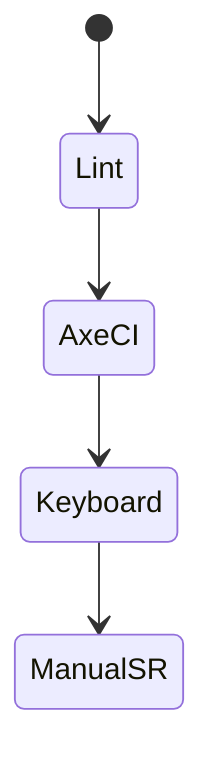
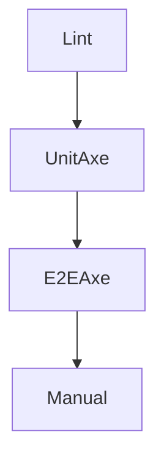

# Accessibility Testing

<TopicMeta />

<Prerequisites />

::: tip Published
This page meets the handbook **published** bar: deep explanation, ≥10 common mistakes, and official references. Further engine-level errata welcome via PR.
:::

## Introduction

**Accessibility testing** combines automated checks (axe-core, eslint-plugin-jsx-a11y), keyboard navigation tests, and manual assistive-technology exploration. Automation catches ~30–50% of issues; humans still needed for UX semantics.

## Why does it exist?

A11y bugs are product bugs—and legal risk. Catching them in CI is cheaper than retrofit after launch.

## Historical Background

WCAG + ARIA matured; axe-core made automated auditing standard in CI and browsers. Testing Library’s role queries reinforce accessible markup.

## Mental Model

Layers: **lint** → **unit/integration axe** → **E2E axe + keyboard** → **manual SR**. Automation is necessary but not sufficient.

## Internal Workflow

1. jsx-a11y lint.
2. `axe` in RTL/Playwright for key pages.
3. Keyboard-only journey tests.
4. Manual VoiceOver/NVDA smoke each release.
5. Track violations as bugs with severity.

## Lifecycle



## Browser Perspective

DevTools Accessibility panel + axe extension locally.

## JavaScript Engine Perspective

Not applicable.

## React Perspective

Role queries in tests double as a11y pressure.

## Next.js Perspective

Check document title, landmarks, and route focus management.

## Server Perspective

Not applicable.

## Network Perspective

Not applicable.

## Memory Perspective

Not applicable.

## Performance

Run axe on critical pages per PR; full crawl nightly.

## Production Example

PR fails on serious axe violations for checkout; release checklist includes keyboard pass and VoiceOver smoke.

## Code Examples

```ts
import { test, expect } from '@playwright/test'
import AxeBuilder from '@axe-core/playwright'

test('home a11y', async ({ page }) => {
  await page.goto('/')
  const results = await new AxeBuilder({ page }).analyze()
  expect(results.violations).toEqual([])
})
```

## Diagrams



## Common Mistakes

1. Relying only on axe
2. Disabling rules globally to go green
3. No keyboard tests for custom widgets
4. aria-label spam hiding poor structure
5. Testing a11y only at the end
6. Missing a production edge case for 16-testing.accessibility-testing (#1)
7. Missing a production edge case for 16-testing.accessibility-testing (#2)
8. Missing a production edge case for 16-testing.accessibility-testing (#3)
9. Missing a production edge case for 16-testing.accessibility-testing (#4)
10. Missing a production edge case for 16-testing.accessibility-testing (#5)


## Best Practices

- Fail CI on serious violations
- Keyboard journeys for custom components
- Manual AT for releases

## Anti-patterns

- `eslint-disable` of jsx-a11y on whole folders
- Decorative icons announced as noise

## Comparison

| Automated | Manual |
| --- | --- |
| Contrast, names, roles | SR UX, cognitive load |
| Fast CI | Essential for quality |

## Interview Questions

### Easy

**Q:** Can axe prove a site is accessible?

**A:** No—it catches many issues but cannot validate all WCAG criteria or real AT UX.

### Medium

**Q:** How do Testing Library queries help a11y?

**A:** They push you to expose roles/labels users and AT rely on, failing when interactions are mouse-only myths.

### Hard

**Q:** Design a11y test strategy for a design system.

**A:** Axe on stories, keyboard interaction tests per widget per APG pattern, visual contrast checks, and manual SR matrix each release.

## Summary

- Automate axe + lint + keyboard
- Manual AT still required
- Treat violations as product defects

## References

- [axe-core](https://github.com/dequelabs/axe-core)
- [WCAG 2.2](https://www.w3.org/TR/WCAG22/)
- [Playwright + axe](https://playwright.dev/docs/accessibility-testing)

<RelatedTopics />


Prev: [`16-testing.visual-regression`](/16-testing/visual-regression/) · Next: [`16-testing.test-strategy`](/16-testing/test-strategy/)
