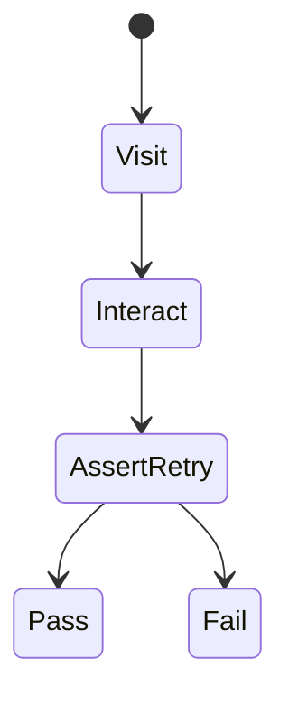
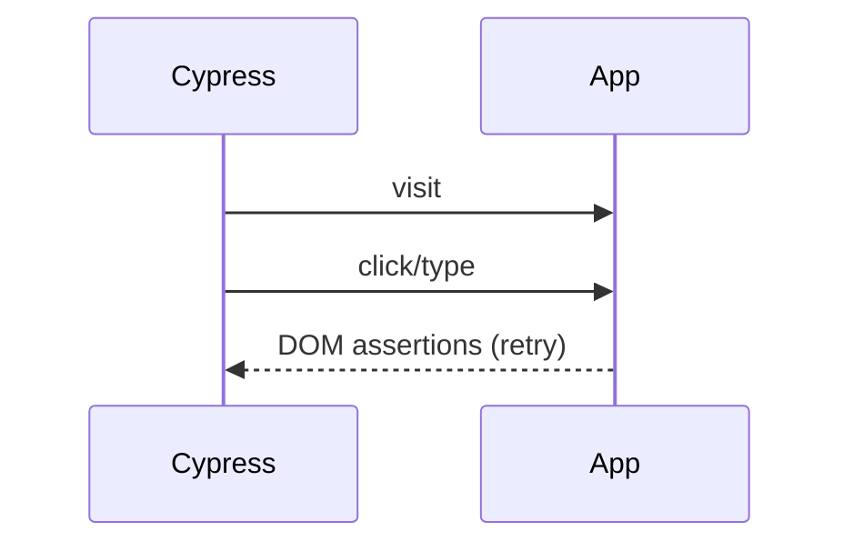

# Cypress

<TopicMeta />

<Prerequisites />

::: tip Published
This page meets the handbook **published** bar: deep explanation, ≥10 common mistakes, and official references. Further engine-level errata welcome via PR.
:::

## Introduction

**Cypress** runs tests in the browser alongside your app (classic architecture), offering automatic waiting, a rich command chain API, and an interactive runner. It also supports component testing. Playwright is often preferred for multi-browser/parallel CI, but Cypress remains popular for DX.

## Why does it exist?

Teams wanted E2E with great local debugging—DOM snapshots, command logs, and less Selenium pain.

## Historical Background

Cypress grew rapidly for SPA E2E. Architectural constraints (same origin, limited multi-tab) led some teams to Playwright; Cypress continues evolving.

## Mental Model

Commands enqueue and auto-retry assertions until timeout. Tests should be isolated; use `cy.intercept` for network stubbing when needed.

## Internal Workflow

1. `cy.visit` app.
2. Interact with resilient selectors.
3. Assert with retries.
4. Use intercepts for deterministic APIs.
5. Run headless in CI; keep interactive runner for debugging.

## Lifecycle



## Browser Perspective

Strong Chromium DX; cross-browser support improved over time but evaluate needs.

## JavaScript Engine Perspective

Not applicable.

## React Perspective

Component testing mounts components in Cypress runner.

## Next.js Perspective

Not applicable.

## Server Perspective

Not applicable.

## Network Perspective

cy.intercept stubs/spies HTTP.

## Memory Perspective

Not applicable.

## Performance

Prefer `data-cy` sparingly; reuse auth via cy.session; avoid full reloads each test when safe.

## Production Example

Marketing site uses Cypress smoke for signup funnel locally; CI runs headedless Chrome shard.

## Code Examples

```ts
it('searches', () => {
  cy.visit('/search')
  cy.findByRole('searchbox').type('shoes{enter}')
  cy.findByRole('heading', { name: /results/i }).should('be.visible')
})
```

## Diagrams



## Common Mistakes

1. Arbitrary cy.wait(500)
2. Massive interdependent test suites
3. Selecting by CSS classes
4. No API stubbing for flaky backends
5. Testing too many non-critical paths in E2E
6. Missing a production edge case for 16-testing.cypress (#1)
7. Missing a production edge case for 16-testing.cypress (#2)
8. Missing a production edge case for 16-testing.cypress (#3)
9. Missing a production edge case for 16-testing.cypress (#4)
10. Missing a production edge case for 16-testing.cypress (#5)


## Best Practices

- Default command timeout tuned, not sleeps
- cy.session for auth
- Isolate test data

## Anti-patterns

- Conditional testing spaghetti (`if (cy.get...)`)
- Ignoring flake dashboards

## Comparison

| Cypress | Playwright |
| --- | --- |
| Excellent interactive runner | Strong traces + multi-browser |
| Unique architecture | Isolated browser contexts |

## Interview Questions

### Easy

**Q:** What is Cypress mainly used for?

**A:** End-to-end (and component) testing with a strong interactive runner and auto-retrying commands.

### Medium

**Q:** Why are arbitrary waits bad?

**A:** They hide race conditions, slow suites, and still flake under load—use assertions that retry on DOM/network conditions.

### Hard

**Q:** When pick Cypress vs Playwright?

**A:** Choose based on multi-browser needs, CI parallelization, team DX preference, and ecosystem—prototype a critical journey in both if undecided.

## Summary

- Cypress prioritizes E2E DX
- Auto-retry instead of sleeps
- Keep journeys few and isolated

## References

- [Cypress documentation](https://docs.cypress.io/)
- [Cypress best practices](https://docs.cypress.io/guides/references/best-practices)

<RelatedTopics />


Prev: [`16-testing.react-testing-library`](/16-testing/react-testing-library/) · Next: [`16-testing.playwright`](/16-testing/playwright/)
