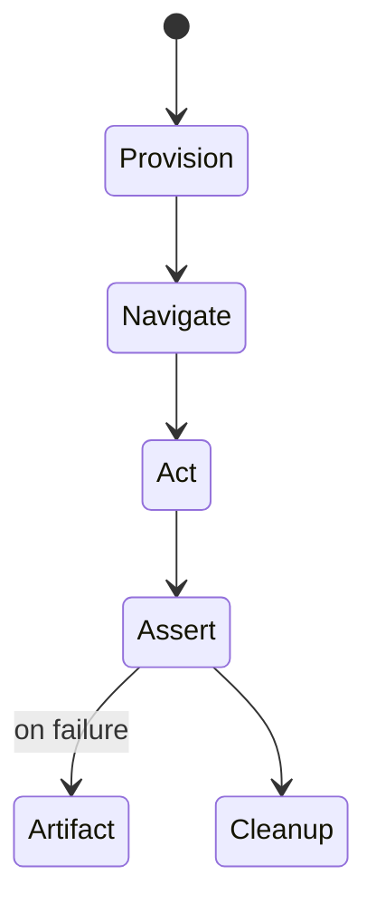
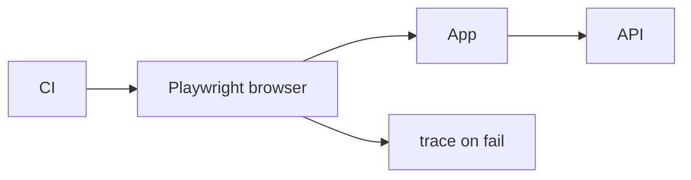

# E2E Testing

<TopicMeta />

<Prerequisites />

::: tip Published
This page meets the handbook **published** bar: deep explanation, ≥10 common mistakes, and official references. Further engine-level errata welcome via PR.
:::

## Introduction

**E2E tests** drive a real browser against a deployed or locally running app to validate critical user journeys. They provide the highest realism and the highest cost—so keep them few, stable, and valuable.

## Why does it exist?

Only E2E proves that build output, routing, auth cookies, and backend contracts work together. Lower layers cannot fully replace that signal.

## Historical Background

Selenium → Cypress → Playwright. Modern tools emphasize auto-waiting, trace viewers, and parallel shards.

## Mental Model

Each E2E is a **journey** (seed → act → assert → cleanup), not a grab bag of clicks. Isolate data; avoid depending on leftover UI state.

## Internal Workflow

1. Pick critical journeys (auth, checkout, smoke).
2. Stable environments + test users.
3. Use resilient selectors (roles/test ids sparingly).
4. Record traces on failure.
5. Shard in CI; quarantine flakes with owners.

## Lifecycle



## Browser Perspective

Real engines (Chromium/WebKit/Firefox) surface layout/input differences.

## JavaScript Engine Perspective

Not applicable.

## React Perspective

E2E should not import React internals—speak through the UI.

## Next.js Perspective

Test production builds; watch for hydration mismatches.

## Server Perspective

Not applicable.

## Network Perspective

Stub only when necessary; prefer API seeding for deterministic data.

## Memory Perspective

Not applicable.

## Performance

Parallel shards, reuse auth state, avoid unnecessary full navigations.

## Production Example

PR CI runs smoke E2E (login + create item). Nightly runs cross-browser checkout. Failures upload Playwright traces.

## Code Examples

```ts
import { test, expect } from '@playwright/test'

test('guest can view pricing', async ({ page }) => {
  await page.goto('/pricing')
  await expect(page.getByRole('heading', { name: 'Pricing' })).toBeVisible()
})
```

## Diagrams



## Common Mistakes

1. Hundreds of E2E covering every unit case
2. CSS-selector soup
3. No test data isolation
4. Ignoring flakes
5. Sleep-based waits
6. Missing a production edge case for 16-testing.e2e-testing (#1)
7. Missing a production edge case for 16-testing.e2e-testing (#2)
8. Missing a production edge case for 16-testing.e2e-testing (#3)
9. Missing a production edge case for 16-testing.e2e-testing (#4)
10. Missing a production edge case for 16-testing.e2e-testing (#5)


## Best Practices

- Auto-wait assertions
- Trace/video on failure
- Seeded fixtures per test

## Anti-patterns

- E2E depending on previous test order
- Testing third-party iframes you do not own without contracts

## Comparison

| Tool | Notes |
| --- | --- |
| Playwright | Strong multi-browser, traces |
| Cypress | Great DX, different architecture |

## Interview Questions

### Easy

**Q:** What does E2E test?

**A:** A full user journey in a real browser against the integrated system.

### Medium

**Q:** How do you reduce E2E flakiness?

**A:** Auto-waiting, deterministic data, avoid sleeps, isolate state, fix timing races, use traces to debug.

### Hard

**Q:** Design an E2E strategy for a large SPA.

**A:** Smoke on PR, journey suites nightly, contract tests with backend, quarantine process with owners, budgets for runtime.

## Summary

- E2E = few critical journeys
- Realism at high cost
- Stability is part of the feature

## References

- [Playwright docs](https://playwright.dev/docs/intro)
- [Cypress docs](https://docs.cypress.io/)

<RelatedTopics />


Prev: [`16-testing.integration-testing`](/16-testing/integration-testing/) · Next: [`16-testing.jest`](/16-testing/jest/)
