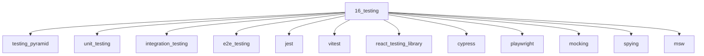

# Testing

## Scope

Test pyramid and frontend testing tooling

## Prerequisites

See the learning paths and each topic's prerequisites in the registry.

## Topics in order

- [Testing Pyramid](/16-testing/testing-pyramid/) — junior, ~25 min
- [Unit Testing](/16-testing/unit-testing/) — junior, ~30 min
- [Integration Testing](/16-testing/integration-testing/) — mid, ~30 min
- [E2E Testing](/16-testing/e2e-testing/) — mid, ~30 min
- [Jest](/16-testing/jest/) — junior, ~30 min
- [Vitest](/16-testing/vitest/) — junior, ~30 min
- [React Testing Library](/16-testing/react-testing-library/) — junior, ~35 min
- [Cypress](/16-testing/cypress/) — mid, ~30 min
- [Playwright](/16-testing/playwright/) — mid, ~35 min
- [Mocking](/16-testing/mocking/) — junior, ~25 min
- [Spying](/16-testing/spying/) — junior, ~20 min
- [MSW](/16-testing/msw/) — mid, ~30 min
- [Visual Regression](/16-testing/visual-regression/) — mid, ~25 min
- [Accessibility Testing](/16-testing/accessibility-testing/) — mid, ~25 min
- [Test Strategy](/16-testing/test-strategy/) — mid, ~30 min

## Module knowledge graph

## Suggested learning paths

Browse [Learning Paths](/learning-paths/).
