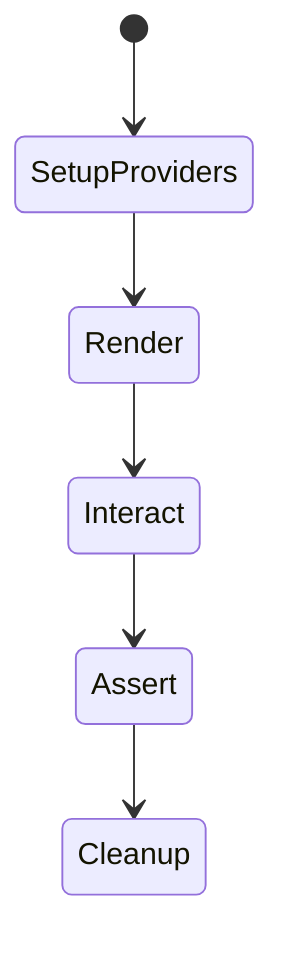
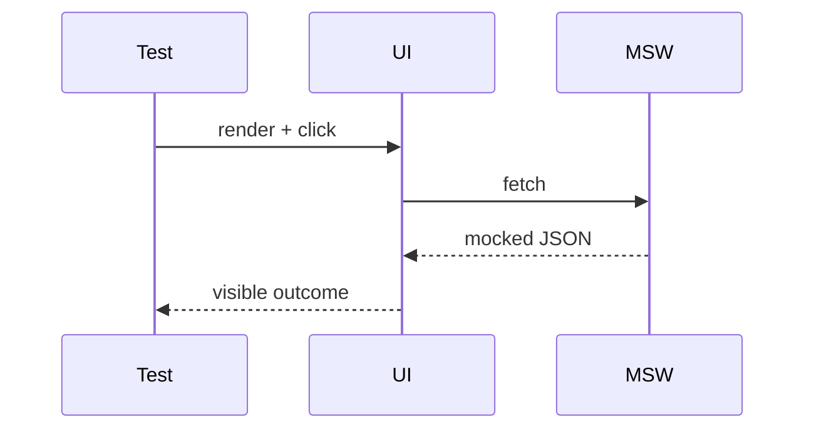

# Integration Testing

<TopicMeta />

<Prerequisites />

::: tip Published
This page meets the handbook **published** bar: deep explanation, ≥10 common mistakes, and official references. Further engine-level errata welcome via PR.
:::

## Introduction

**Integration tests** verify that units collaborate correctly: a React page + router + MSW handlers, or a hook + API module. They sit between pure unit tests and full E2E, catching props/routing/cache wiring bugs without a real backend.

## Why does it exist?

Many frontend bugs are glue bugs. Pure unit tests miss them; E2E overkill them. Integration tests give high signal per minute for UI features.

## Historical Background

Testing Library shifted React testing toward integration-style “render a screen and interact.” MSW made network integration realistic without spinning servers.

## Mental Model

Render a realistic subtree, interact like a user, assert outcomes. Mock only the network/process boundary, not every child component.

## Internal Workflow

1. Render feature with providers (router, query client).
2. Mock HTTP with MSW.
3. Interact via roles/labels.
4. Assert UI and outgoing requests.
5. Reset handlers/cache between tests.

## Lifecycle



## Browser Perspective

jsdom approximates DOM; true browser behavior stays in E2E.

## JavaScript Engine Perspective

Not applicable.

## React Perspective

wrap with the same providers production uses (trimmed).

## Next.js Perspective

Not applicable.

## Server Perspective

Not applicable.

## Network Perspective

MSW intercepts fetch/XHR in jsdom or Node.

## Memory Perspective

Not applicable.

## Performance

Reuse MSW server; create fresh QueryClient per test to avoid cache leaks.

## Production Example

Login form integration test covers validation, 401 message, and success redirect with MSW handlers—no Cypress needed for that matrix.

## Code Examples

```tsx
import { render, screen } from '@testing-library/react'
import userEvent from '@testing-library/user-event'
import { http, HttpResponse } from 'msw'
import { setupServer } from 'msw/node'

const server = setupServer(
  http.post('/api/login', () => HttpResponse.json({ token: 't' })),
)
beforeAll(() => server.listen())
afterEach(() => server.resetHandlers())
afterAll(() => server.close())

it('logs in', async () => {
  render(<LoginPage />)
  await userEvent.type(screen.getByLabelText(/email/i), 'a@b.com')
  await userEvent.click(screen.getByRole('button', { name: /log in/i }))
  expect(await screen.findByText(/welcome/i)).toBeInTheDocument()
})
```

## Diagrams



## Common Mistakes

1. Mocking every child component (testing mocks)
2. Shared QueryClient leaking success between tests
3. Asserting only snapshots
4. Sleeping with arbitrary timeouts instead of findBy
5. No reset of MSW handlers
6. Missing a production edge case for 16-testing.integration-testing (#1)
7. Missing a production edge case for 16-testing.integration-testing (#2)
8. Missing a production edge case for 16-testing.integration-testing (#3)
9. Missing a production edge case for 16-testing.integration-testing (#4)
10. Missing a production edge case for 16-testing.integration-testing (#5)


## Best Practices

- User-centric queries
- Fresh providers per test
- MSW for HTTP

## Anti-patterns

- Full Redux store dump assertions
- Integration tests that require real staging credentials

## Comparison

| Integration | E2E |
| --- | --- |
| Mocked network | Real stack |
| jsdom/real-ish | Real browser |

## Interview Questions

### Easy

**Q:** What is an integration test in frontend?

**A:** A test that verifies multiple modules work together, often a UI feature with mocked HTTP.

### Medium

**Q:** Why prefer MSW over mocking fetch per test?

**A:** MSW keeps client code using real fetch paths and centralizes handlers closer to network contracts.

### Hard

**Q:** How do you keep integration tests stable with TanStack Query?

**A:** New QueryClient per test, controlled timers if needed, await findBy for async UI, and reset MSW handlers.

## Summary

- Integration tests catch glue bugs cheaply
- Mock network, not the whole UI tree
- Reset providers and handlers each test

## References

- [Testing Library — React](https://testing-library.com/docs/react-testing-library/intro/)
- [MSW documentation](https://mswjs.io/docs/)

<RelatedTopics />


Prev: [`16-testing.unit-testing`](/16-testing/unit-testing/) · Next: [`16-testing.e2e-testing`](/16-testing/e2e-testing/)
