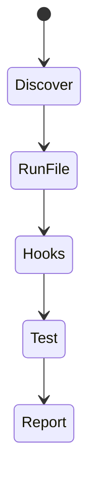
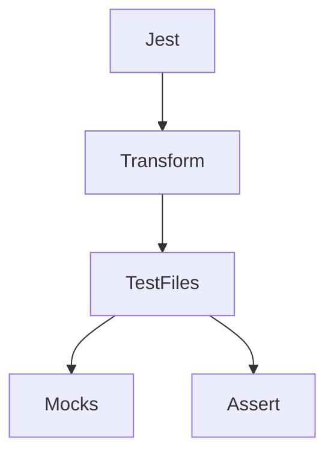

# Jest

<TopicMeta />

<Prerequisites />

::: tip Published
This page meets the handbook **published** bar: deep explanation, ≥10 common mistakes, and official references. Further engine-level errata welcome via PR.
:::

## Introduction

**Jest** is a battle-tested test framework from the Meta ecosystem: runner, assertions (`expect`), mocking (`jest.fn`, module mocks), snapshots, and parallel workers. Still common in CRA and many React codebases; newer Vite apps often prefer Vitest with a Jest-compatible API.

## Why does it exist?

Teams needed a zero/low-config runner that understood Babel/TS React projects and provided mocks/snapshots out of the box.

## Historical Background

Jest rose with React. The API became a de facto standard that Vitest later mirrored for migration ease.

## Mental Model

Jest discovers tests, sandboxes modules (depending on config), runs hooks (`beforeEach`), and reports assertions. Mocks replace dependencies at the module boundary.

## Internal Workflow

1. Configure environment (jsdom/node).
2. Write `*.test.ts(x)` files.
3. Mock modules intentionally.
4. Use coverage thresholds carefully.
5. Prefer Testing Library over shallow snapshots.

## Lifecycle



## Browser Perspective

jsdom is not a real browser—validate critical paths in Playwright.

## JavaScript Engine Perspective

Runs on Node; transforms TS/JSX via babel/ts-jest/swc.

## React Perspective

Pair with @testing-library/react.

## Next.js Perspective

Not applicable.

## Server Perspective

Not applicable.

## Network Perspective

Not applicable.

## Memory Perspective

Not applicable.

## Performance

Transform pipeline dominates; use SWC/jest caches; isolate heavy tests.

## Production Example

Legacy app keeps Jest + Testing Library; new packages migrate to Vitest with nearly identical expect/mock APIs.

## Code Examples

```ts
jest.mock('./api', () => ({ getUser: jest.fn() }))
import { getUser } from './api'
import { loadName } from './loadName'

test('loadName', async () => {
  ;(getUser as jest.Mock).mockResolvedValue({ name: 'Ada' })
  await expect(loadName('1')).resolves.toBe('Ada')
})
```

## Diagrams



## Common Mistakes

1. Snapshotting huge DOM trees
2. Manual mocks that drift from real modules
3. Using Jest for E2E
4. Coverage theater (chasing % over risk)
5. Not clearing mocks between tests
6. Missing a production edge case for 16-testing.jest (#1)
7. Missing a production edge case for 16-testing.jest (#2)
8. Missing a production edge case for 16-testing.jest (#3)
9. Missing a production edge case for 16-testing.jest (#4)
10. Missing a production edge case for 16-testing.jest (#5)


## Best Practices

- Clear mocks in beforeEach
- Prefer Testing Library queries
- Keep transforms fast

## Anti-patterns

- jest.spyOn everything including pure functions needlessly
- Disabled tests left for months

## Comparison

| Jest | Vitest |
| --- | --- |
| Mature ecosystem | Faster in Vite projects |
| Separate tooling | Shares Vite transform |

## Interview Questions

### Easy

**Q:** What is Jest used for?

**A:** Unit/integration tests in JS/TS with built-in mocking and assertions.

### Medium

**Q:** What does jest.mock do?

**A:** It replaces a module with a mock implementation for the test file’s module graph.

### Hard

**Q:** When migrate Jest → Vitest?

**A:** When Vite is the bundler and CI transform time hurts; APIs are similar but config and some ESM edge cases differ.

## Summary

- Jest = runner + mocks + expect
- Pair with Testing Library for React
- Vitest is the common Vite-era alternative

## References

- [Jest documentation](https://jestjs.io/docs/getting-started)
- [Jest mocking](https://jestjs.io/docs/mock-functions)

<RelatedTopics />


Prev: [`16-testing.e2e-testing`](/16-testing/e2e-testing/) · Next: [`16-testing.vitest`](/16-testing/vitest/)
