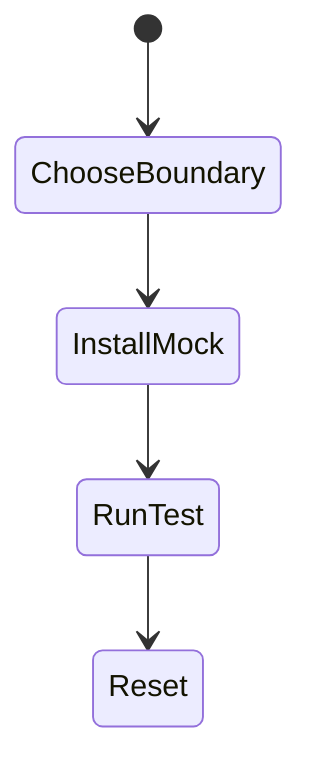
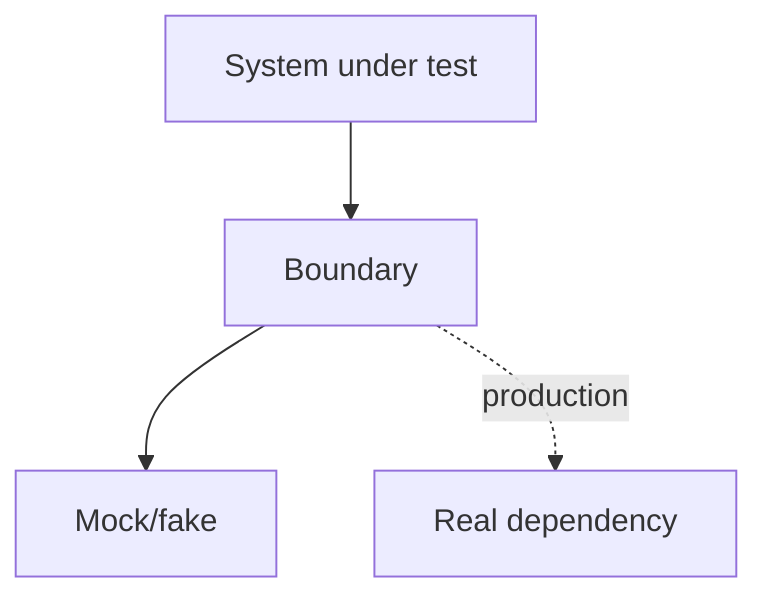

# Mocking

<TopicMeta />

<Prerequisites />

::: tip Published
This page meets the handbook **published** bar: deep explanation, ≥10 common mistakes, and official references. Further engine-level errata welcome via PR.
:::

## Introduction

**Mocking** substitutes a real dependency (module, network, timer) with a controlled stand-in. Good mocks isolate the unit under test; bad mocks reimplement the system incorrectly and greenwash bugs.

## Why does it exist?

Real network/time/randomness make tests slow and flaky. Mocks freeze the world at the boundary you choose—but every mock is an assumption that can drift.

## Historical Background

Classical xUnit test doubles (mock/stub/fake/spy) → Jest automocks → MSW for network-level fakes without mocking fetch call sites.

## Mental Model

Mock **at the boundary** you own less: prefer HTTP-level fakes (MSW) over stubbing internal collaborators. Don’t mock what you are testing.

## Internal Workflow

1. Identify external dependency.
2. Choose double type (stub return, fake in-memory, spy).
3. Set expectations.
4. Reset between tests.
5. Periodically validate against real contracts.

## Lifecycle



## Browser Perspective

Not applicable.

## JavaScript Engine Perspective

Fake timers control Date/setTimeout.

## React Perspective

Avoid mocking child components by default; mock network instead.

## Next.js Perspective

Not applicable.

## Server Perspective

Not applicable.

## Network Perspective

MSW > per-test fetch mocks for API-heavy UIs.

## Memory Perspective

Not applicable.

## Performance

Mocks keep suites fast—don’t boot real browsers to test a pure function.

## Production Example

Payments team mocks PSP HTTP via MSW in integration tests; contract tests against sandbox run nightly without mocks.

## Code Examples

```ts
import { vi } from 'vitest'
import * as api from './api'

vi.spyOn(api, 'getUser').mockResolvedValue({ id: '1', name: 'Ada' })
```

## Diagrams



## Common Mistakes

1. Mocking everything until tests assert mocks
2. Forgetting to reset mocks
3. Out-of-date module mocks after API changes
4. Mocking React itself
5. Using mocks to hide design problems permanently
6. Missing a production edge case for 16-testing.mocking (#1)
7. Missing a production edge case for 16-testing.mocking (#2)
8. Missing a production edge case for 16-testing.mocking (#3)
9. Missing a production edge case for 16-testing.mocking (#4)
10. Missing a production edge case for 16-testing.mocking (#5)


## Best Practices

- Mock at boundaries
- Prefer MSW for HTTP
- Reset after each test

## Anti-patterns

- Partial automock of a huge module you barely understand
- Asserting call counts that encode implementation

## Comparison

| Double | Role |
| --- | --- |
| Stub | Fixed returns |
| Fake | Working simplified impl |
| Mock | Verifies interactions |
| Spy | Wraps real with observation |

## Interview Questions

### Easy

**Q:** Why mock in tests?

**A:** To control slow/flaky/external dependencies and keep tests focused and deterministic.

### Medium

**Q:** When is mocking harmful?

**A:** When mocks diverge from reality or when you mock the code under test’s internals, producing false confidence.

### Hard

**Q:** Compare module mocks vs MSW.

**A:** Module mocks replace functions in-process; MSW intercepts real HTTP at the network boundary, testing more of the client stack.

## Summary

- Mock at true boundaries
- Reset always
- Validate contracts against reality

## References

- [Martin Fowler — Test Doubles](https://martinfowler.com/bliki/TestDouble.html)
- [MSW](https://mswjs.io/docs/)

<RelatedTopics />


Prev: [`16-testing.playwright`](/16-testing/playwright/) · Next: [`16-testing.spying`](/16-testing/spying/)
