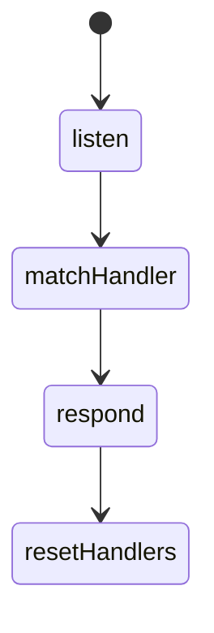
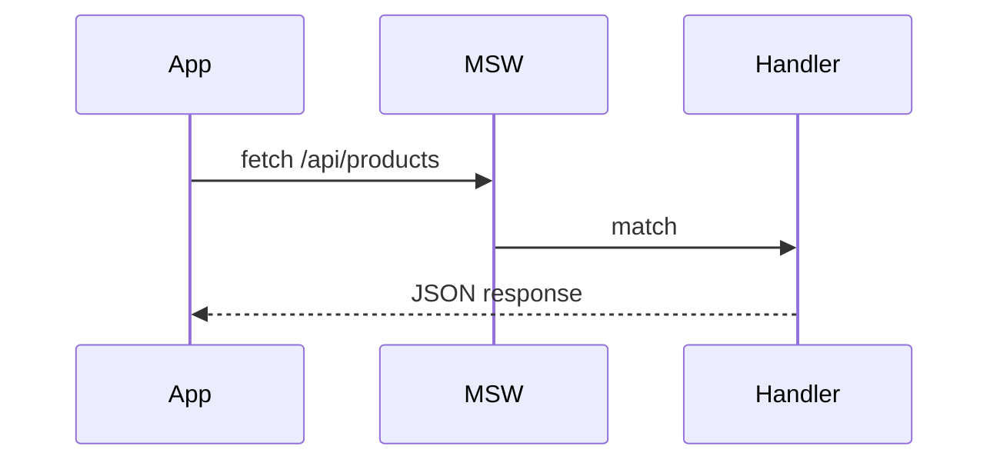

# MSW

<TopicMeta />

<Prerequisites />

::: tip Published
This page meets the handbook **published** bar: deep explanation, ≥10 common mistakes, and official references. Further engine-level errata welcome via PR.
:::

## Introduction

**MSW** mocks APIs by intercepting requests (Service Worker in browser; request listeners in Node). Your app keeps using `fetch`/XHR; handlers define responses. That makes tests exercise more of the real client stack.

## Why does it exist?

Mocking `fetch` per test is brittle and skips your API client. MSW centralizes network contracts and reuses handlers across tests, Storybook, and dev.

## Historical Background

MSW popularized service-worker-based API mocking for frontend. It became the default companion to Testing Library and Playwright route alternatives for jsdom tests.

## Mental Model

Handlers are the fake backend. Matching is by method/URL. Tests can override handlers per case. The client’s baseURL/auth headers still run.

## Internal Workflow

1. Define handlers for resources.
2. `setupServer` in Node tests / `setupWorker` in browser.
3. Start/reset/close in lifecycle hooks.
4. Override for error cases.
5. Share handlers with Storybook.

## Lifecycle



## Browser Perspective

Worker mode needs service worker file in public/.

## JavaScript Engine Perspective

Not applicable.

## React Perspective

Use with RTL without mocking data hooks internals.

## Next.js Perspective

Node server listeners for Vitest; careful with RSC server fetches (different runtime).

## Server Perspective

Not applicable.

## Network Perspective

True HTTP semantics (status, headers, delay) are simulable.

## Memory Perspective

Not applicable.

## Performance

Prefer one server per suite; reset handlers not full restart each test.

## Production Example

Storybook + Vitest share handlers for `/api/products`; error story overrides a 500 handler.

## Code Examples

```ts
import { http, HttpResponse } from 'msw'
import { setupServer } from 'msw/node'

export const handlers = [
  http.get('/api/products', () =>
    HttpResponse.json([{ id: '1', name: 'Mug' }]),
  ),
]

export const server = setupServer(...handlers)
```

## Diagrams



## Common Mistakes

1. Forgetting to reset handlers after error overrides
2. Handlers not matching baseURL/query
3. Using MSW as excuse to never run contract tests
4. Starting worker in tests that already use Node server API incorrectly
5. Returning untyped free-form JSON that drifts from Zod schemas
6. Missing a production edge case for 16-testing.msw (#1)
7. Missing a production edge case for 16-testing.msw (#2)
8. Missing a production edge case for 16-testing.msw (#3)
9. Missing a production edge case for 16-testing.msw (#4)
10. Missing a production edge case for 16-testing.msw (#5)


## Best Practices

- Share handlers with app contracts
- resetHandlers in afterEach
- Model error statuses explicitly

## Anti-patterns

- Per-test ad-hoc fetch mocks beside MSW
- Silent passthrough to real prod APIs in CI

## Comparison

| MSW | page.route (Playwright) |
| --- | --- |
| Great for unit/integration | Great for E2E |
| Reusable handlers | Browser-level |

## Interview Questions

### Easy

**Q:** What does MSW intercept?

**A:** Outgoing HTTP requests from your app, returning mocked responses without changing call sites.

### Medium

**Q:** Why is MSW better than mocking getUser directly sometimes?

**A:** It exercises the real client/fetch path and keeps mocks at the network contract boundary.

### Hard

**Q:** How do you keep MSW handlers honest?

**A:** Generate from OpenAPI or share Zod schemas, plus nightly contract tests against real staging.

## Summary

- MSW mocks HTTP at the network layer
- Reuse handlers across tools
- Reset overrides every test

## References

- [MSW documentation](https://mswjs.io/docs/)
- [MSW — Network behavior](https://mswjs.io/docs/network-behavior/rest)

<RelatedTopics />


Prev: [`16-testing.spying`](/16-testing/spying/) · Next: [`16-testing.visual-regression`](/16-testing/visual-regression/)
