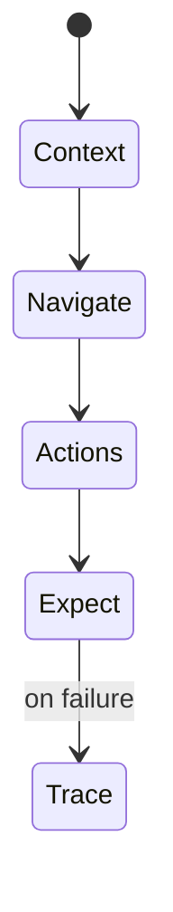
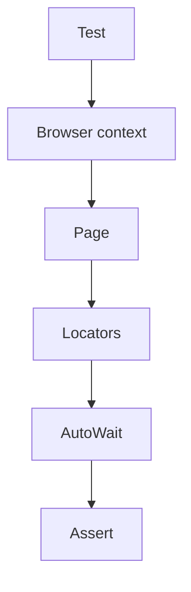

# Playwright

<TopicMeta />

<Prerequisites />

::: tip Published
This page meets the handbook **published** bar: deep explanation, ≥10 common mistakes, and official references. Further engine-level errata welcome via PR.
:::

## Introduction

**Playwright** (Microsoft) automates Chromium, Firefox, and WebKit with one API. It features auto-waiting, browser contexts, tracing, locators, parallel shards, and API testing utilities—making it a top choice for serious frontend E2E.

## Why does it exist?

Cross-browser bugs and flake were expensive. Playwright’s isolated contexts, trace viewer, and locator engine improve reliability and debugability versus older stacks.

## Historical Background

Released by Microsoft; learned from Puppeteer. Rapidly became standard in many engineering orgs alongside or replacing Cypress.

## Mental Model

Locators are lazy and auto-wait for actionability. Each test often gets a fresh **browser context** (cookies/storage isolated). Traces capture DOM/network/screenshots for failures.

## Internal Workflow

1. Configure projects (browsers).
2. Write tests with `page.getByRole`.
3. Use webServer config for local apps.
4. Enable trace=on-first-retry in CI.
5. Shard across CI workers.

## Lifecycle



## Browser Perspective

True multi-engine coverage including WebKit.

## JavaScript Engine Perspective

Not applicable.

## React Perspective

Prefer role selectors over test ids tied to React structure.

## Next.js Perspective

Test start commands should run production builds for confidence.

## Server Perspective

Not applicable.

## Network Perspective

page.route for stubbing; storageState for auth reuse.

## Memory Perspective

Not applicable.

## Performance

Reuse auth storageState; parallelize carefully against backend rate limits.

## Production Example

PR: Playwright smoke on Chromium. Nightly: Firefox+WebKit. Failures publish HTML report + trace.zip.

## Code Examples

```ts
import { test, expect } from '@playwright/test'

test('add to cart', async ({ page }) => {
  await page.goto('/products/1')
  await page.getByRole('button', { name: 'Add to cart' }).click()
  await expect(page.getByRole('status')).toHaveText(/added/i)
})
```

## Diagrams



## Common Mistakes

1. CSS selectors tied to layout
2. Hard waits
3. Shared account causing cross-test collisions
4. No traces in CI
5. Testing every unit edge in Playwright
6. Missing a production edge case for 16-testing.playwright (#1)
7. Missing a production edge case for 16-testing.playwright (#2)
8. Missing a production edge case for 16-testing.playwright (#3)
9. Missing a production edge case for 16-testing.playwright (#4)
10. Missing a production edge case for 16-testing.playwright (#5)


## Best Practices

- getByRole / getByLabel first
- Trace on retry
- Isolated storage per test

## Anti-patterns

- Dependence on wall-clock animations without waiting for UI state
- One giant serial suite

## Comparison

| Playwright strength | Why it matters |
| --- | --- |
| Multi-browser | WebKit parity |
| Trace viewer | Debug CI flakes |
| Contexts | Isolation |

## Interview Questions

### Easy

**Q:** Name a Playwright advantage over older Selenium stacks.

**A:** Auto-waiting locators, built-in tracing, and first-class multi-browser support with modern async APIs.

### Medium

**Q:** What is a browser context?

**A:** An isolated session (cookies, storage) within a browser instance—useful for parallel independent tests.

### Hard

**Q:** How do you debug a flaky Playwright CI test?

**A:** Open the trace, inspect timing/network, remove sleeps, tighten locators, isolate data, and fix race conditions in app or test.

## Summary

- Playwright is a leading multi-browser E2E tool
- Locators auto-wait; traces debug flakes
- Keep E2E journeys focused

## References

- [Playwright documentation](https://playwright.dev/docs/intro)
- [Playwright — Locators](https://playwright.dev/docs/locators)
- [Playwright — Trace viewer](https://playwright.dev/docs/trace-viewer)

<RelatedTopics />


Prev: [`16-testing.cypress`](/16-testing/cypress/) · Next: [`16-testing.mocking`](/16-testing/mocking/)
