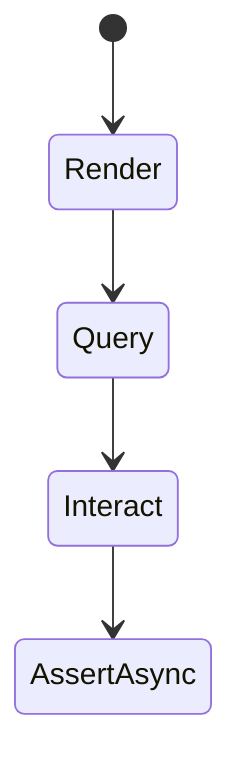
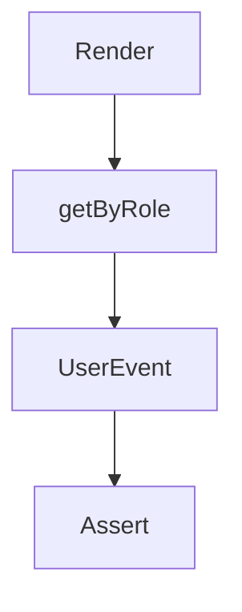

# React Testing Library

<TopicMeta />

<Prerequisites />

::: tip Published
This page meets the handbook **published** bar: deep explanation, ≥10 common mistakes, and official references. Further engine-level errata welcome via PR.
:::

## Introduction

**React Testing Library (RTL)** renders components into a DOM (jsdom) and encourages queries accessible to users—roles, labels, text—plus `user-event` interactions. Guiding principle: the more your tests resemble how software is used, the more confidence they give.

## Why does it exist?

Enzyme-style tests coupled to internals broke on refactors that preserved UX. RTL aligns tests with accessibility and user behavior.

## Historical Background

Created by Kent C. Dodds; became the React community default. Part of the Testing Library family across frameworks.

## Mental Model

Arrange (render + providers) → Act (user events) → Assert (visible state / a11y). Prefer `getByRole`; use `findBy*` for async.

## Internal Workflow

1. Render with needed providers.
2. Query by role/label.
3. Interact with user-event.
4. Assert outcomes with jest-dom matchers.
5. Avoid testing CSS classes or private state.

## Lifecycle



## Browser Perspective

jsdom limitations: no real layout/focus in all cases—use Playwright for those.

## JavaScript Engine Perspective

Not applicable.

## React Perspective

Works with hooks components; wrap routers/query clients as in production.

## Next.js Perspective

Not applicable.

## Server Perspective

Not applicable.

## Network Perspective

Pair with MSW.

## Memory Perspective

Not applicable.

## Performance

Render only the feature under test; avoid mounting the entire app shell unless required.

## Production Example

Form tests assert error announcements by role=alert and successful navigation text—refactors of class names do not break CI.

## Code Examples

```tsx
import { render, screen } from '@testing-library/react'
import userEvent from '@testing-library/user-event'
import { Counter } from './Counter'

it('increments', async () => {
  const user = userEvent.setup()
  render(<Counter />)
  await user.click(screen.getByRole('button', { name: /increment/i }))
  expect(screen.getByText('1')).toBeInTheDocument()
})
```

## Diagrams



## Common Mistakes

1. getByTestId for everything
2. Using fireEvent when user-event matches real interactions better
3. Not wrapping providers
4. Asserting Redux store instead of UI
5. Forgetting await findBy for async UI
6. Missing a production edge case for 16-testing.react-testing-library (#1)
7. Missing a production edge case for 16-testing.react-testing-library (#2)
8. Missing a production edge case for 16-testing.react-testing-library (#3)
9. Missing a production edge case for 16-testing.react-testing-library (#4)
10. Missing a production edge case for 16-testing.react-testing-library (#5)


## Best Practices

- Query priority: role → label → text → test id
- userEvent.setup()
- Assert a11y-friendly outcomes

## Anti-patterns

- Snapshot of entire page as main assertion
- Testing styled-components class hashes

## Comparison

| RTL | Enzyme |
| --- | --- |
| User behavior | Internals |
| Encouraged | Legacy |

## Interview Questions

### Easy

**Q:** Why prefer getByRole?

**A:** It mirrors assistive tech and users’ UI semantics, making tests both robust and a11y-aligned.

### Medium

**Q:** Difference between getBy, queryBy, findBy?

**A:** getBy throws if missing; queryBy returns null; findBy returns a promise and waits—use findBy for async UI.

### Hard

**Q:** How do you test a component that navigates on success?

**A:** Wrap a memory/data router, assert destination UI or location, with MSW providing the success response.

## Summary

- RTL tests user-observable behavior
- Query like users/AT
- Pair with MSW and providers

## References

- [React Testing Library](https://testing-library.com/docs/react-testing-library/intro/)
- [About Queries](https://testing-library.com/docs/queries/about/)
- [user-event](https://testing-library.com/docs/user-event/intro)

<RelatedTopics />


Prev: [`16-testing.vitest`](/16-testing/vitest/) · Next: [`16-testing.cypress`](/16-testing/cypress/)
