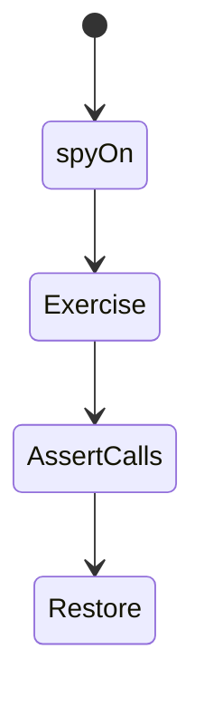
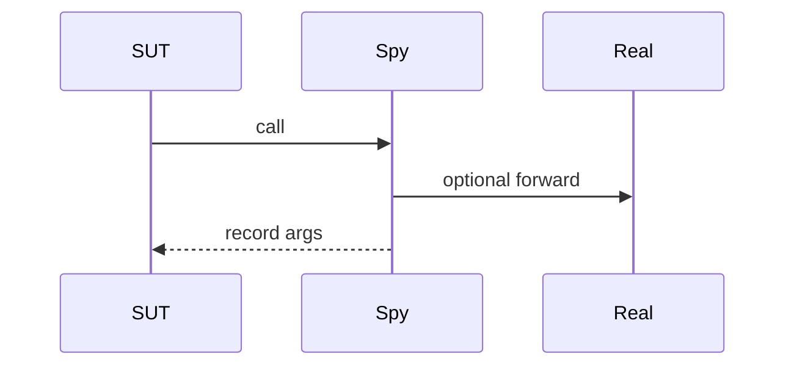

# Spying

<TopicMeta />

<Prerequisites />

::: tip Published
This page meets the handbook **published** bar: deep explanation, ≥10 common mistakes, and official references. Further engine-level errata welcome via PR.
:::

## Introduction

A **spy** wraps a function to record invocations (and optionally stub behavior). In Jest/Vitest: `jest.spyOn` / `vi.spyOn`. Spies verify interactions—analytics fired, navigator called—when return values alone are insufficient.

## Why does it exist?

Some requirements are side effects (telemetry, `navigate`). Spies assert those interactions while keeping the rest of the system real.

## Historical Background

Classical mocking frameworks popularized spies; JS runners made them first-class.

## Mental Model

Spy = observation layer. Prefer asserting **user-visible outcomes** first; spy when the side effect is the requirement.

## Internal Workflow

1. spyOn the collaborator.
2. Optionally mockImplementation.
3. Exercise SUT.
4. Assert calls/args.
5. mockRestore in afterEach.

## Lifecycle



## Browser Perspective

Spy on `window.open` / `matchMedia` carefully with cleanup.

## JavaScript Engine Perspective

Not applicable.

## React Perspective

Spy on props callbacks; prefer UI asserts when possible.

## Next.js Perspective

Not applicable.

## Server Perspective

Not applicable.

## Network Perspective

Not applicable.

## Memory Perspective

Not applicable.

## Performance

Spies are cheap; overuse signals design issues.

## Production Example

Clipboard copy button test spies `navigator.clipboard.writeText` and also asserts the “Copied” live region.

## Code Examples

```ts
import { vi, expect, it } from 'vitest'
import { track } from './analytics'
import { buy } from './buy'

it('tracks purchase', async () => {
  const spy = vi.spyOn(track, 'event').mockImplementation(() => {})
  await buy('sku_1')
  expect(spy).toHaveBeenCalledWith('purchase', { sku: 'sku_1' })
  spy.mockRestore()
})
```

## Diagrams



## Common Mistakes

1. Spying instead of asserting UI
2. Forgetting mockRestore
3. Brittle arg assertions on entire huge objects
4. Spying private internals
5. Leaving mockImplementation that leaks to other tests
6. Missing a production edge case for 16-testing.spying (#1)
7. Missing a production edge case for 16-testing.spying (#2)
8. Missing a production edge case for 16-testing.spying (#3)
9. Missing a production edge case for 16-testing.spying (#4)
10. Missing a production edge case for 16-testing.spying (#5)


## Best Practices

- Restore spies
- Assert meaningful args only
- Prefer outcome asserts when equivalent

## Anti-patterns

- Spies as the only coverage of business logic
- Global spies installed in setup files without reset

## Comparison

| Spy | Stub |
| --- | --- |
| Records calls | Returns canned data |
| May call through | Replaces behavior |

## Interview Questions

### Easy

**Q:** What is a spy?

**A:** A test double that records how a function was called, optionally changing its behavior.

### Medium

**Q:** When prefer a spy over only checking UI?

**A:** When a required side effect is not (or not yet) visible—e.g., analytics events—while still keeping UI asserts for user outcomes.

### Hard

**Q:** How can spies create false confidence?

**A:** They can lock tests to call graphs that refactor away while behavior remains correct—or pass while the real collaborator’s contract changed.

## Summary

- Spies observe interactions
- Restore and reset always
- Do not replace user-centric asserts

## References

- [Vitest — vi.spyOn](https://vitest.dev/api/vi.html#vi-spyon)
- [Jest — spyOn](https://jestjs.io/docs/jest-object#jestspyonobject-methodname)

<RelatedTopics />


Prev: [`16-testing.mocking`](/16-testing/mocking/) · Next: [`16-testing.msw`](/16-testing/msw/)
