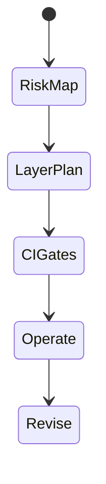
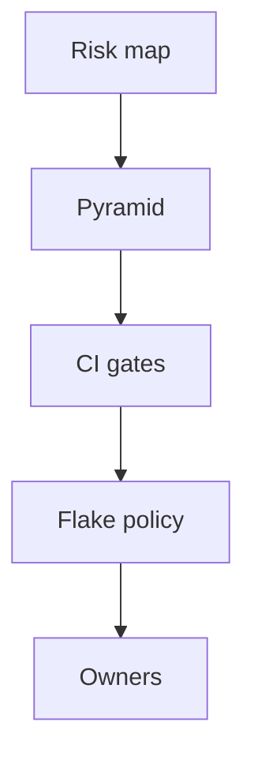

# Test Strategy

<TopicMeta />

<Prerequisites />

::: tip Published
This page meets the handbook **published** bar: deep explanation, ≥10 common mistakes, and official references. Further engine-level errata welcome via PR.
:::

## Introduction

A **test strategy** is the plan: risk areas, pyramid mix, environments, data seeding, flake policy, ownership, and CI gates. Tools are secondary; strategy decides whether tests protect users or just inflate coverage metrics.

## Why does it exist?

Without strategy, teams oscillate between “no tests” and “E2E everything.” Strategy aligns scarce minutes with business risk (payments, auth, data loss).

## Historical Background

Agile testing quadrants, Google’s test sizes, and modern frontend tooling converged on risk-based, behavior-driven suites with explicit CI budgets.

## Mental Model

For each feature: what’s the cost of failure? Map to unit/integration/E2E/visual/a11y. Define **Definition of Done** for tests, not only code.

## Internal Workflow

1. Identify critical journeys and domain invariants.
2. Assign layers and owners.
3. Set CI budgets and required checks.
4. Define flake triage SLA.
5. Review strategy quarterly as architecture changes.

## Lifecycle



## Browser Perspective

Not applicable.

## JavaScript Engine Perspective

Not applicable.

## React Perspective

Behavior tests over implementation snapshots.

## Next.js Perspective

Include SSR/hydration smoke for critical routes.

## Server Perspective

Shared staging with isolated tenants/data.

## Network Perspective

Contract tests with backend reduce UI E2E load.

## Memory Perspective

Not applicable.

## Performance

Strategy includes runtime budgets; otherwise suites grow until ignored.

## Production Example

Payments: mutation unit tests + MSW integration + 3 Playwright journeys + axe. Settings pages: integration only. Marketing: visual smoke.

## Code Examples

```ts
export const strategy = {
  critical: ['checkout', 'login'],
  prRequired: ['unit', 'integration', 'e2e-smoke', 'a11y-critical'],
  nightly: ['e2e-full', 'visual', 'cross-browser'],
}
```

## Diagrams



## Common Mistakes

1. Coverage % as the only goal
2. No flake owner
3. Testing only happy paths on critical flows
4. Strategy that ignores a11y/security
5. Copying another company’s tool list blindly
6. Missing a production edge case for 16-testing.test-strategy (#1)
7. Missing a production edge case for 16-testing.test-strategy (#2)
8. Missing a production edge case for 16-testing.test-strategy (#3)
9. Missing a production edge case for 16-testing.test-strategy (#4)
10. Missing a production edge case for 16-testing.test-strategy (#5)


## Best Practices

- Risk-based journey list
- Explicit CI budgets
- Contract tests with backend

## Anti-patterns

- Quarantine folder as permanent trash
- Blocking releases on flaky non-critical suites without fix path

## Comparison

| Bad goal | Better goal |
| --- | --- |
| 100% coverage | Critical risks covered |
| More E2E | Right-layer signal |

## Interview Questions

### Easy

**Q:** What belongs in a test strategy?

**A:** Risk areas, test layers, tooling, environments, CI gates, and flake/ownership policies.

### Medium

**Q:** How do you decide if a bug needs a new E2E?

**A:** If lower layers could not have caught it and the journey is user-critical/regression-prone; otherwise add a cheaper test.

### Hard

**Q:** Create a strategy for a monorepo with DS + two apps.

**A:** DS: unit + visual + a11y on stories. Apps: integration with MSW, smoke E2E on PR, shared contract tests, nightly cross-browser; affected-only CI.

## Summary

- Strategy beats tool collecting
- Map risk → layer → CI gate
- Operate flakes with owners and budgets

## References

- [Martin Fowler — Test Pyramid](https://martinfowler.com/articles/practical-test-pyramid.html)
- [Google Testing Blog — Test sizes](https://testing.googleblog.com/2010/12/test-sizes.html)
- [Playwright — Best practices](https://playwright.dev/docs/best-practices)

<RelatedTopics />


Prev: [`16-testing.accessibility-testing`](/16-testing/accessibility-testing/)
