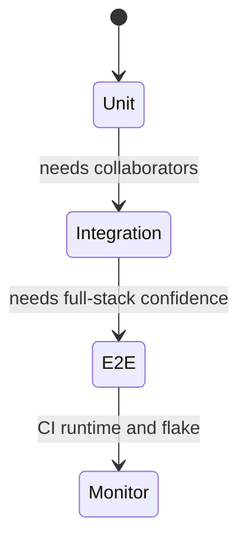
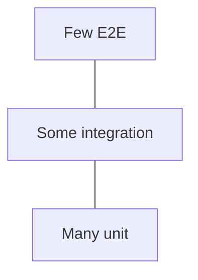

# Testing Pyramid

<TopicMeta />

<Prerequisites />

::: tip Published
This page meets the handbook **published** bar: deep explanation, ≥10 common mistakes, and official references. Further engine-level errata welcome via PR.
:::

## Introduction

The **testing pyramid** is a strategy heuristic: invest most in **fast, focused unit tests**, a solid middle of **integration tests**, and a thin top of **end-to-end (E2E)** tests. It counters the inverted “ice-cream cone” where brittle UI E2E tests dominate.

## Why does it exist?

E2E tests catch real bugs but are slow, flaky, and expensive. Unit tests are fast but can miss wiring bugs. The pyramid balances feedback speed with confidence across a frontend codebase.

## Historical Background

Mike Cohn popularized the pyramid; Google and others refined “test sizes.” Frontend adapted it with Testing Library (integration-leaning) and Playwright/Cypress at the top.

## Mental Model

Think in **cost × confidence**. Push assertions as far down the pyramid as they still give signal. Prefer user-observable behavior over private implementation details.

## Internal Workflow

1. Define critical user journeys for E2E.
2. Cover feature wiring with integration tests (UI + mocked network).
3. Unit-test pure logic and edge cases heavily.
4. Measure flakiness and runtime in CI.
5. Delete duplicate coverage that only exists at higher layers.

## Lifecycle



## Browser Perspective

E2E runs real browsers; unit tests often use jsdom.

## JavaScript Engine Perspective

Not applicable.

## React Perspective

Prefer Testing Library integration tests over shallow tests of internals.

## Next.js Perspective

Not applicable.

## Server Perspective

Contract tests with backend reduce oversized E2E matrices.

## Network Perspective

Decide per layer: MSW mocks vs staging backends.

## Memory Perspective

Not applicable.

## Performance

Keep CI under a budget: parallelize, shard E2E, fail fast on unit.

## Production Example

Checkout team: pricing functions unit-tested; cart page integration with MSW; two Playwright journeys on every PR; full browser matrix nightly.

## Code Examples

```ts
// Explicit CI budgets make the pyramid real
export const testBudgets = { unitMinutes: 3, integrationMinutes: 5, e2eMinutes: 10 }
```

## Diagrams



## Common Mistakes

1. Ice-cream cone: mostly E2E
2. Calling enzyme-style internals tests “unit tests” and stopping there
3. Zero integration tests
4. Duplicating the same assertion in unit and E2E
5. Ignoring flake rate as a first-class metric
6. Missing a production edge case for 16-testing.testing-pyramid (#1)
7. Missing a production edge case for 16-testing.testing-pyramid (#2)
8. Missing a production edge case for 16-testing.testing-pyramid (#3)
9. Missing a production edge case for 16-testing.testing-pyramid (#4)
10. Missing a production edge case for 16-testing.testing-pyramid (#5)


## Best Practices

- Risk-based journey selection for E2E
- MSW for UI integration
- Track CI time and flakes

## Anti-patterns

- Permanently disabling flaky tests without triage
- Screenshot-only “coverage”

## Comparison

| Layer | Speed | Confidence |
| --- | --- | --- |
| Unit | Fast | Local |
| Integration | Medium | Wiring |
| E2E | Slow | System |

## Interview Questions

### Easy

**Q:** What is the testing pyramid?

**A:** A strategy to have many fast unit tests, fewer integration tests, and few E2E tests to balance speed and confidence.

### Medium

**Q:** Why avoid an E2E-heavy suite?

**A:** E2E tests are slower, flakier, and costlier; they should cover critical paths while lower layers cover breadth.

### Hard

**Q:** How do you apply the pyramid in a React SPA?

**A:** Pure logic unit tests, Testing Library + MSW for pages, Playwright for a few critical journeys; assert roles/text, not CSS class names.

## Summary

- Pyramid balances speed vs confidence
- Push tests downward when signal remains
- Watch flake and CI budgets

## References

- [Martin Fowler — Test Pyramid](https://martinfowler.com/articles/practical-test-pyramid.html)
- [Testing Library guiding principles](https://testing-library.com/docs/guiding-principles)

<RelatedTopics />


Next: [`16-testing.unit-testing`](/16-testing/unit-testing/)
