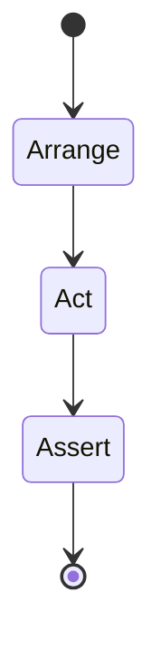

# Unit Testing

<TopicMeta />

<Prerequisites />

::: tip Published
This page meets the handbook **published** bar: deep explanation, ≥10 common mistakes, and official references. Further engine-level errata welcome via PR.
:::

## Introduction

**Unit tests** verify a small unit—usually a pure function, reducer, or schema parser—in isolation. They should be deterministic, millisecond-fast, and numerous. In UI apps, prefer unit-testing logic extracted from components rather than shallow-rendering implementation details.

## Why does it exist?

Edge cases explode combinatorially. Unit tests explore them cheaply before you pay integration/E2E costs. They also document expected behavior of domain functions.

## Historical Background

xUnit patterns → Jest in the React ecosystem → Vitest for Vite-native speed. The industry learned that “unit testing every component method” via Enzyme was brittle.

## Mental Model

Inputs → function → outputs/errors. Mock only true externalities (time, randomness, I/O). If you need a huge mock graph, it may not be a unit test.

## Internal Workflow

1. Extract pure logic from UI.
2. Table-driven cases for edges.
3. Avoid snapshot spam for logic.
4. Run on every save/PR.
5. Keep tests readable as specs.

## Lifecycle



## Browser Perspective

Not applicable for pure unit tests.

## JavaScript Engine Perspective

Tests run in Node; DOM APIs need jsdom or explicit mocks.

## React Perspective

Unit-test hooks/utilities; use Testing Library for component behavior.

## Next.js Perspective

Not applicable.

## Server Perspective

Not applicable.

## Network Perspective

Not applicable.

## Memory Perspective

Not applicable.

## Performance

Unit suites should finish in seconds. Parallelize; avoid heavy setup per test.

## Production Example

`calculateShipping(weight, zone)` has 40 table cases covering rounding and forbidden zones; caught a kg/lb bug before QA.

## Code Examples

```ts
import { describe, it, expect } from 'vitest'
import { calcDiscount } from './calcDiscount'

describe('calcDiscount', () => {
  it.each([
    [100, 10, 90],
    [0, 10, 0],
    [50, 0, 50],
  ])('price %i off %i%% => %i', (price, pct, out) => {
    expect(calcDiscount(price, pct)).toBe(out)
  })
})
```

## Diagrams


## Common Mistakes

1. Testing private implementation details
2. Over-mocking until the test asserts nothing real
3. Huge snapshots as fake unit coverage
4. Non-deterministic tests (wall clock without faking)
5. Coupling tests to CSS class strings
6. Missing a production edge case for 16-testing.unit-testing (#1)
7. Missing a production edge case for 16-testing.unit-testing (#2)
8. Missing a production edge case for 16-testing.unit-testing (#3)
9. Missing a production edge case for 16-testing.unit-testing (#4)
10. Missing a production edge case for 16-testing.unit-testing (#5)


## Best Practices

- Table-driven edge cases
- Name tests as behavior
- Keep units pure when possible

## Anti-patterns

- One test file that boots the whole app
- Shared mutable fixtures across tests without reset

## Comparison

| Unit | Integration |
| --- | --- |
| Isolated logic | Wired modules |
| Many, fast | Fewer, slower |

## Interview Questions

### Easy

**Q:** What makes a good unit test?

**A:** It is fast, deterministic, focused on one unit’s behavior, and fails for clear reasons.

### Medium

**Q:** Should every React component have unit tests?

**A:** Not necessarily—extract logic for unit tests and cover components with behavior-centric integration tests.

### Hard

**Q:** How do you unit-test time-dependent code?

**A:** Inject clocks or use fake timers; assert on behavior at controlled timestamps, never on real wall-clock sleeps.

## Summary

- Unit tests excel at pure logic and edges
- Avoid brittle UI internals tests
- Keep them fast and deterministic

## References

- [Vitest docs](https://vitest.dev/)
- [Jest docs](https://jestjs.io/docs/getting-started)

<RelatedTopics />


Prev: [`16-testing.testing-pyramid`](/16-testing/testing-pyramid/) · Next: [`16-testing.integration-testing`](/16-testing/integration-testing/)
