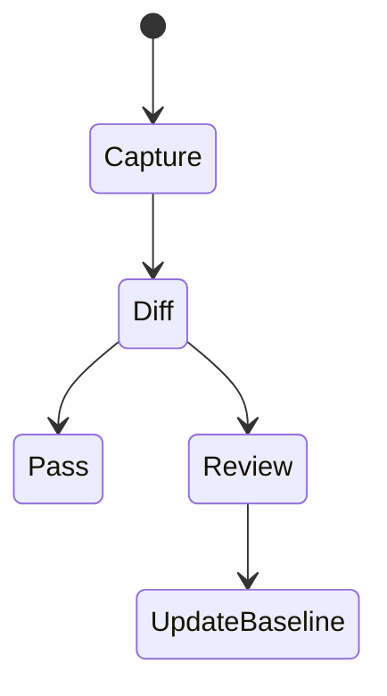
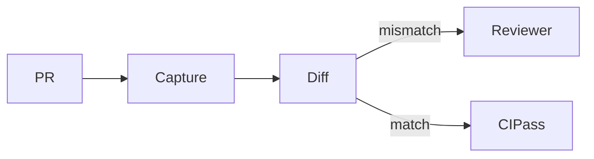

# Visual Regression

<TopicMeta />

<Prerequisites />

::: tip Published
This page meets the handbook **published** bar: deep explanation, ≥10 common mistakes, and official references. Further engine-level errata welcome via PR.
:::

## Introduction

**Visual regression testing** compares UI appearance against baselines (screenshots or DOM snapshots). It catches CSS breakages that unit tests miss—and can also create noisy failures when animations or data move.

## Why does it exist?

Many bugs are purely visual. Human QA cannot pixel-diff every PR. Automated visual checks protect design systems and critical pages.

## Historical Background

Screenshot diffs evolved from tools like Percy, Chromatic, Loki, Playwright `toHaveScreenshot`, and Storybook visual test integrations.

## Mental Model

Stabilize the pixel: freeze time, fonts, viewport, and data. Diff against a reviewed baseline. Treat intentional changes as baseline updates, not permanent ignores.

## Internal Workflow

1. Choose surfaces (Storybook stories or critical routes).
2. Stabilize (disable animations, seed data).
3. Capture baselines.
4. Review diffs in PRs.
5. Update baselines deliberately.

## Lifecycle



## Browser Perspective

Engine/font differences need consistent CI images.

## JavaScript Engine Perspective

Not applicable.

## React Perspective

Storybook stories are ideal visual units.

## Next.js Perspective

Watch hydration-only visual flashes—test settled UI.

## Server Perspective

Not applicable.

## Network Perspective

Not applicable.

## Memory Perspective

Not applicable.

## Performance

Run on changed stories/routes; full matrix nightly.

## Production Example

Design system uses Chromatic on Storybook; app uses Playwright screenshots for checkout header only.

## Code Examples

```ts
import { test, expect } from '@playwright/test'

test('pricing visual', async ({ page }) => {
  await page.goto('/pricing')
  await expect(page).toHaveScreenshot('pricing.png')
})
```

## Diagrams



## Common Mistakes

1. Unstabilized animations causing flakes
2. Updating baselines blindly
3. Screenshotting dynamic timestamps
4. Visual tests for every tiny component without ownership
5. Different OS fonts locally vs CI
6. Missing a production edge case for 16-testing.visual-regression (#1)
7. Missing a production edge case for 16-testing.visual-regression (#2)
8. Missing a production edge case for 16-testing.visual-regression (#3)
9. Missing a production edge case for 16-testing.visual-regression (#4)
10. Missing a production edge case for 16-testing.visual-regression (#5)


## Best Practices

- Stabilize viewport/fonts/time
- Review diffs as design review
- Scope to high-value surfaces

## Anti-patterns

- Huge full-app screenshots as only QA
- Hiding diffs with absurd thresholds

## Comparison

| Approach | Pros |
| --- | --- |
| Storybook visual | Component-level |
| Playwright screenshots | Real routes |
| Cloud (Chromatic/Percy) | Review UX |

## Interview Questions

### Easy

**Q:** What is visual regression testing?

**A:** Automated comparison of UI screenshots/baselines to detect unintended visual changes.

### Medium

**Q:** How do you reduce visual flake?

**A:** Disable animations, freeze data/time, consistent CI environment, and mask dynamic regions.

### Hard

**Q:** Where does visual testing fit in the pyramid?

**A:** Near E2E/component layers—few high-value baselines, not a replacement for unit/integration logic tests.

## Summary

- Visual diffs catch CSS regressions
- Stabilize or flake
- Review baselines intentionally

## References

- [Playwright — Visual comparisons](https://playwright.dev/docs/test-snapshots)
- [Storybook — Visual testing](https://storybook.js.org/docs/writing-tests/visual-testing)

<RelatedTopics />


Prev: [`16-testing.msw`](/16-testing/msw/) · Next: [`16-testing.accessibility-testing`](/16-testing/accessibility-testing/)
