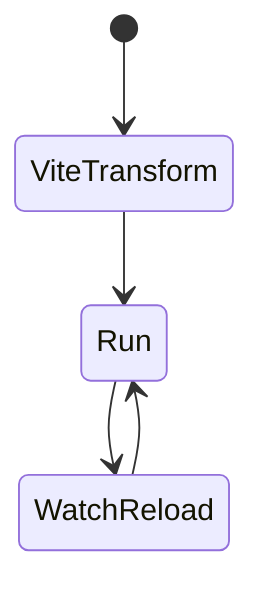
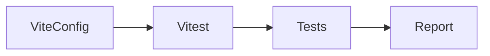

# Vitest

<TopicMeta />

<Prerequisites />

::: tip Published
This page meets the handbook **published** bar: deep explanation, ≥10 common mistakes, and official references. Further engine-level errata welcome via PR.
:::

## Introduction

**Vitest** is a test runner built on Vite’s transform pipeline. It offers Jest-like `expect`, `vi.fn`, and watch mode, with excellent ESM/TypeScript DX—now the default choice for many Vite/React projects.

## Why does it exist?

Jest’s transform stack can be slow or awkward in pure ESM/Vite repos. Vitest reuses Vite config/plugins so tests match production transforms.

## Historical Background

Created in the Vite ecosystem to be “Jest-compatible, Vite-powered.” Rapidly adopted alongside Vite 2–5.

## Mental Model

Same testing habits as Jest, different engine: Vite handles transforms; `vi` is the mock namespace; threads/vmForks pool runs files.

## Internal Workflow

1. Add `vitest` + config aligned with Vite.
2. Use `describe/it/expect/vi`.
3. jsdom/happy-dom for DOM tests.
4. `vitest --coverage` as needed.
5. Migrate Jest mocks `jest.*` → `vi.*`.

## Lifecycle



## Browser Perspective

DOM environments are simulated unless using browser mode.

## JavaScript Engine Perspective

Not applicable.

## React Perspective

Works with Testing Library identically to Jest setups.

## Next.js Perspective

Next apps may still use Jest; Vitest is natural for Vite SPAs and libraries.

## Server Perspective

Not applicable.

## Network Perspective

Not applicable.

## Memory Perspective

Not applicable.

## Performance

Watch mode and transform cache make TDD snappy; shard in CI.

## Production Example

Design-system package runs Vitest in watch locally and CI with coverage thresholds on utilities.

## Code Examples

```ts
import { describe, it, expect, vi } from 'vitest'

describe('add', () => {
  it('adds', () => {
    const spy = vi.fn((a: number, b: number) => a + b)
    expect(spy(2, 3)).toBe(5)
    expect(spy).toHaveBeenCalledOnce()
  })
})
```

## Diagrams



## Common Mistakes

1. Duplicating Vite config incorrectly so tests diverge from app
2. Forgetting cleanup from Testing Library
3. Assuming browser-only APIs exist without polyfills
4. Mixing Jest globals without globals config
5. Overusing snapshots
6. Missing a production edge case for 16-testing.vitest (#1)
7. Missing a production edge case for 16-testing.vitest (#2)
8. Missing a production edge case for 16-testing.vitest (#3)
9. Missing a production edge case for 16-testing.vitest (#4)
10. Missing a production edge case for 16-testing.vitest (#5)


## Best Practices

- Share Vite plugins/aliases with app
- Use vi.mocked for typed mocks
- Prefer happy-dom/jsdom consciously

## Anti-patterns

- Starting a real browser for unit tests
- Global mutable state across files without isolation

## Comparison

| Vitest | Jest |
| --- | --- |
| Vite transforms | Own transforms |
| vi API | jest API |
| Great for Vite | Ubiquitous legacy |

## Interview Questions

### Easy

**Q:** Why choose Vitest with Vite?

**A:** It reuses Vite’s pipeline for fast, consistent transforms and Jest-like DX.

### Medium

**Q:** What is `vi.fn`?

**A:** Vitest’s mock function API, analogous to jest.fn, for spying and stubbing.

### Hard

**Q:** How do you migrate a Jest suite to Vitest?

**A:** Swap config, replace jest with vi, align module mocking/ESM settings, fix env differences, keep Testing Library tests mostly unchanged.

## Summary

- Vitest is Vite-native and Jest-like
- Align test transforms with app
- Use vi for mocks/spies

## References

- [Vitest documentation](https://vitest.dev/guide/)
- [Vitest mocking](https://vitest.dev/guide/mocking.html)

<RelatedTopics />


Prev: [`16-testing.jest`](/16-testing/jest/) · Next: [`16-testing.react-testing-library`](/16-testing/react-testing-library/)
