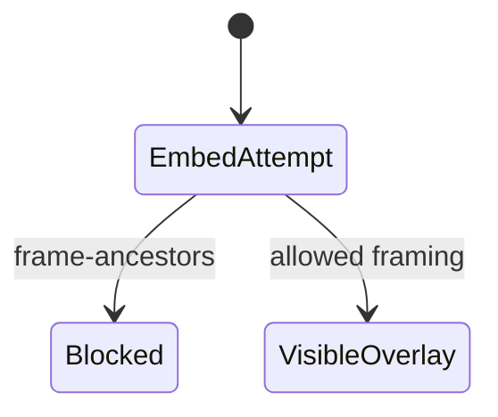
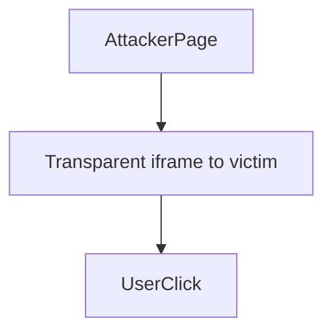

# Clickjacking

<TopicMeta />

<Prerequisites />

::: tip Published
This page meets the handbook **published** bar: deep explanation, ≥10 common mistakes, and official references. Further engine-level errata welcome via PR.
:::

## Introduction

**Clickjacking** tricks users into clicking hidden UI under a decoy (usually via iframe overlay). Mitigate by controlling who can embed your pages (`frame-ancestors`, `X-Frame-Options`) and careful UX for sensitive actions.

## Why does it exist?

Users think they click “play video” but hit “Delete account” underneath.

## Historical Background

Classic 2000s attack; CSP `frame-ancestors` supersedes older headers in modern stacks.

## Mental Model

If your page can be framed by an attacker, they can overlay it. Deny framing by default; allow only trusted ancestors.

## Internal Workflow

1. Set `Content-Security-Policy: frame-ancestors 'none'` (or allowlist).
2. Keep `X-Frame-Options` for legacy.
3. Use re-auth for sensitive actions.
4. Test embedding intentionally if product requires it.
5. Avoid relying only on JS frame-busting.

## Lifecycle



## Browser Perspective

Enforces frame-ancestors / XFO.

## JavaScript Engine Perspective

Not applicable.

## React Perspective

Sensitive confirmations should not be one-click without context.

## Next.js Perspective

Not applicable.

## Server Perspective

Not applicable.

## Network Perspective

Headers from server/CDN.

## Memory Perspective

Not applicable.

## Performance

Negligible.

## Production Example

Admin app `frame-ancestors none`; marketing pages allow only the corporate CMS origin.

## Code Examples

```http
Content-Security-Policy: frame-ancestors 'none'
X-Frame-Options: DENY
```

## Diagrams



## Common Mistakes

1. JS-only frame busting
2. Allowing all framing
3. Forgetting admin sites
4. Only XFO without CSP on modern browsers needing ancestors allowlists
5. No step-up auth on dangerous actions
6. Missing a production edge case for 17-security.clickjacking (#1)
7. Missing a production edge case for 17-security.clickjacking (#2)
8. Missing a production edge case for 17-security.clickjacking (#3)
9. Missing a production edge case for 17-security.clickjacking (#4)
10. Missing a production edge case for 17-security.clickjacking (#5)


## Best Practices

- frame-ancestors default none
- Allowlist embeds explicitly
- Re-auth for destructive actions

## Anti-patterns

- wildcard frame-ancestors
- Relying on visual tricks alone

## Comparison

| X-Frame-Options | frame-ancestors |
| --- | --- |
| Older | CSP modern, allowlists |

## Interview Questions

### Easy

**Q:** What is clickjacking?

**A:** Tricking users into clicking hidden UI, often via transparent iframes.

### Medium

**Q:** Best header mitigation?

**A:** CSP frame-ancestors (and X-Frame-Options for legacy) to control embedding.

### Hard

**Q:** Product must be embeddable in partner sites—how secure it?

**A:** Explicit frame-ancestors allowlist, signed embed tokens, sandbox where possible, and sensitive actions require re-auth that cannot be completed unnoticed.

## Summary

- Deny framing by default
- CSP frame-ancestors is key
- Step-up auth for sensitive actions

## References

- [OWASP Clickjacking](https://owasp.org/www-community/attacks/Clickjacking)
- [MDN — X-Frame-Options](https://developer.mozilla.org/en-US/docs/Web/HTTP/Headers/X-Frame-Options)
- [CSP frame-ancestors](https://developer.mozilla.org/en-US/docs/Web/HTTP/Headers/Content-Security-Policy/frame-ancestors)

<RelatedTopics />


Prev: [`17-security.https-security`](/17-security/https-security/) · Next: [`17-security.prototype-pollution`](/17-security/prototype-pollution/)
