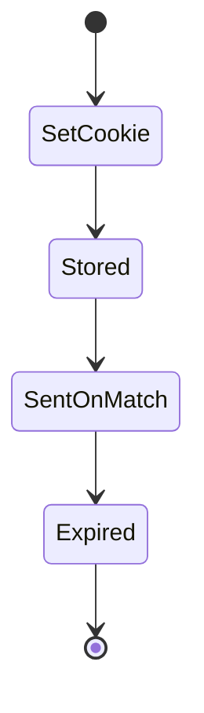
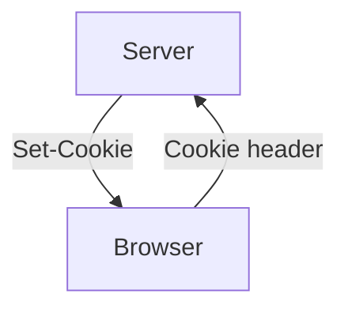

# Cookies Security

<TopicMeta />

<Prerequisites />

::: tip Published
This page meets the handbook **published** bar: deep explanation, ≥10 common mistakes, and official references. Further engine-level errata welcome via PR.
:::

## Introduction

Cookies are the browser’s credential store for many web apps. Security hinges on attributes: **Secure**, **HttpOnly**, **SameSite**, **Domain**, **Path**, **Priority**, and prefixes (`__Host-`). Misconfiguration enables theft or CSRF.

## Why does it exist?

Cookies are auto-sent; they are powerful and dangerous. Frontend engineers must understand what JS can and cannot read.

## Historical Background

Cookie spec evolved with SameSite defaults changing across browsers to mitigate CSRF.

## Mental Model

HttpOnly → not readable by JS (XSS harder to steal). Secure → HTTPS only. SameSite → cross-site sending rules. Scope (Domain/Path) → where they go.

## Internal Workflow

1. Session cookies: Secure + HttpOnly + appropriate SameSite.
2. Prefer `__Host-` prefix when possible.
3. Minimize Domain breadth.
4. Short lifetimes + rotation.
5. Clear on logout.

## Lifecycle



## Browser Perspective

Stores and attaches cookies by policy.

## JavaScript Engine Perspective

Not applicable.

## React Perspective

JS cannot read HttpOnly—good.

## Next.js Perspective

Not applicable.

## Server Perspective

Must set attributes; frontend cannot “fix” HttpOnly via JS.

## Network Perspective

Set-Cookie on responses; Cookie on requests.

## Memory Perspective

Not applicable.

## Performance

Too many cookies bloat requests—keep small.

## Production Example

Session: `Set-Cookie: __Host-session=...; Path=/; Secure; HttpOnly; SameSite=Lax`.

## Code Examples

```http
Set-Cookie: __Host-session=abc; Path=/; Secure; HttpOnly; SameSite=Lax; Max-Age=3600
```

## Diagrams



## Common Mistakes

1. Session cookie without HttpOnly
2. Broad Domain=.example.com unnecessarily
3. Secure missing on HTTPS sites
4. Using cookies for huge JWTs
5. Assuming SameSite=Lax stops all CSRF
6. Missing a production edge case for 17-security.cookies-security (#1)
7. Missing a production edge case for 17-security.cookies-security (#2)
8. Missing a production edge case for 17-security.cookies-security (#3)
9. Missing a production edge case for 17-security.cookies-security (#4)
10. Missing a production edge case for 17-security.cookies-security (#5)


## Best Practices

- HttpOnly + Secure session
- __Host- prefix when possible
- Tight Path/Domain

## Anti-patterns

- Document.cookie session tokens
- Forever Max-Age sessions without rotation

## Comparison

| Attribute | Effect |
| --- | --- |
| HttpOnly | Hide from JS |
| Secure | HTTPS only |
| SameSite | Cross-site send rules |

## Interview Questions

### Easy

**Q:** What does HttpOnly do?

**A:** Prevents JavaScript from reading the cookie, mitigating token theft via XSS.

### Medium

**Q:** What is the __Host- prefix requirement?

**A:** Cookie must be Secure, Path=/, no Domain attribute—binds tightly to the host.

### Hard

**Q:** Cookie design for SPA + API on sibling subdomains.

**A:** Avoid overly broad Domain; prefer BFF same-site host; if cross-subdomain needed, threat-model CSRF/XSS carefully with SameSite and CSRF tokens.

## Summary

- Cookie attributes are security controls
- HttpOnly+Secure+SameSite baseline
- Minimize scope and lifetime

## References

- [MDN — Set-Cookie](https://developer.mozilla.org/en-US/docs/Web/HTTP/Headers/Set-Cookie)
- [RFC 6265bis / cookie prefixes](https://datatracker.ietf.org/doc/html/draft-ietf-httpbis-rfc6265bis)
- [OWASP Session Management](https://cheatsheetseries.owasp.org/cheatsheets/Session_Management_Cheat_Sheet.html)

<RelatedTopics />


Prev: [`17-security.oidc`](/17-security/oidc/) · Next: [`17-security.samesite`](/17-security/samesite/)
