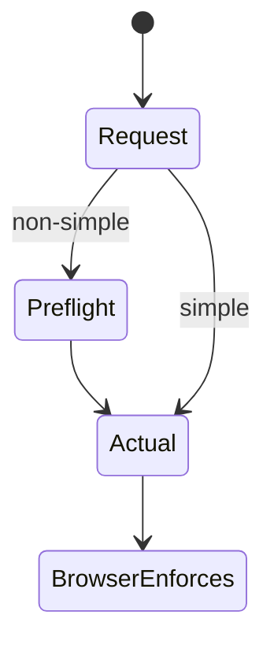
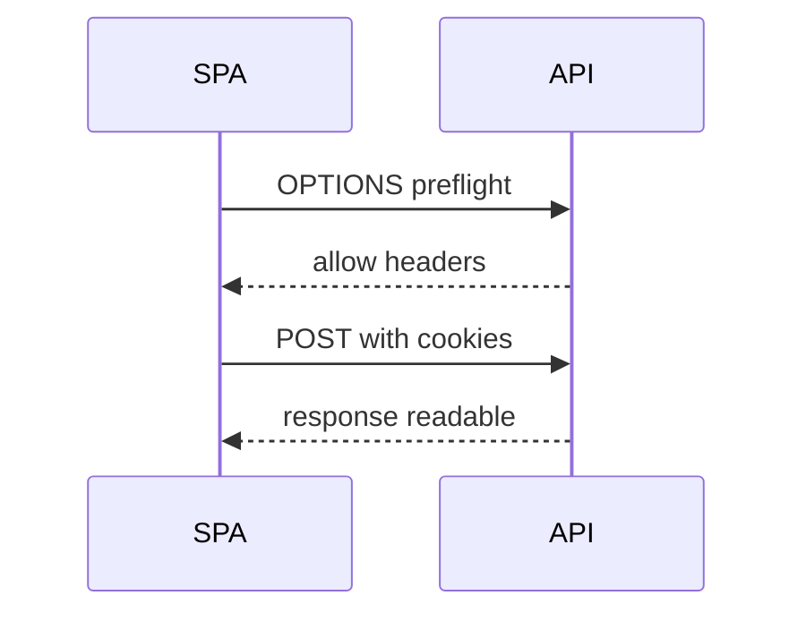

# CORS

<TopicMeta />

<Prerequisites />

::: tip Published
This page meets the handbook **published** bar: deep explanation, ≥10 common mistakes, and official references. Further engine-level errata welcome via PR.
:::

## Introduction

**CORS** is a browser mechanism that relaxes the same-origin policy for **controlled** cross-origin access. Servers opt in via headers (`Access-Control-Allow-Origin`, etc.). CORS is not an authorization framework and does not protect a public API from non-browser clients.

## Why does it exist?

SPAs on `app.example.com` calling `api.example.com` need explicit CORS. Misconfiguration either breaks apps or uses `*` with credentials unsafely.

## Historical Background

Same-origin policy predates CORS; CORS standardized safe cross-origin XHR/fetch.

## Mental Model

Simple requests vs **preflighted** requests (custom headers, non-simple methods). Credentialed requests cannot use `*` ACAO. Browsers enforce; curl does not.

## Internal Workflow

1. List legitimate web origins.
2. Configure ACAO/ACAC/methods/headers.
3. Handle OPTIONS preflights.
4. Never reflect arbitrary Origin blindly without allowlist.
5. Test from real browsers.

## Lifecycle



## Browser Perspective

Only browsers enforce CORS.

## JavaScript Engine Perspective

Not applicable.

## React Perspective

fetch credentials mode must match server ACAC.

## Next.js Perspective

Not applicable.

## Server Perspective

Allowlists over wildcards for credentialed APIs.

## Network Perspective

Preflight adds OPTIONS latency.

## Memory Perspective

Not applicable.

## Performance

Cache preflights with Access-Control-Max-Age; minimize custom headers.

## Production Example

API allowlists https://app.example.com with credentials; staging origin separate; rejects unknown Origin.

## Code Examples

```http
Access-Control-Allow-Origin: https://app.example.com
Access-Control-Allow-Credentials: true
Access-Control-Allow-Headers: Content-Type, X-CSRF-Token
Access-Control-Allow-Methods: GET,POST,PUT,DELETE
```

## Diagrams



## Common Mistakes

1. `Access-Control-Allow-Origin: *` with credentials
2. Reflecting any Origin
3. Thinking CORS protects the API from Postman
4. Forgetting preflight for custom headers
5. Using CORS as CSRF defense
6. Missing a production edge case for 17-security.cors (#1)
7. Missing a production edge case for 17-security.cors (#2)
8. Missing a production edge case for 17-security.cors (#3)
9. Missing a production edge case for 17-security.cors (#4)
10. Missing a production edge case for 17-security.cors (#5)


## Best Practices

- Explicit origin allowlists
- Separate envs
- Minimize credentialed cross-origin surface

## Anti-patterns

- Null origin acceptance for everyone
- Disabling SOP via browser flags in prod support advice

## Comparison

| SOP | CORS |
| --- | --- |
| Default deny cross-origin reads | Server-opt-in exceptions |

## Interview Questions

### Easy

**Q:** What problem does CORS solve?

**A:** It allows browsers to permit controlled cross-origin access that the same-origin policy would otherwise block for web pages.

### Medium

**Q:** When is a preflight sent?

**A:** When a request is not “simple”—e.g., custom headers or methods like PUT—browsers send OPTIONS first.

### Hard

**Q:** Why is reflecting Origin dangerous?

**A:** Any malicious site could obtain ACAO for itself and read credentialed responses if ACAC is true—effectively bypassing SOP for victims.

## Summary

- CORS is browser-enforced opt-in
- Not API authorization
- Allowlist origins for credentials

## References

- [MDN — CORS](https://developer.mozilla.org/en-US/docs/Web/HTTP/CORS)
- [Fetch Standard — CORS](https://fetch.spec.whatwg.org/#http-cors-protocol)

<RelatedTopics />


Prev: [`17-security.csrf`](/17-security/csrf/) · Next: [`17-security.csp`](/17-security/csp/)
