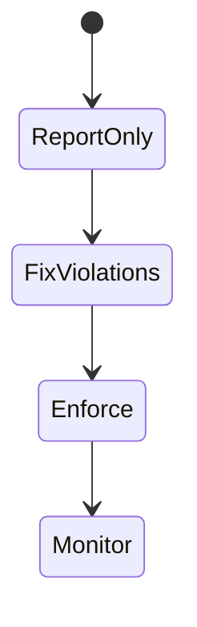
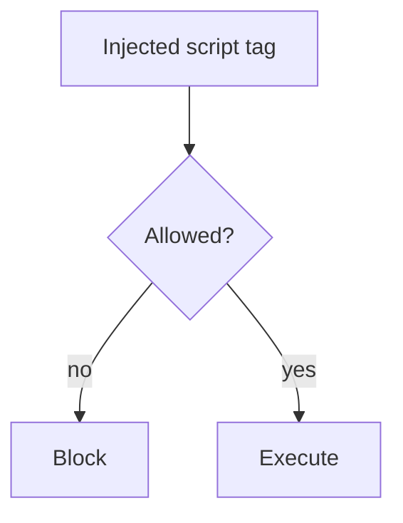

# Content Security Policy

<TopicMeta />

<Prerequisites />

::: tip Published
This page meets the handbook **published** bar: deep explanation, ≥10 common mistakes, and official references. Further engine-level errata welcome via PR.
:::

## Introduction

**Content Security Policy (CSP)** tells browsers which sources may load scripts, styles, images, frames, etc. A strict CSP (nonces/hashes, no `unsafe-inline`) significantly raises the cost of XSS exploitation.

## Why does it exist?

Encoding bugs happen. CSP is defense-in-depth that blocks many injected scripts even if they reach HTML.

## Historical Background

CSP Level 1–3 evolved toward nonces, strict-dynamic, and better reporting. Adoption is uneven because third-party scripts often demand looseness.

## Mental Model

Default-deny then allow. Prefer **nonces/hashes** for scripts over broad CDNs. `report-uri`/`report-to` for monitoring. Start with Report-Only.

## Internal Workflow

1. Inventory script/style sources.
2. Draft Report-Only policy.
3. Fix violations (remove inline, add nonces).
4. Enforce gradually.
5. Monitor reports.

## Lifecycle



## Browser Perspective

Enforcement is in the browser; unsupported directives are ignored carefully.

## JavaScript Engine Perspective

Not applicable.

## React Perspective

Frameworks can emit nonces for inline hydration scripts (Next has CSP guidance).

## Next.js Perspective

Middleware can set CSP with nonces per request.

## Server Perspective

Not applicable.

## Network Perspective

Deliver via HTTP headers (preferred over meta).

## Memory Perspective

Not applicable.

## Performance

Fewer third-party scripts improves security and performance together.

## Production Example

App CSP: default-src self; script-src nonce + strict-dynamic; object-src none; base-uri self; frame-ancestors none.

## Code Examples

```http
Content-Security-Policy: default-src 'self'; script-src 'nonce-rAnd0m' 'strict-dynamic'; object-src 'none'; base-uri 'self'; frame-ancestors 'none'
```

## Diagrams



## Common Mistakes

1. `unsafe-inline` everywhere
2. Enforcing without Report-Only first
3. Allowing wildcard https:
4. Ignoring CSP reports
5. Meta CSP when header needed for frame-ancestors
6. Missing a production edge case for 17-security.csp (#1)
7. Missing a production edge case for 17-security.csp (#2)
8. Missing a production edge case for 17-security.csp (#3)
9. Missing a production edge case for 17-security.csp (#4)
10. Missing a production edge case for 17-security.csp (#5)


## Best Practices

- Nonces/hashes
- Report-Only rollout
- frame-ancestors for clickjacking defense

## Anti-patterns

- Copy-paste CSP from a blog without inventory
- Disabling CSP for one vendor permanently

## Comparison

| Weak CSP | Strict CSP |
| --- | --- |
| Many CDNs + unsafe-inline | Nonces + minimal sources |

## Interview Questions

### Easy

**Q:** What does CSP protect against?

**A:** Primarily XSS and some injection/loading abuses by restricting resource sources.

### Medium

**Q:** Why prefer nonces over unsafe-inline?

**A:** Nonces allow specific inline scripts you emit while blocking attacker-injected inline scripts without the nonce.

### Hard

**Q:** How do you CSP a Next.js app with third-party analytics?

**A:** Per-request nonces, minimize vendors, use strict-dynamic carefully, isolate analytics, Report-Only first, measure violations.

## Summary

- CSP restricts what the page can load/execute
- Prefer nonces; avoid unsafe-inline
- Roll out with reporting

## References

- [MDN — CSP](https://developer.mozilla.org/en-US/docs/Web/HTTP/CSP)
- [OWASP CSP Cheat Sheet](https://cheatsheetseries.owasp.org/cheatsheets/Content_Security_Policy_Cheat_Sheet.html)
- [CSP Level 3](https://www.w3.org/TR/CSP3/)

<RelatedTopics />


Prev: [`17-security.cors`](/17-security/cors/) · Next: [`17-security.jwt`](/17-security/jwt/)
