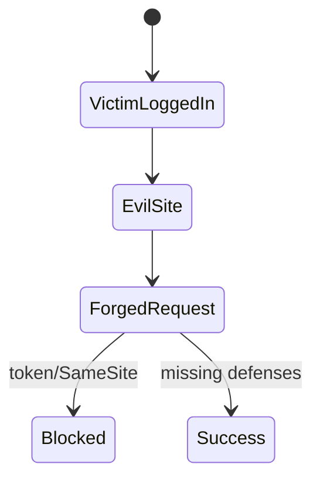
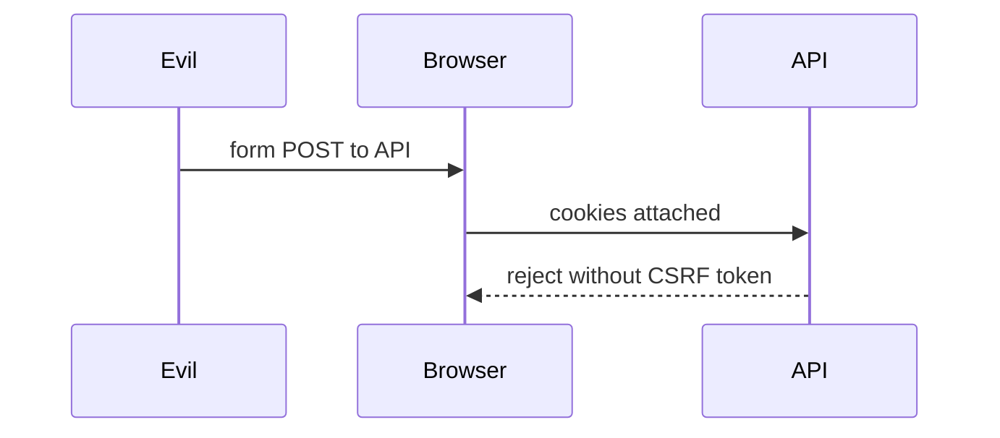

# CSRF

<TopicMeta />

<Prerequisites />

::: tip Published
This page meets the handbook **published** bar: deep explanation, ≥10 common mistakes, and official references. Further engine-level errata welcome via PR.
:::

## Introduction

**CSRF** abuses the browser’s automatic credential sending (cookies) so a malicious site triggers state-changing requests as the victim. Mitigations: **SameSite cookies**, **CSRF tokens**, and avoiding cookie auth for pure Bearer-header APIs (with XSS trade-offs).

## Why does it exist?

Users stay logged into your site; browsers attach cookies on navigations and many requests. Without CSRF defenses, “one click on evil.com” can change email or transfer funds.

## Historical Background

Classic vulnerability for cookie-session apps. SameSite=Lax/Strict reduced many cases; tokens remain important for stricter APIs and older browsers.

## Mental Model

Forgery works when the browser authenticates automatically and the server cannot distinguish intent. Tokens / custom headers prove the request came from your app.

## Internal Workflow

1. Identify cookie-authenticated state changes.
2. Set SameSite appropriately.
3. Add synchronizer tokens or double-submit patterns.
4. Reject unsafe content-types as needed.
5. Test with cross-origin form posts.

## Lifecycle



## Browser Perspective

SameSite and CORS interact; form POST is a classic CSRF vector.

## JavaScript Engine Perspective

Not applicable.

## React Perspective

SPA fetch must include tokens if cookie-sessioned.

## Next.js Perspective

Not applicable.

## Server Perspective

Validation is server-side only.

## Network Perspective

Custom headers (e.g., X-CSRF-Token) trigger preflights from foreign origins.

## Memory Perspective

Not applicable.

## Performance

Token checks are cheap vs breach cost.

## Production Example

Session cookie SameSite=Lax; mutating API requires CSRF header matching server secret; login flow tested cross-site.

## Code Examples

```ts
await fetch('/api/transfer', {
  method: 'POST',
  credentials: 'include',
  headers: {
    'Content-Type': 'application/json',
    'X-CSRF-Token': csrfTokenFromCookieOrMeta,
  },
  body: JSON.stringify({ amount: 10 }),
})
```

## Diagrams



## Common Mistakes

1. Assuming CORS alone stops CSRF
2. SameSite=None without Secure and threat review
3. CSRF tokens only on GET
4. Exposing tokens to third-party scripts
5. State-changing GET requests
6. Missing a production edge case for 17-security.csrf (#1)
7. Missing a production edge case for 17-security.csrf (#2)
8. Missing a production edge case for 17-security.csrf (#3)
9. Missing a production edge case for 17-security.csrf (#4)
10. Missing a production edge case for 17-security.csrf (#5)


## Best Practices

- SameSite for cookies
- CSRF tokens on mutations
- No state change via GET

## Anti-patterns

- Relying on secret URLs
- Only checking Referer (brittle)

## Comparison

| Cookie session | Bearer in memory |
| --- | --- |
| CSRF risk high | CSRF low; XSS risk higher if token in JS |

## Interview Questions

### Easy

**Q:** What is CSRF?

**A:** An attack where a malicious site causes the victim’s browser to send authenticated requests to another site.

### Medium

**Q:** Why doesn’t CORS prevent classic form CSRF?

**A:** Simple form POSTs are not subject to CORS preflight in the same way; the browser still sends the request; CORS limits JS reading the response, not the server action.

### Hard

**Q:** Design CSRF protection for a SPA with cookie sessions.

**A:** SameSite=Lax/Strict cookies, CSRF token on mutations (header), Secure/HttpOnly session cookie, reject unsafe methods without token, test cross-site posts.

## Summary

- CSRF abuses automatic cookie auth
- SameSite + tokens
- Server must enforce

## References

- [OWASP CSRF](https://owasp.org/www-community/attacks/csrf)
- [OWASP CSRF Prevention Cheat Sheet](https://cheatsheetseries.owasp.org/cheatsheets/Cross-Site_Request_Forgery_Prevention_Cheat_Sheet.html)

<RelatedTopics />


Prev: [`17-security.xss`](/17-security/xss/) · Next: [`17-security.cors`](/17-security/cors/)
