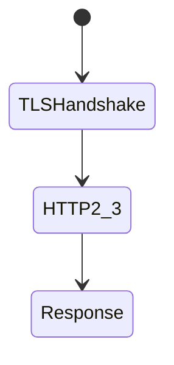
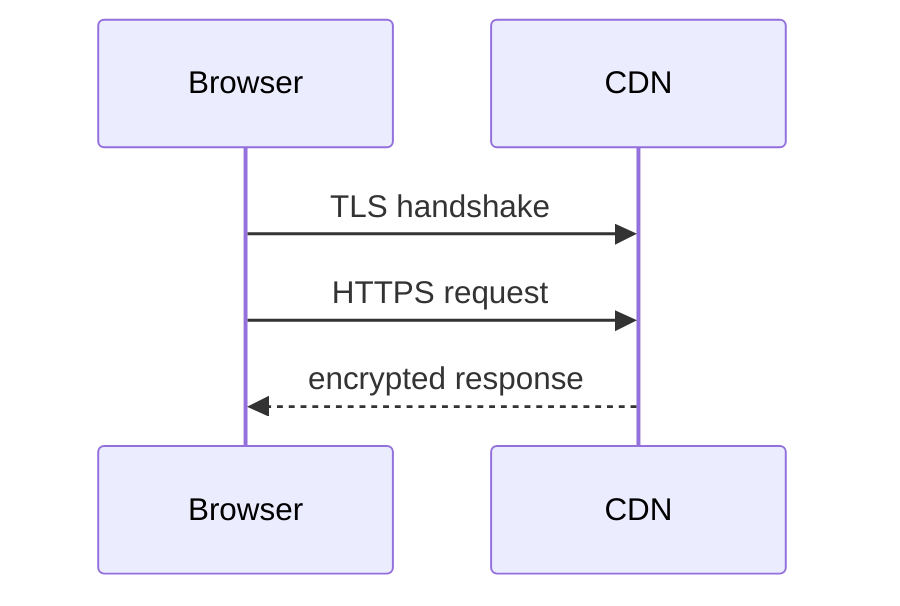

# HTTPS Security

<TopicMeta />

<Prerequisites />

::: tip Published
This page meets the handbook **published** bar: deep explanation, ≥10 common mistakes, and official references. Further engine-level errata welcome via PR.
:::

## Introduction

**HTTPS** wraps HTTP in TLS so data is encrypted and authenticated in transit. Frontends must avoid mixed content, use HSTS, and treat certificate errors as fatal—not something users should click through.

## Why does it exist?

Without TLS, attackers on the network can steal cookies/tokens and rewrite scripts (MITM).

## Historical Background

HTTPS became default via Let’s Encrypt, browser warnings, and SEO ranking. HTTP is legacy.

## Mental Model

TLS provides confidentiality + integrity + server authentication. HSTS forces HTTPS on future visits. Mixed active content is blocked.

## Internal Workflow

1. Serve site only over HTTPS.
2. Redirect HTTP→HTTPS.
3. Enable HSTS (carefully).
4. Fix mixed content.
5. Keep cert renewals automated.

## Lifecycle



## Browser Perspective

Padlock UX; mixed content blocking.

## JavaScript Engine Perspective

Not applicable.

## React Perspective

Absolute http:// asset URLs break secure pages.

## Next.js Perspective

Not applicable.

## Server Perspective

Not applicable.

## Network Perspective

TLS termination at CDN/load balancer common.

## Memory Perspective

Not applicable.

## Performance

TLS is cheap with modern HTTP/2/3; not a reason to skip HTTPS.

## Production Example

Cloudflare/Vercel terminates TLS; HSTS preload for apex; CI checks for mixed content.

## Code Examples

```http
Strict-Transport-Security: max-age=31536000; includeSubDomains; preload
```

## Diagrams



## Common Mistakes

1. Mixed content scripts
2. HSTS preload without full HTTPS on subdomains
3. Self-signed in production
4. Allowing TLS downgrade links in emails
5. Disabling cert validation in mobile apps talking to API
6. Missing a production edge case for 17-security.https-security (#1)
7. Missing a production edge case for 17-security.https-security (#2)
8. Missing a production edge case for 17-security.https-security (#3)
9. Missing a production edge case for 17-security.https-security (#4)
10. Missing a production edge case for 17-security.https-security (#5)


## Best Practices

- HTTPS everywhere
- HSTS after readiness
- Automate cert renewal

## Anti-patterns

- “Just click advanced / proceed” support guidance
- Loading analytics over http

## Comparison

| HTTP | HTTPS |
| --- | --- |
| Cleartext | TLS protected |
| Easy MITM | Mitigates network attackers |

## Interview Questions

### Easy

**Q:** Why HTTPS?

**A:** To encrypt and authenticate traffic so network attackers cannot read or modify requests/responses easily.

### Medium

**Q:** What is mixed content?

**A:** HTTPS page loading insecure HTTP active resources; browsers block active mixed content because it undermines TLS.

### Hard

**Q:** HSTS preload risks?

**A:** If any subdomain is not HTTPS-ready, you can brick access; require complete inventory before preload.

## Summary

- HTTPS is mandatory baseline
- Fix mixed content; use HSTS carefully
- Automate certificates

## References

- [MDN — HTTPS](https://developer.mozilla.org/en-US/docs/Glossary/HTTPS)
- [MDN — HSTS](https://developer.mozilla.org/en-US/docs/Web/HTTP/Headers/Strict-Transport-Security)
- [OWASP Transport Layer Protection](https://cheatsheetseries.owasp.org/cheatsheets/Transport_Layer_Protection_Cheat_Sheet.html)

<RelatedTopics />


Prev: [`17-security.secure-cookies`](/17-security/secure-cookies/) · Next: [`17-security.clickjacking`](/17-security/clickjacking/)
