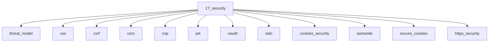

# Security

## Scope

Frontend threat model, browser security controls, and auth tokens

## Prerequisites

See the learning paths and each topic's prerequisites in the registry.

## Topics in order

- [Threat Model](/17-security/threat-model/) — mid, ~30 min
- [XSS](/17-security/xss/) — mid, ~40 min
- [CSRF](/17-security/csrf/) — mid, ~35 min
- [CORS](/17-security/cors/) — mid, ~40 min
- [Content Security Policy](/17-security/csp/) — mid, ~35 min
- [JWT](/17-security/jwt/) — mid, ~35 min
- [OAuth](/17-security/oauth/) — mid, ~40 min
- [OIDC](/17-security/oidc/) — mid, ~30 min
- [Cookies Security](/17-security/cookies-security/) — mid, ~30 min
- [SameSite](/17-security/samesite/) — mid, ~25 min
- [Secure Cookies](/17-security/secure-cookies/) — mid, ~20 min
- [HTTPS Security](/17-security/https-security/) — junior, ~25 min
- [Clickjacking](/17-security/clickjacking/) — mid, ~20 min
- [Prototype Pollution](/17-security/prototype-pollution/) — senior, ~30 min
- [Supply Chain Security](/17-security/supply-chain-security/) — mid, ~30 min
- [Secrets in the Frontend](/17-security/secrets-in-frontend/) — junior, ~20 min

## Module knowledge graph

## Suggested learning paths

Browse [Learning Paths](/learning-paths/).
