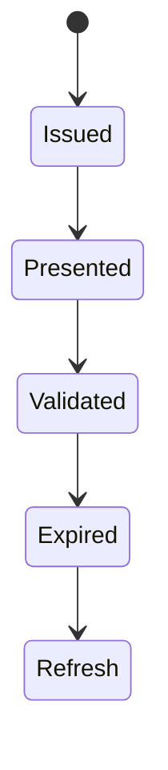
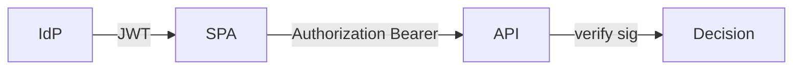

# JWT

<TopicMeta />

<Prerequisites />

::: tip Published
This page meets the handbook **published** bar: deep explanation, ≥10 common mistakes, and official references. Further engine-level errata welcome via PR.
:::

## Introduction

A **JWT** is a signed (JWS) or encrypted (JWE) token encoding claims (sub, exp, roles). Common in OAuth/OIDC access tokens. Frontends must treat JWTs as **credentials**: storage, XSS, and validation rules matter.

## Why does it exist?

Stateless APIs like bearer tokens. Poor frontend storage (localStorage) recreates XSS session theft.

## Historical Background

RFC 7519 popularized JWTs; endless misuse (“alg none”, huge tokens in localStorage) followed.

## Mental Model

Header.payload.signature. Signature proves issuer integrity (with right key/alg). JWT is not encrypted by default—claims are readable. Validation is a **server** job for access control.

## Internal Workflow

1. Prefer opaque session cookies when possible.
2. If JWT access tokens: short TTL, refresh carefully.
3. Store via HttpOnly cookie or in-memory—not localStorage if XSS is a concern.
4. Never trust client-side JWT decoding for authorization.
5. Validate aud/iss/exp server-side.

## Lifecycle



## Browser Perspective

Visible to JS if not HttpOnly—XSS steals it.

## JavaScript Engine Perspective

Not applicable.

## React Perspective

In-memory tokens die on refresh—pair with refresh cookie patterns.

## Next.js Perspective

Not applicable.

## Server Perspective

Signature + claims validation mandatory.

## Network Perspective

Always HTTPS; Bearer header or cookie.

## Memory Perspective

Not applicable.

## Performance

Large JWTs bloat every request; keep claims minimal.

## Production Example

Access token 10m in memory; refresh token rotate in HttpOnly Secure SameSite cookie; APIs validate JWT.

## Code Examples

```ts
// Client should NOT invent authz from payload alone
function parseJwtUnsafe(token: string) {
  const [, payload] = token.split('.')
  return JSON.parse(atob(payload.replace(/-/g, '+').replace(/_/g, '/')))
}
// Use only for display hints; server enforces authz
```

## Diagrams



## Common Mistakes

1. Storing JWTs in localStorage by default
2. Trusting alg from header without allowlist
3. Long-lived access tokens
4. Putting secrets/PII in JWT payload casually
5. Client-only “authorization”
6. Missing a production edge case for 17-security.jwt (#1)
7. Missing a production edge case for 17-security.jwt (#2)
8. Missing a production edge case for 17-security.jwt (#3)
9. Missing a production edge case for 17-security.jwt (#4)
10. Missing a production edge case for 17-security.jwt (#5)


## Best Practices

- Short TTL access tokens
- Server-side validation
- Prefer secure cookie patterns when fit

## Anti-patterns

- alg=none acceptance
- Forever-lived JWT as session

## Comparison

| JWT access token | Opaque session id |
| --- | --- |
| Stateless APIs | Server session store |
| Harder revoke | Easy revoke |

## Interview Questions

### Easy

**Q:** Are JWT payloads secret?

**A:** Not by default—JWS payloads are readable; use JWE or omit sensitive claims.

### Medium

**Q:** Why is localStorage risky for JWTs?

**A:** Any XSS can read localStorage and exfiltrate the bearer token.

### Hard

**Q:** Design SPA token storage with XSS in mind.

**A:** HttpOnly Secure SameSite cookies for refresh/session, short-lived access tokens, strict CSP, and server-side authorization checks.

## Summary

- JWTs are credentials
- Validate on server
- Storage choice is a security decision

## References

- [RFC 7519 — JWT](https://www.rfc-editor.org/rfc/rfc7519)
- [OWASP JWT Cheat Sheet](https://cheatsheetseries.owasp.org/cheatsheets/JSON_Web_Token_for_Java_Cheat_Sheet.html)

<RelatedTopics />


Prev: [`17-security.csp`](/17-security/csp/) · Next: [`17-security.oauth`](/17-security/oauth/)
