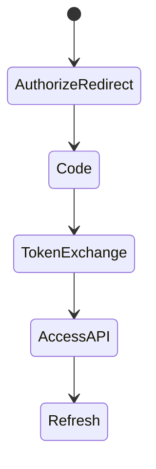
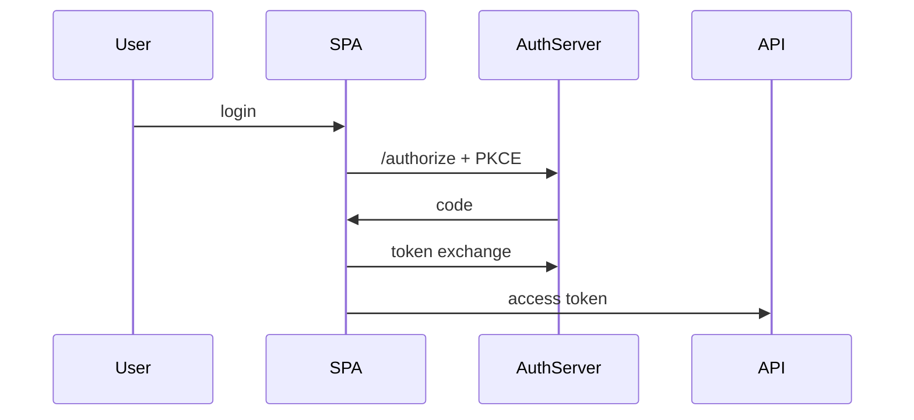

# OAuth

<TopicMeta />

<Prerequisites />

::: tip Published
This page meets the handbook **published** bar: deep explanation, ≥10 common mistakes, and official references. Further engine-level errata welcome via PR.
:::

## Introduction

**OAuth 2.0** lets a user grant a client limited access to resources without sharing passwords. For browser apps, the recommended flow is **Authorization Code with PKCE**, not implicit flow.

## Why does it exist?

“Login with X” and scoped API access need standardized delegation. Rolling your own password sharing is worse.

## Historical Background

OAuth 1 → OAuth 2. Implicit flow was common for SPAs then deprecated in OAuth 2.1 guidance in favor of code+PKCE.

## Mental Model

Roles: resource owner, client, authorization server, resource server. Tokens are capabilities. Frontend is usually a **public client**.

## Internal Workflow

1. Redirect to authorize with PKCE challenge.
2. Receive auth code on redirect URI.
3. Exchange code+verifier for tokens (via BFF preferred).
4. Call APIs with access token.
5. Refresh per security design.

## Lifecycle



## Browser Perspective

Redirect URIs must be exact allowlisted.

## JavaScript Engine Perspective

Not applicable.

## React Perspective

Prefer BFF pattern so tokens stay off the SPA when possible.

## Next.js Perspective

Not applicable.

## Server Perspective

Token exchange and storage safer on backend.

## Network Perspective

Use HTTPS; protect against auth code interception with PKCE.

## Memory Perspective

Not applicable.

## Performance

Extra redirects; cache tokens within TTL carefully.

## Production Example

SPA uses BFF: browser session cookie to BFF; BFF holds tokens; APIs never see tokens in localStorage.

## Code Examples

```ts
// PKCE sketch
const verifier = base64url(randomBytes(32))
const challenge = base64url(sha256(verifier))
// authorize?response_type=code&code_challenge=...&code_challenge_method=S256
```

## Diagrams



## Common Mistakes

1. Implicit flow for new apps
2. Custom redirect URI wildcards
3. Storing refresh tokens in localStorage
4. Skipping PKCE
5. Confusing authentication with authorization (use OIDC for login identity)
6. Missing a production edge case for 17-security.oauth (#1)
7. Missing a production edge case for 17-security.oauth (#2)
8. Missing a production edge case for 17-security.oauth (#3)
9. Missing a production edge case for 17-security.oauth (#4)
10. Missing a production edge case for 17-security.oauth (#5)


## Best Practices

- Auth code + PKCE
- BFF for browsers when possible
- Exact redirect allowlists

## Anti-patterns

- Embedded WebViews that steal redirects carelessly
- Overbroad scopes forever

## Comparison

| OAuth | OIDC |
| --- | --- |
| Authorization/delegation | Authentication identity layer on OAuth |

## Interview Questions

### Easy

**Q:** What is OAuth for?

**A:** Delegated authorization—granting a client limited access without sharing the user’s password.

### Medium

**Q:** Why PKCE?

**A:** It binds the token exchange to the client that started the flow, mitigating intercepted authorization codes on public clients.

### Hard

**Q:** Why prefer BFF over SPA-held tokens?

**A:** Keeps refresh/access tokens out of the JavaScript realm, reducing XSS impact; browser holds only a session cookie to the BFF.

## Summary

- OAuth delegates access
- Code+PKCE for public clients
- BFF reduces token exposure

## References

- [RFC 6749 — OAuth 2.0](https://www.rfc-editor.org/rfc/rfc6749)
- [RFC 7636 — PKCE](https://www.rfc-editor.org/rfc/rfc7636)
- [OAuth 2.1 draft / best current practices](https://datatracker.ietf.org/doc/html/draft-ietf-oauth-v2-1-11)

<RelatedTopics />


Prev: [`17-security.jwt`](/17-security/jwt/) · Next: [`17-security.oidc`](/17-security/oidc/)
