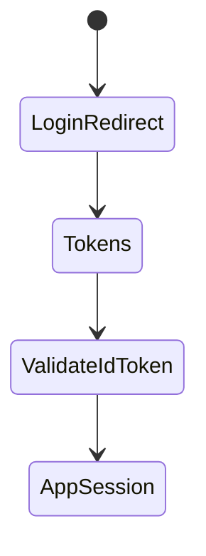
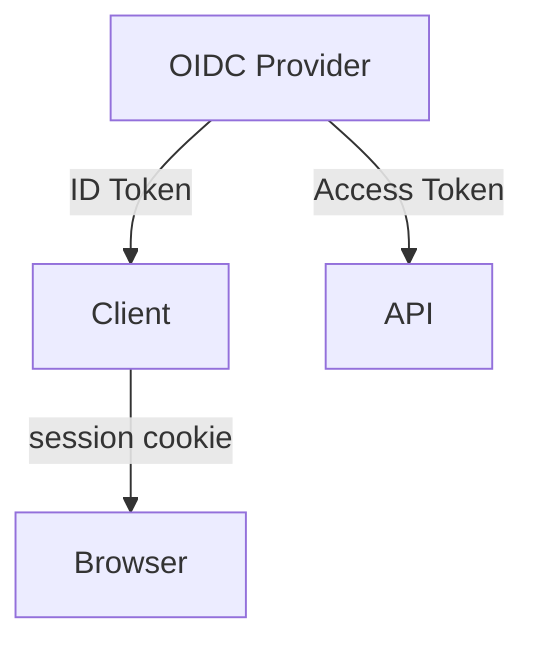

# OIDC

<TopicMeta />

<Prerequisites />

::: tip Published
This page meets the handbook **published** bar: deep explanation, ≥10 common mistakes, and official references. Further engine-level errata welcome via PR.
:::

## Introduction

**OpenID Connect (OIDC)** adds authentication to OAuth: an **ID Token** (JWT) asserts who logged in, plus UserInfo endpoint. Use OIDC for “sign in,” OAuth scopes for API access.

## Why does it exist?

OAuth alone does not define login identity. OIDC standardizes identity claims and discovery.

## Historical Background

OIDC 1.0 built on OAuth 2 to fix the “OAuth for login” mess.

## Mental Model

ID Token → identity for the client. Access Token → authorization at APIs. Validate ID Token (iss, aud, exp, nonce, signature) before trusting login.

## Internal Workflow

1. Discovery (`.well-known/openid-configuration`).
2. Auth code + PKCE (+ nonce).
3. Validate ID Token.
4. Establish app session.
5. Optionally fetch UserInfo.

## Lifecycle



## Browser Perspective

Third-party cookie restrictions affect some silent iframe renewals—use modern refresh patterns.

## JavaScript Engine Perspective

Not applicable.

## React Perspective

Libraries (oidc-client) help but still need secure session design.

## Next.js Perspective

Not applicable.

## Server Perspective

BFF validates ID Token and creates server session.

## Network Perspective

JWKS fetch for signature verification.

## Memory Perspective

Not applicable.

## Performance

Cache JWKS; avoid validating huge tokens on every static asset.

## Production Example

Enterprise SSO via OIDC; BFF validates ID Token nonce/aud; creates HttpOnly session; access tokens stay server-side.

## Code Examples

```ts
// Claims you must verify server-side
const required = ['iss', 'aud', 'exp', 'nonce', 'sub'] as const
```

## Diagrams



## Common Mistakes

1. Treating access token as identity proof only
2. Skipping nonce validation
3. Not checking aud/iss
4. Using implicit for OIDC login
5. Storing ID Token forever in localStorage
6. Missing a production edge case for 17-security.oidc (#1)
7. Missing a production edge case for 17-security.oidc (#2)
8. Missing a production edge case for 17-security.oidc (#3)
9. Missing a production edge case for 17-security.oidc (#4)
10. Missing a production edge case for 17-security.oidc (#5)


## Best Practices

- Validate ID Token fully
- Use nonce
- Server/BFF session after login

## Anti-patterns

- Parsing ID Token in UI as authorization for APIs
- Disabling state/nonce checks

## Comparison

| ID Token | Access Token |
| --- | --- |
| AuthN for client | AuthZ for APIs |
| aud=client | aud=API |

## Interview Questions

### Easy

**Q:** What does OIDC add to OAuth?

**A:** A standardized authentication layer with ID Tokens and UserInfo.

### Medium

**Q:** What is the nonce for?

**A:** It binds the ID Token to the authentication request and mitigates replay/injection of tokens.

### Hard

**Q:** How do third-party cookie restrictions affect OIDC SPAs?

**A:** Silent iframe renewal breaks; prefer refresh-token rotation via BFF/secure cookies and explicit re-auth UX.

## Summary

- OIDC = login identity on OAuth
- Validate ID Tokens properly
- Prefer BFF sessions

## References

- [OpenID Connect Core](https://openid.net/specs/openid-connect-core-1_0.html)
- [OWASP OAuth/OIDC guidance](https://cheatsheetseries.owasp.org/cheatsheets/OAuth2_Cheat_Sheet.html)

<RelatedTopics />


Prev: [`17-security.oauth`](/17-security/oauth/) · Next: [`17-security.cookies-security`](/17-security/cookies-security/)
