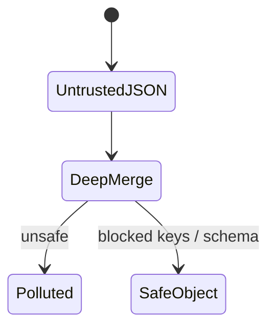
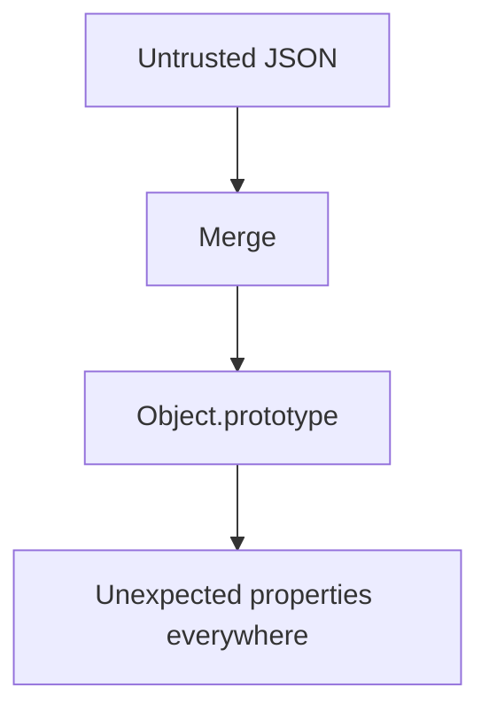

# Prototype Pollution

<TopicMeta />

<Prerequisites />

::: tip Published
This page meets the handbook **published** bar: deep explanation, ≥10 common mistakes, and official references. Further engine-level errata welcome via PR.
:::

## Introduction

**Prototype pollution** occurs when untrusted input recursively merges into objects without blocking `__proto__`/`constructor.prototype`, altering `Object.prototype` and surprising all code that inherits it. It can escalate to XSS or RCE in some Node sinks.

## Why does it exist?

JavaScript’s prototype inheritance means one polluted property can change default behavior app-wide.

## Historical Background

Highlighted in client libraries (lodash merge historically) and Node apps; still appears in custom deep-merge utilities.

## Mental Model

Never deep-merge untrusted JSON onto objects without freezing prototypes / blocking dangerous keys. Prefer `Object.create(null)` maps for dictionaries.

## Internal Workflow

1. Audit deep merge/clone/extend utilities.
2. Block `__proto__`, `prototype`, `constructor`.
3. Prefer structured cloning / schema parsing (Zod) over merges.
4. Keep dependencies updated.
5. Add regression tests with pollution payloads.

## Lifecycle



## Browser Perspective

Client-side pollution can flip feature flags or break security checks.

## JavaScript Engine Perspective

Prototype chain lookup reads polluted values.

## React Perspective

Config objects merged from URL/state can be vectors.

## Next.js Perspective

Not applicable.

## Server Perspective

Node pollution can hit dangerous sinks—higher severity.

## Network Perspective

Not applicable.

## Memory Perspective

Not applicable.

## Performance

Safe merges are fine; avoid recursive merges on huge untrusted blobs.

## Production Example

Removed home-grown `deepMerge` for `structuredClone` + Zod; added tests with `{"__proto__":{"admin":true}}`.

## Code Examples

```ts
function unsafeMerge(target: any, source: any) {
  for (const key of Object.keys(source)) {
    // BAD: does not block __proto__
    target[key] = source[key]
  }
}

const dangerous = JSON.parse('{"__proto__":{"polluted":true}}')
// Use schema parse instead of merge
```

## Diagrams



## Common Mistakes

1. Custom deepMerge without key allowlists
2. Assuming JSON.parse is enough protection
3. Ignoring dependency advisories on merge libs
4. Using objects as maps without null prototype
5. Merging query-string parsed objects into config
6. Missing a production edge case for 17-security.prototype-pollution (#1)
7. Missing a production edge case for 17-security.prototype-pollution (#2)
8. Missing a production edge case for 17-security.prototype-pollution (#3)
9. Missing a production edge case for 17-security.prototype-pollution (#4)
10. Missing a production edge case for 17-security.prototype-pollution (#5)


## Best Practices

- Schema validation over merge
- Block dangerous keys
- Object.create(null) for dictionaries

## Anti-patterns

- Recursive merge of request bodies into prototypes
- Silencing secops on “frontend-only” pollution

## Comparison

| Unsafe merge | Zod parse |
| --- | --- |
| Can pollute | Only known keys |

## Interview Questions

### Easy

**Q:** What is prototype pollution?

**A:** An attack that injects properties into Object.prototype via unsafe merges, affecting all objects.

### Medium

**Q:** Name dangerous keys.

**A:** `__proto__`, `constructor`, and `prototype` are classic vectors in merge utilities.

### Hard

**Q:** How could client-side pollution become XSS?

**A:** If polluted defaults change insecure HTML rendering options or URL handling, gadgets may turn pollution into script execution—depends on sinks.

## Summary

- Unsafe deep merge is the usual bug
- Validate schemas; block proto keys
- Patch vulnerable dependencies

## References

- [OWASP Prototype Pollution](https://owasp.org/www-community/vulnerabilities/Prototype_pollution_attack)
- [PortSwigger — Prototype pollution](https://portswigger.net/web-security/prototype-pollution)

<RelatedTopics />


Prev: [`17-security.clickjacking`](/17-security/clickjacking/) · Next: [`17-security.supply-chain-security`](/17-security/supply-chain-security/)
