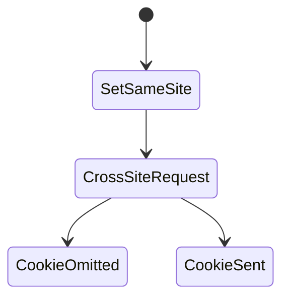
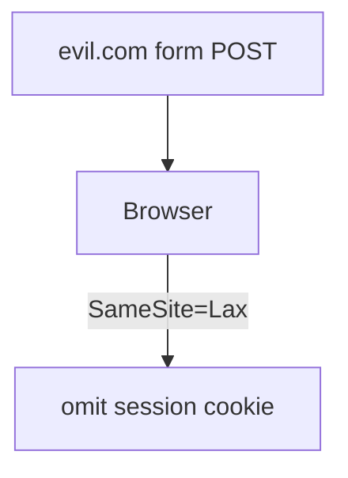

# SameSite

<TopicMeta />

<Prerequisites />

::: tip Published
This page meets the handbook **published** bar: deep explanation, ≥10 common mistakes, and official references. Further engine-level errata welcome via PR.
:::

## Introduction

**SameSite** (`Strict`, `Lax`, `None`) controls whether cookies are included on cross-site requests. It is a primary CSRF mitigation lever, with UX trade-offs for cross-site navigations and embedded use cases.

## Why does it exist?

CSRF thrives on cross-site cookie sends. SameSite lets browsers suppress cookies in those contexts.

## Historical Background

Introduced and then defaulted toward Lax in major browsers; `None` requires `Secure`.

## Mental Model

Strict: no cross-site send. Lax: send on top-level GET navigations, not on most cross-site POSTs/iframes. None: send cross-site (needs Secure)—for third-party contexts.

## Internal Workflow

1. Default session to Lax or Strict.
2. Use None only for known cross-site needs.
3. Pair with CSRF tokens for defense-in-depth.
4. Test login/return navigations.
5. Document embed/third-party requirements.

## Lifecycle



## Browser Perspective

Schemeful same-site rules matter (http vs https).

## JavaScript Engine Perspective

Not applicable.

## React Perspective

Cross-site popups/embeds may break with Strict.

## Next.js Perspective

Not applicable.

## Server Perspective

Not applicable.

## Network Perspective

Observe Cookie header presence in DevTools.

## Memory Perspective

Not applicable.

## Performance

Not a perf feature—security/UX trade-off.

## Production Example

Main session SameSite=Lax; rare embed token cookie SameSite=None;Secure with separate threat model.

## Code Examples

```http
Set-Cookie: session=...; Secure; HttpOnly; SameSite=Lax
Set-Cookie: embed=...; Secure; HttpOnly; SameSite=None
```

## Diagrams



## Common Mistakes

1. SameSite=None without Secure
2. Strict breaking OAuth return flows without testing
3. Relying on SameSite alone forever
4. Confusing same-site with same-origin
5. Assuming mobile WebViews behave identically
6. Missing a production edge case for 17-security.samesite (#1)
7. Missing a production edge case for 17-security.samesite (#2)
8. Missing a production edge case for 17-security.samesite (#3)
9. Missing a production edge case for 17-security.samesite (#4)
10. Missing a production edge case for 17-security.samesite (#5)


## Best Practices

- Lax/Strict for session defaults
- Pair with CSRF tokens
- Test SSO redirects

## Anti-patterns

- None on all cookies “for convenience”
- Ignoring schemeful same-site issues

## Comparison

| Value | Cross-site POST cookies | Top-level GET |
| --- | --- | --- |
| Strict | No | No |
| Lax | No | Yes |
| None | Yes (Secure) | Yes |

## Interview Questions

### Easy

**Q:** What does SameSite=Lax do?

**A:** It generally withholds cookies on cross-site subrequests/POSTs but allows them on top-level GET navigations.

### Medium

**Q:** Same-site vs same-origin?

**A:** Same-origin is scheme+host+port. Same-site is eTLD+1 relatedness (e.g., a.example.com and b.example.com are same-site, different origin).

### Hard

**Q:** When is SameSite insufficient against CSRF?

**A:** Some bypasses/edge cases and older browsers exist; also Lax allows top-level GET—never use GET for state changes. Keep CSRF tokens.

## Summary

- SameSite limits cross-site cookie sends
- Lax/Strict for sessions
- Defense-in-depth with tokens

## References

- [MDN — SameSite](https://developer.mozilla.org/en-US/docs/Web/HTTP/Headers/Set-Cookie#samesitesamesite-value)
- [web.dev — SameSite cookies](https://web.dev/articles/samesite-cookies-explained)

<RelatedTopics />


Prev: [`17-security.cookies-security`](/17-security/cookies-security/) · Next: [`17-security.secure-cookies`](/17-security/secure-cookies/)
