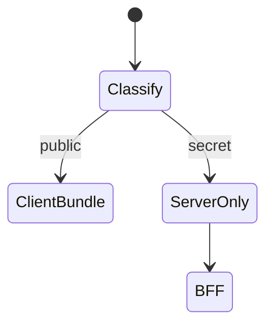
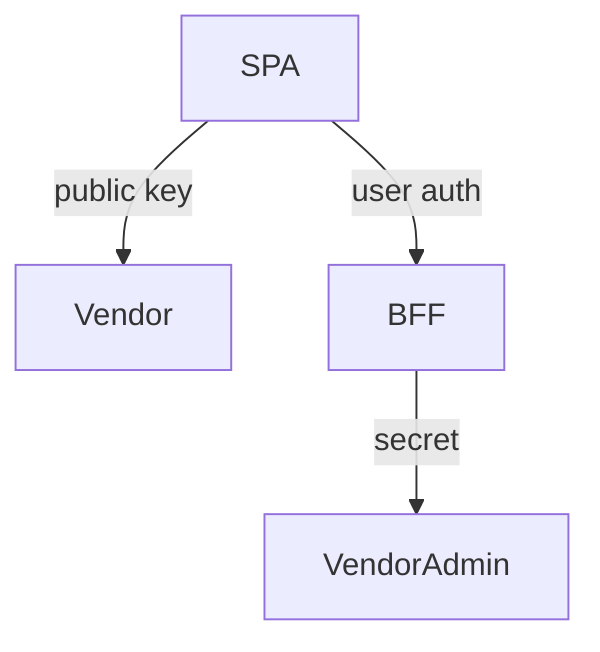

# Secrets in the Frontend

<TopicMeta />

<Prerequisites />

::: tip Published
This page meets the handbook **published** bar: deep explanation, ≥10 common mistakes, and official references. Further engine-level errata welcome via PR.
:::

## Introduction

The frontend bundle is downloadable by anyone. **There are no confidential secrets in client-side JavaScript.** `NEXT_PUBLIC_*` / `VITE_*` variables are compile-time public config, not vault secrets. Real secrets stay on servers.

## Why does it exist?

Teams repeatedly ship private API keys in React apps “temporarily.” Attackers scrape them from bundles in minutes.

## Historical Background

Map API keys, Firebase configs, and SaaS tokens have been leaked endlessly via frontend env misuse.

## Mental Model

Public config (stripe publishable key, analytics id) ≠ secret (stripe secret key, DB URL). If the browser needs a privileged call, proxy via your backend with authz.

## Internal Workflow

1. Classify each key public vs secret.
2. Only public keys in client env.
3. Proxy privileged APIs through BFF.
4. Restrict public keys by HTTP referrer/domain when vendor allows.
5. Scan bundles/PRs for accidental secrets.

## Lifecycle



## Browser Perspective

Users can read Network tab and sources.

## JavaScript Engine Perspective

Not applicable.

## React Perspective

Not applicable.

## Next.js Perspective

`NEXT_PUBLIC_` is inlined into client bundles—assume world-readable.

## Server Perspective

Hold real secrets in vault/env with IAM.

## Network Perspective

Domain-restricted keys still aren’t secrets but reduce abuse.

## Memory Perspective

Not applicable.

## Performance

BFF adds a hop—required for secret operations.

## Production Example

Maps SDK uses publishable key with HTTP referrer lock; geocoding privileged calls go through backend with secret.

## Code Examples

```ts
// Public OK
const STRIPE_PK = import.meta.env.VITE_STRIPE_PUBLISHABLE_KEY

// NEVER
// const STRIPE_SK = import.meta.env.VITE_STRIPE_SECRET_KEY
```

## Diagrams



## Common Mistakes

1. Putting secret keys in VITE_/NEXT_PUBLIC_
2. Relying on “obfuscation”
3. Committing .env with secrets
4. Assuming source maps hide nothing when uploaded publicly
5. Client-side “authorization” with a shared secret
6. Missing a production edge case for 17-security.secrets-in-frontend (#1)
7. Missing a production edge case for 17-security.secrets-in-frontend (#2)
8. Missing a production edge case for 17-security.secrets-in-frontend (#3)
9. Missing a production edge case for 17-security.secrets-in-frontend (#4)
10. Missing a production edge case for 17-security.secrets-in-frontend (#5)


## Best Practices

- Classify keys
- BFF for privileged ops
- Secret scanning in CI

## Anti-patterns

- Emailing .env to contractors
- Same secret for all environments

## Comparison

| Publishable key | Secret key |
| --- | --- |
| Browser OK | Server only |
| Domain-restricted | IAM/vault |

## Interview Questions

### Easy

**Q:** Can you put API secrets in React env vars?

**A:** No—client env vars are public. Only publishable identifiers belong there.

### Medium

**Q:** Why are NEXT_PUBLIC vars unsafe for secrets?

**A:** They are inlined into client JavaScript shipped to users.

### Hard

**Q:** Vendor only offers a secret key—how do you integrate?

**A:** Never ship it; create a backend/BFF endpoint that uses the secret with server authz, rate limits, and auditing; browser calls your API.

## Summary

- Browser code is public
- Only publishable keys on client
- Proxy privileged operations

## References

- [OWASP — Secrets Management](https://cheatsheetseries.owasp.org/cheatsheets/Secrets_Management_Cheat_Sheet.html)
- [Next.js — Environment variables](https://nextjs.org/docs/app/building-your-application/configuring/environment-variables)
- [Vite — Env variables](https://vitejs.dev/guide/env-and-mode.html)

<RelatedTopics />


Prev: [`17-security.supply-chain-security`](/17-security/supply-chain-security/)
