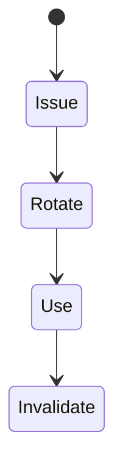

# Secure Cookies

<TopicMeta />

<Prerequisites />

::: tip Published
This page meets the handbook **published** bar: deep explanation, ≥10 common mistakes, and official references. Further engine-level errata welcome via PR.
:::

## Introduction

**Secure cookies** means configuring session cookies so they are only sent over HTTPS, inaccessible to JavaScript, appropriately SameSite-scoped, tightly path/host bound, and rotated on login/privilege change.

## Why does it exist?

Session cookies are keys to the kingdom. A single missing flag can enable theft or forgery pathways.

## Historical Background

Browser defaults improved, but explicit flags remain mandatory for high-assurance apps.

## Mental Model

Treat the cookie value as a random opaque id (not a JWT dump). Server stores session; cookie is just a pointer.

## Internal Workflow

1. Issue opaque session id.
2. Set Secure; HttpOnly; SameSite=Lax/Strict; Path=/; prefer __Host-.
3. Rotate on login and privilege elevation.
4. Invalidate server-side on logout.
5. Monitor for fixation/theft patterns.

## Lifecycle



## Browser Perspective

Enforces Secure/HttpOnly/SameSite.

## JavaScript Engine Perspective

Not applicable.

## React Perspective

Cannot read HttpOnly—use /me endpoints for user info.

## Next.js Perspective

Not applicable.

## Server Perspective

Authoritative session store and invalidation.

## Network Perspective

HTTPS required for Secure cookies.

## Memory Perspective

Not applicable.

## Performance

Keep cookie small; avoid storing carts in cookies.

## Production Example

Login sets `__Host-session`; step-up auth rotates id; logout deletes cookie and revokes server session.

## Code Examples

```http
Set-Cookie: __Host-session=3f2c...; Path=/; Secure; HttpOnly; SameSite=Strict; Max-Age=1800
```

## Diagrams

```mermaid
flowchart LR
  Login --> SetCookie
  SetCookie --> ServerSession
  Logout --> Revoke + ClearCookie
```

## Common Mistakes

1. Putting JWTs with PII in cookies carelessly
2. No rotation on login (fixation)
3. Missing Secure on HTTPS sites
4. Client “logout” only clearing non-HttpOnly crumbs
5. Long-lived absolute sessions without idle timeout
6. Missing a production edge case for 17-security.secure-cookies (#1)
7. Missing a production edge case for 17-security.secure-cookies (#2)
8. Missing a production edge case for 17-security.secure-cookies (#3)
9. Missing a production edge case for 17-security.secure-cookies (#4)
10. Missing a production edge case for 17-security.secure-cookies (#5)


## Best Practices

- Opaque ids + server store
- Rotate on privilege change
- __Host- when possible

## Anti-patterns

- document.cookie session management
- Same cookie for all subdomains by default

## Comparison

| Secure cookie session | localStorage JWT |
| --- | --- |
| HttpOnly possible | JS-readable |
| CSRF to consider | CSRF lower; XSS higher |

## Interview Questions

### Easy

**Q:** List three flags for a secure session cookie.

**A:** Secure, HttpOnly, and an appropriate SameSite value (plus tight Path/Host).

### Medium

**Q:** What is session fixation?

**A:** Attacker fixes a known session id on the victim before login; mitigated by rotating session id on authentication.

### Hard

**Q:** Design cookie session for SPA + API same site.

**A:** __Host-session HttpOnly Secure SameSite=Lax/Strict, CSRF tokens for mutations, short idle TTL, rotate on login, BFF if cross-origin APIs complicate things.

## Summary

- Opaque session + strict cookie flags
- Rotate and revoke server-side
- Prefer __Host- cookies

## References

- [OWASP Session Management Cheat Sheet](https://cheatsheetseries.owasp.org/cheatsheets/Session_Management_Cheat_Sheet.html)
- [MDN — Set-Cookie](https://developer.mozilla.org/en-US/docs/Web/HTTP/Headers/Set-Cookie)

<RelatedTopics />


Prev: [`17-security.samesite`](/17-security/samesite/) · Next: [`17-security.https-security`](/17-security/https-security/)
