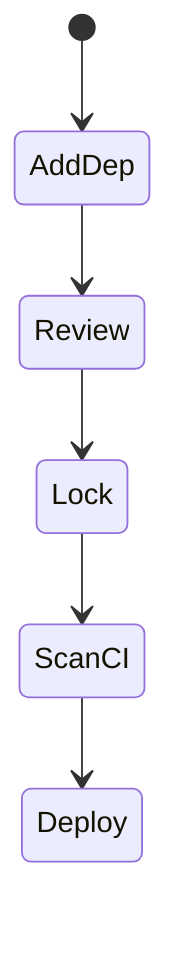
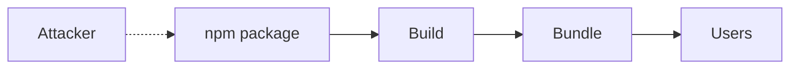

# Supply Chain Security

<TopicMeta />

<Prerequisites />

::: tip Published
This page meets the handbook **published** bar: deep explanation, ≥10 common mistakes, and official references. Further engine-level errata welcome via PR.
:::

## Introduction

**Supply-chain security** covers risks from dependencies, maintainers, build pipelines, and CDNs. A single compromised npm package can exfiltrate secrets or inject XSS into millions of apps.

## Why does it exist?

Modern frontends depend on hundreds of packages. Trust is transitive; attackers target that trust.

## Historical Background

Incidents (event-stream, ua-parser-js, protestware, typosquatting) made lockfiles, 2FA, and provenance mainstream topics.

## Mental Model

Pin → scan → review → least privilege in CI → verify provenance. Treat `postinstall` scripts as untrusted code execution.

## Internal Workflow

1. Commit lockfiles.
2. Run `pnpm audit`/OSV in CI.
3. Pin GitHub Actions by SHA.
4. Least-privilege tokens; no secrets in PR forks casually.
5. Prefer maintained packages; vendor critical code when needed.

## Lifecycle



## Browser Perspective

Compromised dependency can ship malicious JS to users.

## JavaScript Engine Perspective

Not applicable.

## React Perspective

Evaluate packages before adding to the client bundle.

## Next.js Perspective

Not applicable.

## Server Perspective

CI secrets are high-value targets.

## Network Perspective

Verify CDN SRI for third-party scripts when used.

## Memory Perspective

Not applicable.

## Performance

Fewer deps help security and bundles.

## Production Example

CI: lockfile enforced, audit gate, Actions pinned by SHA, npm ignore-scripts in CI except allowlisted, SRI for rare third-party scripts.

## Code Examples

```html
<script src="https://cdn.example.com/lib.js"
  integrity="sha384-..."
  crossorigin="anonymous"></script>
```

## Diagrams



## Common Mistakes

1. No lockfile
2. Blindly updating majors
3. Long-lived npm tokens in developers’ laptops without rotation
4. install scripts unrestricted in CI
5. Loading many third-party scripts without SRI
6. Missing a production edge case for 17-security.supply-chain-security (#1)
7. Missing a production edge case for 17-security.supply-chain-security (#2)
8. Missing a production edge case for 17-security.supply-chain-security (#3)
9. Missing a production edge case for 17-security.supply-chain-security (#4)
10. Missing a production edge case for 17-security.supply-chain-security (#5)


## Best Practices

- Lockfiles + audit CI
- Pin Actions by SHA
- Least privilege secrets

## Anti-patterns

- `curl | bash` in build
- Commit node_modules from untrusted machines

## Comparison

| Control | Threat |
| --- | --- |
| Lockfile | Unexpected upgrades |
| Audit | Known vulns |
| SRI | CDN tampering |
| Provenance | Build forgery |

## Interview Questions

### Easy

**Q:** Why commit a lockfile?

**A:** To pin transitive dependency versions so installs are reproducible and unexpected malicious upgrades are harder.

### Medium

**Q:** What is typosquatting?

**A:** Publishing a malicious package with a name similar to a popular one to trick installs.

### Hard

**Q:** Hardening plan for frontend CI supply chain.

**A:** Pin actions by SHA, short-lived OIDC tokens to clouds, no secrets on fork PRs, dependency review, ignore-scripts by default, artifact provenance, SBOM.

## Summary

- Dependencies are part of your TCB
- Pin, scan, least privilege
- SRI/provenance for critical paths

## References

- [OWASP Software Supply Chain Security](https://owasp.org/www-project-software-supply-chain-security/)
- [GitHub — Securing use of Actions](https://docs.github.com/en/actions/security-guides/security-hardening-for-github-actions)
- [MDN — SRI](https://developer.mozilla.org/en-US/docs/Web/Security/Subresource_Integrity)

<RelatedTopics />


Prev: [`17-security.prototype-pollution`](/17-security/prototype-pollution/) · Next: [`17-security.secrets-in-frontend`](/17-security/secrets-in-frontend/)
