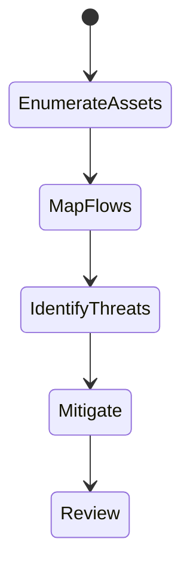
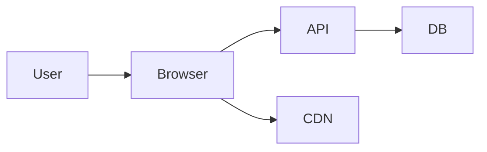

# Threat Model

<TopicMeta />

<Prerequisites />

::: tip Published
This page meets the handbook **published** bar: deep explanation, ≥10 common mistakes, and official references. Further engine-level errata welcome via PR.
:::

## Introduction

A **threat model** lists what you protect (tokens, PII, integrity of UI actions), who might attack (XSS thief, CSRF forger, supply-chain attacker), and which controls mitigate which threats. Frontend security without a model becomes checklist theater.

## Why does it exist?

Not every app needs the same defenses at the same strength. Threat modeling focuses effort on realistic abuse (token theft via XSS) over imaginary ones.

## Historical Background

STRIDE, attack trees, and OWASP methodologies moved from enterprise security into product engineering. SPAs and PWAs changed the asset map (tokens in JS, service workers).

## Mental Model

Assets → entry points → threats → mitigations → residual risk. Revisit when architecture changes (new OAuth, new CDN, new user-generated HTML).

## Internal Workflow

1. Draw data flows (browser ↔ API ↔ third parties).
2. Mark trust boundaries.
3. Apply STRIDE-like questions per boundary.
4. Map mitigations (CSP, HttpOnly, SameSite…).
5. Track residual risks explicitly.

## Lifecycle



## Browser Perspective

Browser is a hostile execution environment for secrets.

## JavaScript Engine Perspective

Not applicable.

## React Perspective

Dangerous HTML and open redirects often enter via components.

## Next.js Perspective

Not applicable.

## Server Perspective

Authorization must be enforced server-side regardless of UI.

## Network Perspective

TLS, CORS, and cookie policies are boundary controls.

## Memory Perspective

Not applicable.

## Performance

Security controls can cost (CSP nonces, extra round trips)—budget consciously.

## Production Example

Before launching in-app messaging with HTML, the team threat-models XSS → CSP + sanitizer + HttpOnly session; documents residual risk of SVG uploads.

## Code Examples

```ts
type Threat = { asset: string; threat: string; mitigation: string }
export const model: Threat[] = [
  { asset: 'session', threat: 'XSS token theft', mitigation: 'HttpOnly cookie + CSP' },
  { asset: 'state-changing POST', threat: 'CSRF', mitigation: 'SameSite=Lax + CSRF token' },
]
```

## Diagrams



## Common Mistakes

1. Skipping modeling until after a breach
2. Trusting client-only authorization
3. Ignoring third-party scripts in the model
4. Treating OWASP Top 10 as the full model
5. Never updating the model after major features
6. Missing a production edge case for 17-security.threat-model (#1)
7. Missing a production edge case for 17-security.threat-model (#2)
8. Missing a production edge case for 17-security.threat-model (#3)
9. Missing a production edge case for 17-security.threat-model (#4)
10. Missing a production edge case for 17-security.threat-model (#5)


## Best Practices

- Data-flow diagrams for auth/session
- Revisit on architecture change
- Record residual risk

## Anti-patterns

- Security questionnaire with no asset list
- “We use React so XSS is impossible”

## Comparison

| Approach | Use |
| --- | --- |
| STRIDE | Systematic per-component |
| Abuse cases | Product workshops |
| Checklists | Necessary but incomplete |

## Interview Questions

### Easy

**Q:** What is a threat model?

**A:** A structured analysis of assets, threats, and mitigations for a system.

### Medium

**Q:** Name a frontend-specific threat.

**A:** XSS stealing session tokens or performing actions as the user; mitigated with CSP, encoding, HttpOnly cookies.

### Hard

**Q:** Threat-model adding a third-party chat widget.

**A:** New script trust, data exfiltration, XSS via widget, supply chain; mitigations: sandbox/iframe, CSP, subdomain isolation, vendor review, least data shared.

## Summary

- Model assets and trust boundaries first
- Map mitigations to threats
- Update when architecture changes

## References

- [OWASP Threat Modeling](https://owasp.org/www-community/Threat_Modeling)
- [OWASP Top Ten](https://owasp.org/www-project-top-ten/)

<RelatedTopics />


Next: [`17-security.xss`](/17-security/xss/)
