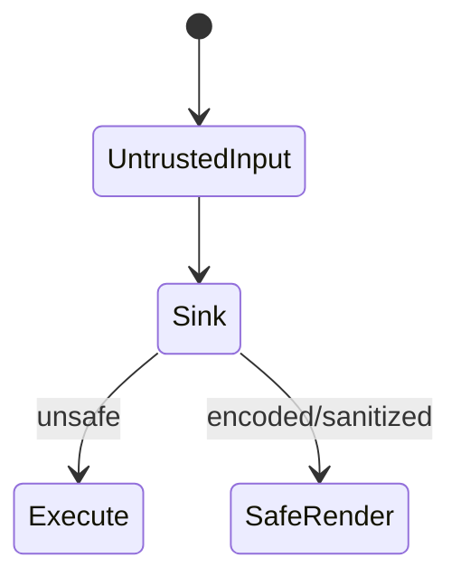
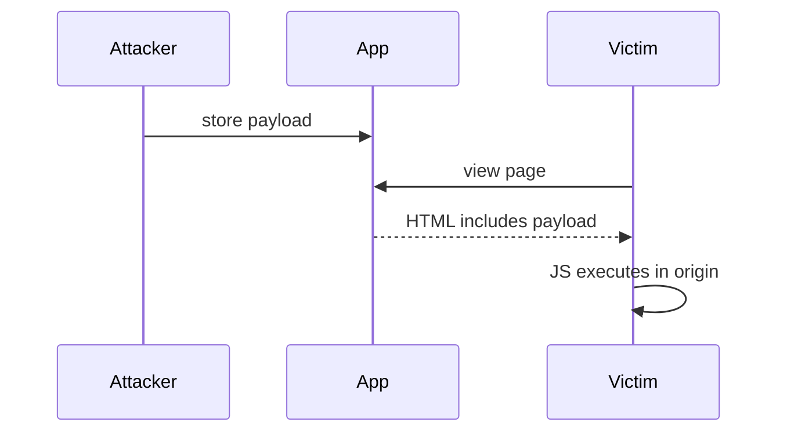

# XSS

<TopicMeta />

<Prerequisites />

::: tip Published
This page meets the handbook **published** bar: deep explanation, ≥10 common mistakes, and official references. Further engine-level errata welcome via PR.
:::

## Introduction

**XSS** lets an attacker run JavaScript in a victim’s origin. Types: **stored**, **reflected**, **DOM-based**. Impact ranges from session theft to malware. React escapes text by default, but `dangerouslySetInnerHTML`, unsafe URLs, and open `eval` paths remain footguns.

## Why does it exist?

Browsers execute script from the page’s origin with that origin’s privileges. One injection bypasses many UI trust assumptions.

## Historical Background

XSS is as old as dynamic HTML. CSP, Trusted Types, and framework escaping raised the bar but did not eliminate it.

## Mental Model

Untrusted data must be **contextually encoded** (HTML text, attributes, JS, URL, CSS). Prefer not putting untrusted HTML in the DOM; sanitize if unavoidable; CSP as defense-in-depth.

## Internal Workflow

1. Identify sinks (`innerHTML`, href/javascript:, eval).
2. Encode/sanitize at the sink’s context.
3. Avoid storing HTML unless required.
4. Deploy CSP + Trusted Types where possible.
5. Test with intentional payloads in staging.

## Lifecycle



## Browser Perspective

Same-origin script can call APIs with user cookies (unless HttpOnly + other controls).

## JavaScript Engine Perspective

XSS runs as normal JS in the page realm.

## React Perspective

Default text escaping helps; markdown/HTML rendering needs sanitizers.

## Next.js Perspective

Not applicable.

## Server Perspective

Not applicable.

## Network Perspective

CSP delivered via headers; watch report-only rollout.

## Memory Perspective

Not applicable.

## Performance

Sanitization costs CPU on large HTML; cache carefully without skipping safety.

## Production Example

Comments allow Markdown → HTML via sanitizer allowlist; CSP blocks inline scripts; session cookies HttpOnly.

## Code Examples

```tsx
// Dangerous
<div dangerouslySetInnerHTML={{ __html: userHtml }} />

// Safer: text only
<div>{userHtml}</div>

// If HTML required: sanitize with a maintained library + strict allowlist
```

## Diagrams



## Common Mistakes

1. Assuming React makes XSS impossible
2. Sanitizing on input only, not at sink
3. Allowing javascript: URLs in href
4. Disabling CSP because it broke analytics
5. Logging raw HTML into admin panels unsafely
6. Missing a production edge case for 17-security.xss (#1)
7. Missing a production edge case for 17-security.xss (#2)
8. Missing a production edge case for 17-security.xss (#3)
9. Missing a production edge case for 17-security.xss (#4)
10. Missing a production edge case for 17-security.xss (#5)


## Best Practices

- Contextual encoding
- HttpOnly sessions
- CSP defense-in-depth

## Anti-patterns

- Blacklist-based filters (“remove script tags”)
- Blanket `dangerouslySetInnerHTML` for convenience

## Comparison

| Type | Injection point |
| --- | --- |
| Stored | DB → page |
| Reflected | Request → response |
| DOM-based | Client-side sink |

## Interview Questions

### Easy

**Q:** What is XSS?

**A:** Injecting script that runs in another user’s browser within your origin.

### Medium

**Q:** How does React mitigate XSS?

**A:** It escapes string children into text content by default; unsafe APIs and URL sinks still require care.

### Hard

**Q:** Defense-in-depth plan against XSS.

**A:** Encode/sanitize sinks, HttpOnly cookies, strict CSP with nonces, Trusted Types, avoid inline handlers, monitor CSP reports.

## Summary

- XSS = attacker script in your origin
- Encode by context; sanitize HTML rarely
- CSP + HttpOnly as layers

## References

- [OWASP XSS](https://owasp.org/www-community/attacks/xss/)
- [OWASP Cheat Sheet — XSS Prevention](https://cheatsheetseries.owasp.org/cheatsheets/Cross_Site_Scripting_Prevention_Cheat_Sheet.html)
- [MDN — XSS](https://developer.mozilla.org/en-US/docs/Web/Security/Attacks/XSS)

<RelatedTopics />


Prev: [`17-security.threat-model`](/17-security/threat-model/) · Next: [`17-security.csrf`](/17-security/csrf/)
