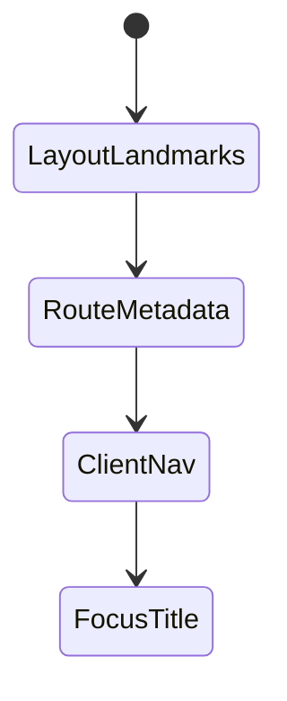
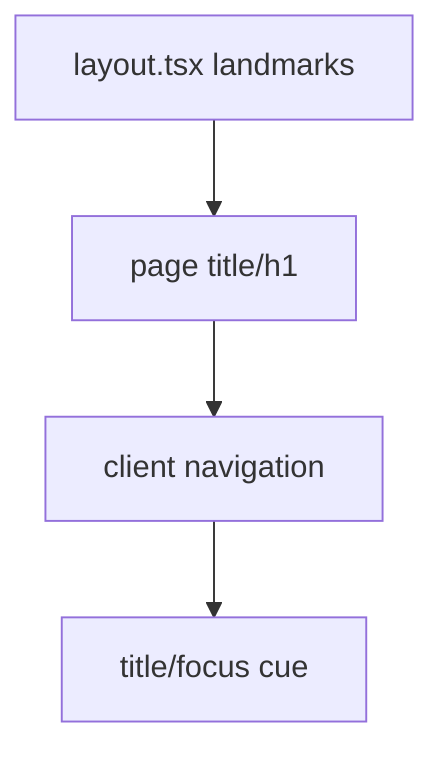

# Accessibility in Next.js

<TopicMeta />

<Prerequisites />

::: tip Published
This page meets the handbook **published** bar: deep explanation, ≥10 common mistakes, and official references. Further engine-level errata welcome via PR.
:::

## Introduction

**Accessibility in Next.js** adds framework concerns on top of React a11y: set `<html lang>`, per-route **titles**, landmark structure in layouts, focus management on client navigations, and careful handling of client-only interactive regions.

## Why does it exist?

App Router soft navigations can leave SR users without a page-change cue if titles/focus aren’t handled. Root layout mistakes affect every page.

## Historical Background

Pages Router used `next/head`; App Router uses the Metadata API. Community guidance continues to evolve for focus-on-navigation.

## Mental Model

Layout provides stable landmarks; each page provides unique title/h1; client navigations should update accessible context.

## Internal Workflow

1. Set lang on html.
2. Metadata titles per route.
3. One main landmark in layout.
4. Verify focus/title on client nav.
5. Keep interactive widgets as Client Components with a11y baked in.

## Lifecycle



## Browser Perspective

Title changes are announced by many SR setups on load; SPA nav may need focus help.

## JavaScript Engine Perspective

Not applicable.

## React Perspective

Client components for APG widgets.

## Next.js Perspective

Metadata API + layouts are the primary levers.

## Server Perspective

Not applicable.

## Network Perspective

Not applicable.

## Memory Perspective

Not applicable.

## Performance

Server Components help ship less JS—good for all users including AT on slow devices.

## Production Example

Root layout: lang=en, skip link, main; each page metadata.title template; monitored with axe on key routes.

## Code Examples

```tsx
// app/layout.tsx
export default function RootLayout({ children }: { children: React.ReactNode }) {
  return (
    <html lang="en">
      <body>
        <a href="#main">Skip to content</a>
        <main id="main">{children}</main>
      </body>
    </html>
  )
}
```

## Diagrams



## Common Mistakes

1. Missing html lang
2. Identical titles across routes
3. No main landmark
4. Client nav without focus strategy
5. Marking whole trees use client and shipping inaccessible custom widgets
6. Missing a production edge case for 18-accessibility.a11y-in-nextjs (#1)
7. Missing a production edge case for 18-accessibility.a11y-in-nextjs (#2)
8. Missing a production edge case for 18-accessibility.a11y-in-nextjs (#3)
9. Missing a production edge case for 18-accessibility.a11y-in-nextjs (#4)
10. Missing a production edge case for 18-accessibility.a11y-in-nextjs (#5)


## Best Practices

- Metadata titles
- Skip link + main
- Test client navigations with SR

## Anti-patterns

- Only setting title in a client useEffect inconsistently
- Multiple mains per page

## Comparison

| Pages Router | App Router |
| --- | --- |
| next/head | Metadata API |
| _app shell | layout.tsx tree |

## Interview Questions

### Easy

**Q:** Why set lang on `<html>`?

**A:** So assistive tech can pronounce content with the correct language rules.

### Medium

**Q:** What a11y risk do SPA navigations introduce?

**A:** Without focus/title cues, screen-reader users may not realize the page changed.

### Hard

**Q:** How would you implement focus-on-route-change in App Router?

**A:** Provide a consistent main heading target with tabIndex=-1 and move focus after navigation (or use a well-tested library pattern), plus unique titles via metadata.

## Summary

- lang, titles, landmarks in Next layouts
- Mind client navigation cues
- Keep interactive a11y in client primitives

## References

- [Next.js — Metadata](https://nextjs.org/docs/app/building-your-application/optimizing/metadata)
- [WCAG — Page Titled](https://www.w3.org/WAI/WCAG22/Understanding/page-titled.html)
- [React — Accessibility](https://react.dev/learn/accessibility)

<RelatedTopics />


Prev: [`18-accessibility.a11y-in-react`](/18-accessibility/a11y-in-react/)
