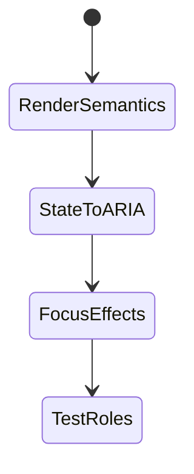
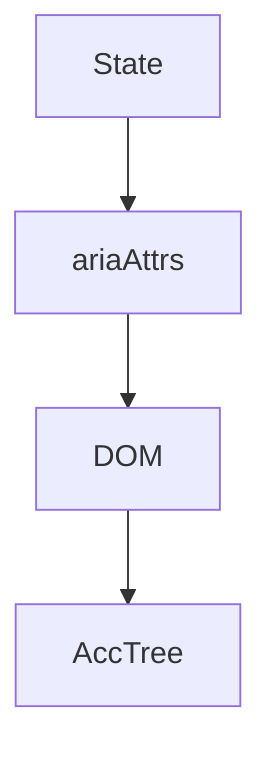

# Accessibility in React

<TopicMeta />

<Prerequisites />

::: tip Published
This page meets the handbook **published** bar: deep explanation, ≥10 common mistakes, and official references. Further engine-level errata welcome via PR.
:::

## Introduction

**Accessibility in React** means rendering semantic elements, wiring labels correctly in JSX, keeping `aria-*` synchronized with state, managing focus around portals/dialogs, and testing with RTL role queries.

## Why does it exist?

React’s power to build custom widgets makes it easy to ship `div` forests. The framework won’t stop inaccessible patterns unless you design for them.

## Historical Background

React docs and Testing Library pushed a11y-friendly practices; concurrent features require careful focus effects.

## Mental Model

JSX should look like accessible HTML. Derived UI state drives ARIA. Portals still belong in the a11y story (focus trap, aria-modal).

## Internal Workflow

1. Prefer native elements in components.
2. Sync aria-expanded/checked/invalid with state.
3. Manage focus for dialogs/menus.
4. Use RTL getByRole in tests.
5. Avoid spreading unknown props onto wrong elements.

## Lifecycle



## Browser Perspective

Accessibility tree updates with React commits.

## JavaScript Engine Perspective

Not applicable.

## React Perspective

Portals for dialogs; restore focus on unmount.

## Next.js Perspective

See Next-specific topic for routing titles/focus.

## Server Perspective

Not applicable.

## Network Perspective

Not applicable.

## Memory Perspective

Not applicable.

## Performance

Don’t run heavy focus logic every render—use effects keyed on transitions.

## Production Example

Shared Dialog uses portal + focus trap + aria-labelledby; features must pass label props.

## Code Examples

```tsx
function Disclosure({ title, children }: { title: string; children: React.ReactNode }) {
  const [open, setOpen] = React.useState(false)
  return (
    <div>
      <button aria-expanded={open} onClick={() => setOpen((v) => !v)}>{title}</button>
      {open && <div>{children}</div>}
    </div>
  )
}
```

## Diagrams



## Common Mistakes

1. aria-expanded stale vs open state
2. Focus lost when list re-renders with new keys
3. Stopping propagation in ways that break labels
4. Using index keys causing wrong announcements after sort
5. Unlabeled controlled inputs
6. Missing a production edge case for 18-accessibility.a11y-in-react (#1)
7. Missing a production edge case for 18-accessibility.a11y-in-react (#2)
8. Missing a production edge case for 18-accessibility.a11y-in-react (#3)
9. Missing a production edge case for 18-accessibility.a11y-in-react (#4)
10. Missing a production edge case for 18-accessibility.a11y-in-react (#5)


## Best Practices

- State drives ARIA
- Role-based tests
- Dialog focus patterns in one shared component

## Anti-patterns

- Global CSS `* { outline: none }` in the React app
- Custom checkbox without role/checked keyboard

## Comparison

| React anti-pattern | Better |
| --- | --- |
| div onClick | button |
| Manual ARIA checkbox | input type=checkbox |

## Interview Questions

### Easy

**Q:** How do you label an input in React?

**A:** Use htmlFor/id with a label element, or wrap the input in a label; placeholders alone are insufficient.

### Medium

**Q:** Why keep aria-expanded tied to state?

**A:** AT announces the disclosure state; stale ARIA lies to users when UI toggles.

### Hard

**Q:** Accessible list virtualization concerns?

**A:** Ensure focus isn’t lost on recycle, active descendant patterns if used, and that offscreen items remain operable per chosen approach.

## Summary

- Semantic JSX first
- Keep ARIA synchronized
- Shared focus-aware primitives

## References

- [React docs — Accessibility](https://react.dev/learn/accessibility)
- [Testing Library — queries](https://testing-library.com/docs/queries/about/)

<RelatedTopics />


Prev: [`18-accessibility.a11y-testing`](/18-accessibility/a11y-testing/) · Next: [`18-accessibility.a11y-in-nextjs`](/18-accessibility/a11y-in-nextjs/)
