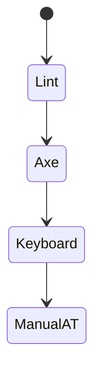
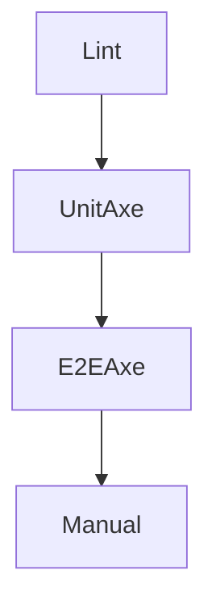

# Accessibility Testing

<TopicMeta />

<Prerequisites />

::: tip Published
This page meets the handbook **published** bar: deep explanation, ≥10 common mistakes, and official references. Further engine-level errata welcome via PR.
:::

## Introduction

**A11y testing** stacks eslint-plugin-jsx-a11y, axe-core in unit/E2E, keyboard interaction tests, and manual screen-reader exploration. Automation is necessary; manual AT catches the rest.

## Why does it exist?

Without CI gates, regressions ship. Without manual tests, “green axe” false confidence ships.

## Historical Background

axe-core became the default engine behind many tools (Playwright, Storybook addons, Lighthouse).

## Mental Model

Shift-left: lint → component axe → journey axe/keyboard → release AT smoke. Map failures to WCAG criteria.

## Internal Workflow

1. Enable jsx-a11y.
2. axe on stories/pages in CI.
3. Keyboard tests for custom widgets.
4. Manual SR checklist per release.
5. Track exceptions with expiry.

## Lifecycle



## Browser Perspective

Extensions for local audits.

## JavaScript Engine Perspective

Not applicable.

## React Perspective

RTL role queries encourage accessible markup.

## Next.js Perspective

Include route-level checks for titles/landmarks.

## Server Perspective

Not applicable.

## Network Perspective

Not applicable.

## Memory Perspective

Not applicable.

## Performance

Shard axe E2E; don’t axe every pixel page if budget tight—prioritize critical.

## Production Example

CI fails on serious/critical axe; nightly fuller crawl; VoiceOver smoke before major releases.

## Code Examples

```ts
import { axe } from 'vitest-axe'
it('is accessible', async () => {
  const { container } = render(<Dialog open />)
  expect(await axe(container)).toHaveNoViolations()
})
```

## Diagrams



## Common Mistakes

1. Axe-only strategy
2. Disabling rules globally
3. No keyboard coverage
4. Testing only desktop Chrome
5. Ignoring failures in third-party widgets you chose
6. Missing a production edge case for 18-accessibility.a11y-testing (#1)
7. Missing a production edge case for 18-accessibility.a11y-testing (#2)
8. Missing a production edge case for 18-accessibility.a11y-testing (#3)
9. Missing a production edge case for 18-accessibility.a11y-testing (#4)
10. Missing a production edge case for 18-accessibility.a11y-testing (#5)


## Best Practices

- Fail CI on serious issues
- Manual AT for releases
- Prioritize critical journeys

## Anti-patterns

- Forever-ignored violation baselines
- Accessibility overlay as “fix”

## Comparison

| Automated | Manual |
| --- | --- |
| Fast, partial | Slow, essential |

## Interview Questions

### Easy

**Q:** Name an automated a11y tool.

**A:** axe-core (via Playwright, Testing Library integrations, browser extensions, etc.).

### Medium

**Q:** Why isn’t axe enough?

**A:** Many WCAG criteria need human judgment (clarity, SR UX, complex interactions).

### Hard

**Q:** Build an a11y CI plan for a DS + app.

**A:** jsx-a11y + axe on Storybook/CI, keyboard tests for patterns, app journey axe, release AT matrix, tracked exceptions.

## Summary

- Layer automated and manual a11y tests
- Gate serious violations
- Map to WCAG

## References

- [axe-core](https://github.com/dequelabs/axe-core)
- [Playwright accessibility testing](https://playwright.dev/docs/accessibility-testing)
- [eslint-plugin-jsx-a11y](https://github.com/jsx-eslint/eslint-plugin-jsx-a11y)

<RelatedTopics />


Prev: [`18-accessibility.accessible-components`](/18-accessibility/accessible-components/) · Next: [`18-accessibility.a11y-in-react`](/18-accessibility/a11y-in-react/)
