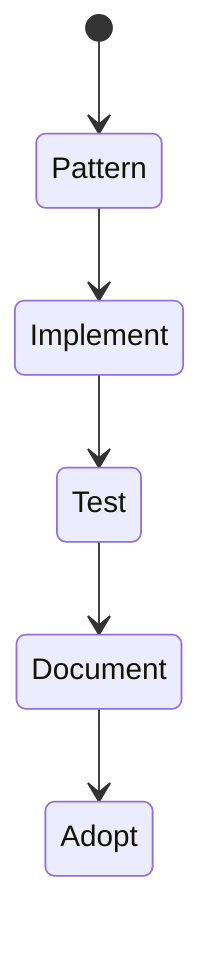
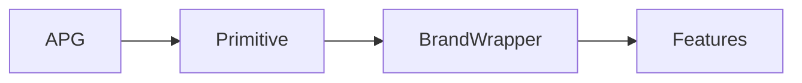

# Accessible Components

<TopicMeta />

<Prerequisites />

::: tip Published
This page meets the handbook **published** bar: deep explanation, ≥10 common mistakes, and official references. Further engine-level errata welcome via PR.
:::

## Introduction

**Accessible components** encode a11y into the design system: correct elements/roles, keyboard support, focus management, labeling APIs, and tested patterns (APG). Product teams inherit accessibility instead of reinventing it.

## Why does it exist?

Fixing a11y in every feature is expensive. Primitives multiply quality—or multiply bugs.

## Historical Background

React Aria, Radix, Reach UI popularized accessible headless components; strong internal DS teams adopt APG suites.

## Mental Model

Each component documents: roles, keys, labeling props (`aria-label` vs children), composition, and known limitations. Defaults should be safe.

## Internal Workflow

1. Pick APG pattern.
2. Implement keys + state.
3. Add RTL keyboard tests + axe.
4. Document usage.
5. Version breaking a11y fixes carefully.

## Lifecycle



## Browser Perspective

Verify across SR pairings for complex widgets.

## JavaScript Engine Perspective

Not applicable.

## React Perspective

Headless + styled wrappers; forward refs for focus.

## Next.js Perspective

Client components for interactive primitives.

## Server Perspective

Not applicable.

## Network Perspective

Not applicable.

## Memory Perspective

Not applicable.

## Performance

Accessibility is not optional for “lighter” components.

## Production Example

Modal/Select/Tooltip in `@acme/ui` have Interaction tests + axe; product features must use them for those patterns.

## Code Examples

```tsx
export const IconButton = React.forwardRef<HTMLButtonElement, { label: string } & React.ButtonHTMLAttributes<HTMLButtonElement>>(
  function IconButton({ label, children, ...rest }, ref) {
    return (
      <button ref={ref} type="button" aria-label={label} {...rest}>
        {children}
      </button>
    )
  },
)
```

## Diagrams



## Common Mistakes

1. Unnamed icon buttons
2. Missing ref forwarding breaking focus return
3. Tooltips as only label
4. Select built from divs without listbox pattern
5. No tests for keyboard
6. Missing a production edge case for 18-accessibility.accessible-components (#1)
7. Missing a production edge case for 18-accessibility.accessible-components (#2)
8. Missing a production edge case for 18-accessibility.accessible-components (#3)
9. Missing a production edge case for 18-accessibility.accessible-components (#4)
10. Missing a production edge case for 18-accessibility.accessible-components (#5)


## Best Practices

- APG-first
- Required label props in API
- Axe + keyboard tests on stories

## Anti-patterns

- Optional a11y props that default to broken
- Copying inaccessible competitors blindly

## Comparison

| Headless a11y kit | Styled kit |
| --- | --- |
| Behavior solid | Must verify a11y quality |

## Interview Questions

### Easy

**Q:** What must an icon-only button have?

**A:** An accessible name via aria-label (or visually hidden text).

### Medium

**Q:** Why forward refs in accessible components?

**A:** Parents and focus management need to call focus() on the real DOM node.

### Hard

**Q:** How do you API-design a Select for a11y?

**A:** Enforce labeling props, implement listbox/combobox APG, keyboard support, and prevent usage patterns that strip semantics.

## Summary

- Bake a11y into components
- APG + tests
- Safe defaults over optional escape hatches

## References

- [APG Patterns](https://www.w3.org/WAI/ARIA/apg/patterns/)
- [React Aria](https://react-spectrum.adobe.com/react-aria/)
- [Radix Primitives](https://www.radix-ui.com/primitives)

<RelatedTopics />


Prev: [`18-accessibility.live-regions`](/18-accessibility/live-regions/) · Next: [`18-accessibility.a11y-testing`](/18-accessibility/a11y-testing/)
