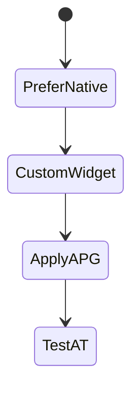
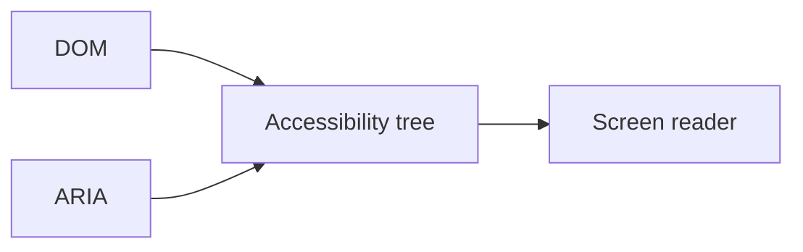

# ARIA

<TopicMeta />

<Prerequisites />

::: tip Published
This page meets the handbook **published** bar: deep explanation, ≥10 common mistakes, and official references. Further engine-level errata welcome via PR.
:::

## Introduction

**ARIA** (Accessible Rich Internet Applications) adds roles/states/properties to the accessibility tree when native HTML semantics are insufficient. First rule: **don’t use ARIA if a native element works.** Wrong ARIA is worse than none.

## Why does it exist?

Custom widgets (tabs, comboboxes) need names, roles, and keyboard patterns so AT users can operate them.

## Historical Background

WAI-ARIA evolved with APG (Authoring Practices Guide) patterns describing expected keyboard behavior.

## Mental Model

Role = what it is; name = what it’s called; state = current condition. ARIA does not add keyboard behavior by itself—you must implement it.

## Internal Workflow

1. Prefer native HTML.
2. If custom, copy an APG pattern.
3. Ensure name/role/value.
4. Implement full keyboard support.
5. Test with SR + axe.

## Lifecycle



## Browser Perspective

Maps ARIA + DOM into accessibility tree.

## JavaScript Engine Perspective

Not applicable.

## React Perspective

Keep aria-* in sync with state (selected, expanded, invalid).

## Next.js Perspective

Not applicable.

## Server Perspective

Not applicable.

## Network Perspective

Not applicable.

## Memory Perspective

Not applicable.

## Performance

Excessive live regions can spam AT—use carefully.

## Production Example

Design system Tabs follow APG: roles tablist/tab/tabpanel, arrow keys, aria-selected.

## Code Examples

```tsx
<button aria-expanded={open} aria-controls="panel" onClick={toggle}>
  Filters
</button>
<div id="panel" role="region" hidden={!open}>...</div>
```

## Diagrams



## Common Mistakes

1. role=button on a div without keyboard support
2. ARIA that contradicts native semantics
3. aria-label on everything, killing visible text
4. Using ARIA to “fix” poor HTML
5. Ignoring APG keyboard requirements
6. Missing a production edge case for 18-accessibility.aria (#1)
7. Missing a production edge case for 18-accessibility.aria (#2)
8. Missing a production edge case for 18-accessibility.aria (#3)
9. Missing a production edge case for 18-accessibility.aria (#4)
10. Missing a production edge case for 18-accessibility.aria (#5)


## Best Practices

- First rule of ARIA
- Follow APG patterns
- Keep states synchronized

## Anti-patterns

- aria-hidden=true on focusable elements
- Positive tabindex spaghetti with ARIA roles

## Comparison

| Native button | div + ARIA |
| --- | --- |
| Free keyboard/AT | You must reimplement |

## Interview Questions

### Easy

**Q:** What is the first rule of ARIA?

**A:** Do not use ARIA if you can use a native HTML element with the semantics you need.

### Medium

**Q:** Does role=button make a div keyboard accessible?

**A:** No. You must add tabindex and key handlers (Enter/Space) yourself—or use `<button>`.

### Hard

**Q:** When is aria-live appropriate?

**A:** For important updates that are not focused—errors, status—without over-announcing; choose polite/assertive carefully.

## Summary

- ARIA patches semantics, not behavior
- Prefer native elements
- APG patterns for custom widgets

## References

- [WAI-ARIA 1.2](https://www.w3.org/TR/wai-aria-1.2/)
- [ARIA Authoring Practices Guide (APG)](https://www.w3.org/WAI/ARIA/apg/)
- [Using ARIA](https://www.w3.org/TR/using-aria/)

<RelatedTopics />


Prev: [`18-accessibility.wcag`](/18-accessibility/wcag/) · Next: [`18-accessibility.semantic-html-a11y`](/18-accessibility/semantic-html-a11y/)
