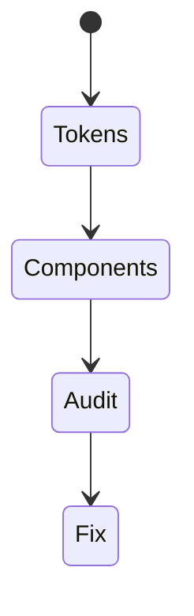
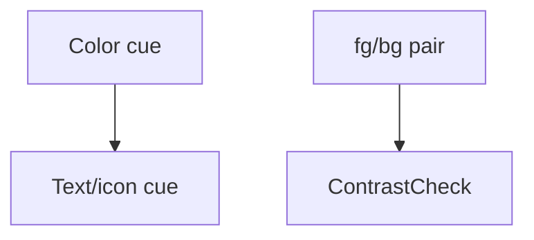

# Color and Contrast

<TopicMeta />

<Prerequisites />

::: tip Published
This page meets the handbook **published** bar: deep explanation, ≥10 common mistakes, and official references. Further engine-level errata welcome via PR.
:::

## Introduction

Text and meaningful UI icons need sufficient **contrast** against backgrounds (WCAG 1.4.3 AA generally 4.5:1 for normal text, 3:1 for large). Meaning must not rely on **color alone** (1.4.1)—add text/icons/patterns.

## Why does it exist?

Low vision and color vision deficiency are common. Pale gray text fails many users and audits.

## Historical Background

Contrast algorithms in WCAG 2.x; APCA is discussed for future but WCAG 2.2 contrast remains normative today.

## Mental Model

Tokens should encode compliant pairs (fg/bg). States (error) need non-color cues. Focus indicators also need contrast.

## Internal Workflow

1. Define semantic color tokens with contrast checks.
2. Test components in light/dark themes.
3. Add icons/text for status.
4. Verify charts with patterns.
5. Include contrast in CI/visual review.

## Lifecycle



## Browser Perspective

DevTools contrast overlays help locally.

## JavaScript Engine Perspective

Not applicable.

## React Perspective

Status components include text, not only red borders.

## Next.js Perspective

Not applicable.

## Server Perspective

Not applicable.

## Network Perspective

Not applicable.

## Memory Perspective

Not applicable.

## Performance

Irrelevant CPU-wise; huge UX impact.

## Production Example

Design tokens fail lint if text/bg pairs < 4.5:1; charts use patterns + labels.

## Code Examples

```css
:root {
  --fg: #121212;
  --bg: #ffffff;
  --danger-fg: #8b0000;
}
```

## Diagrams



## Common Mistakes

1. Gray on gray placeholders as only labels
2. Error only as red outline
3. Ignoring contrast in dark mode
4. Disabled states with tiny contrast used for critical info
5. Focus rings that disappear on brand backgrounds
6. Missing a production edge case for 18-accessibility.color-and-contrast (#1)
7. Missing a production edge case for 18-accessibility.color-and-contrast (#2)
8. Missing a production edge case for 18-accessibility.color-and-contrast (#3)
9. Missing a production edge case for 18-accessibility.color-and-contrast (#4)
10. Missing a production edge case for 18-accessibility.color-and-contrast (#5)


## Best Practices

- Tokenized compliant pairs
- Non-color cues
- Check dark and light

## Anti-patterns

- Brand palette without accessibility review
- Low-contrast legal text

## Comparison

| AA normal text | Large text |
| --- | --- |
| 4.5:1 | 3:1 |

## Interview Questions

### Easy

**Q:** What contrast ratio does WCAG AA require for normal text?

**A:** Generally 4.5:1 against its background.

### Medium

**Q:** Why is color-alone insufficient?

**A:** Users with color vision deficiency or monochrome displays may not perceive the difference—pair with text or icons.

### Hard

**Q:** How do you handle contrast for charts?

**A:** Use patterns/shapes/direct labels, not only hue; ensure legend text meets contrast; provide tabular alternative.

## Summary

- Meet contrast ratios
- Never color-only meaning
- Encode compliance in tokens

## References

- [WCAG 1.4.3 Contrast](https://www.w3.org/WAI/WCAG22/Understanding/contrast-minimum.html)
- [WCAG 1.4.1 Use of Color](https://www.w3.org/WAI/WCAG22/Understanding/use-of-color.html)

<RelatedTopics />


Prev: [`18-accessibility.screen-readers`](/18-accessibility/screen-readers/) · Next: [`18-accessibility.forms-a11y`](/18-accessibility/forms-a11y/)
