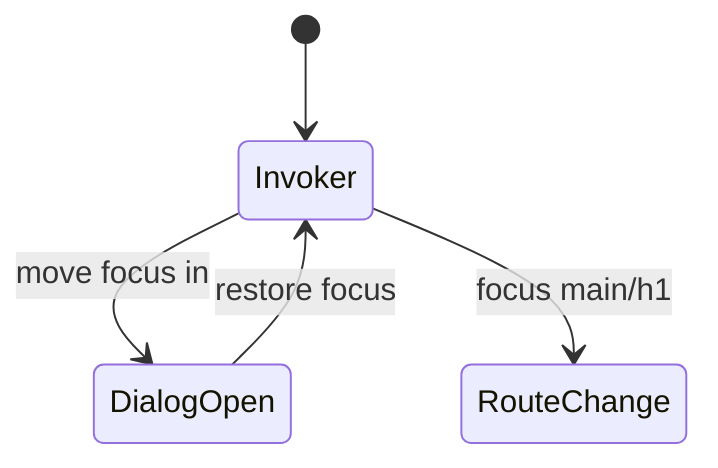
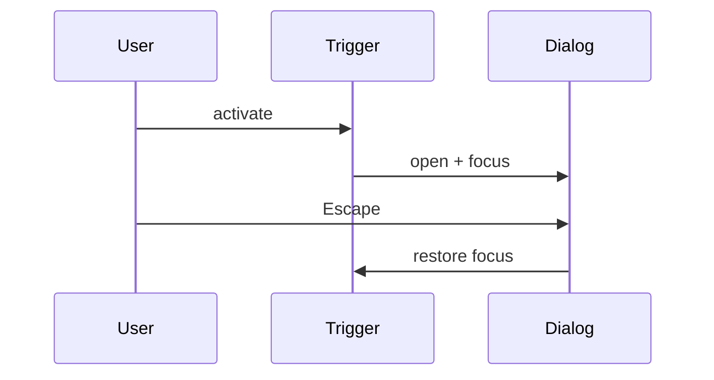

# Focus Management

<TopicMeta />

<Prerequisites />

::: tip Published
This page meets the handbook **published** bar: deep explanation, ≥10 common mistakes, and official references. Further engine-level errata welcome via PR.
:::

## Introduction

**Focus management** is deliberately moving or restoring keyboard focus when the UI changes—opening dialogs, deleting items, client-side navigations—so users are not stranded or lost.

## Why does it exist?

SPAs update content without full reloads; without focus moves, SR/keyboard users may hear nothing or stay on detached controls.

## Historical Background

As SPAs grew, focus management became a first-class a11y skill alongside routing libraries’ guidance.

## Mental Model

When context changes significantly, send focus to a logical destination (dialog container, new heading, next item). When closing, restore focus to the invoker.

## Internal Workflow

1. Identify UI transitions.
2. Choose focus target.
3. Use ref.focus() carefully (tabIndex=-1 on non-interactive targets).
4. Restore on dismiss.
5. Test with keyboard only.

## Lifecycle



## Browser Perspective

focus() options (preventScroll) for UX.

## JavaScript Engine Perspective

Not applicable.

## React Perspective

useEffect + refs; careful with Strict Mode double invoke in dev.

## Next.js Perspective

App Router should move focus on navigation; verify behavior.

## Server Perspective

Not applicable.

## Network Perspective

Not applicable.

## Memory Perspective

Not applicable.

## Performance

Avoid focusing on every tiny re-render.

## Production Example

Dialog component focuses first input; on close returns to trigger; route change focuses `#main-heading`.

## Code Examples

```tsx
useEffect(() => {
  if (open) panelRef.current?.focus()
}, [open])

return (
  <div role="dialog" aria-modal="true" tabIndex={-1} ref={panelRef}>
    ...
  </div>
)
```

## Diagrams



## Common Mistakes

1. Not restoring focus after modal close
2. Focusing body only, leaving SR without context
3. Auto-focusing in ways that break screen reader reading order unexpectedly
4. Losing focus when list items unmount
5. Ignoring route change focus in SPAs
6. Missing a production edge case for 18-accessibility.focus-management (#1)
7. Missing a production edge case for 18-accessibility.focus-management (#2)
8. Missing a production edge case for 18-accessibility.focus-management (#3)
9. Missing a production edge case for 18-accessibility.focus-management (#4)
10. Missing a production edge case for 18-accessibility.focus-management (#5)


## Best Practices

- Restore to invoker
- Focus dialog containers or first fields intentionally
- Manage focus after deletions

## Anti-patterns

- focus() in render body
- Trap focus without Escape

## Comparison

| No management | Managed |
| --- | --- |
| Lost keyboard users | Predictable context |

## Interview Questions

### Easy

**Q:** Where should focus go when a modal opens?

**A:** Into the modal (container or first meaningful control), and back to the opener on close.

### Medium

**Q:** How do you focus a non-interactive heading?

**A:** Give it tabIndex={-1} and call focus(); it becomes programmatically focusable without adding a tab stop.

### Hard

**Q:** Focus strategy for SPA route transitions.

**A:** Move focus to a main heading or skip-target on navigation, announce via that focus (and optionally a polite live region), keep consistency across routes.

## Summary

- SPAs must manage focus on transitions
- Open/close pairs restore context
- Test with keyboard

## References

- [APG — Dialog pattern](https://www.w3.org/WAI/ARIA/apg/patterns/dialog-modal/)
- [MDN — HTMLElement.focus](https://developer.mozilla.org/en-US/docs/Web/API/HTMLElement/focus)

<RelatedTopics />


Prev: [`18-accessibility.keyboard-navigation`](/18-accessibility/keyboard-navigation/) · Next: [`18-accessibility.screen-readers`](/18-accessibility/screen-readers/)
