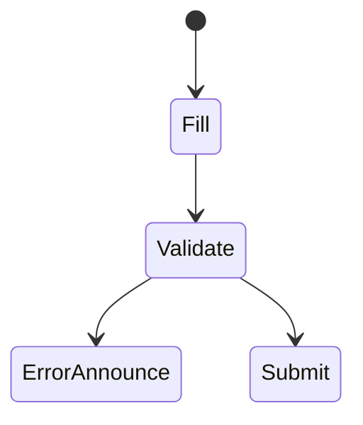
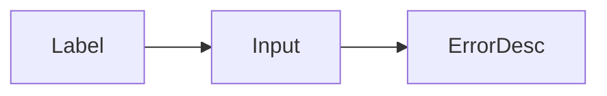

# Accessible Forms

<TopicMeta />

<Prerequisites />

::: tip Published
This page meets the handbook **published** bar: deep explanation, ≥10 common mistakes, and official references. Further engine-level errata welcome via PR.
:::

## Introduction

Accessible **forms** need programmatically associated **labels**, clear instructions, keyboard operability, and error messages tied to fields (`aria-describedby` / `aria-invalid`). Placeholders are not labels.

## Why does it exist?

Forms are where users complete tasks—and where a11y failures block conversion hardest.

## Historical Background

HTML labeling + ARIA invalid/describedby patterns became standard for modern validation UX.

## Mental Model

Every control has an accessible name. Errors are announced and visible. Required fields are indicated in text, not color alone.

## Internal Workflow

1. Use label/input association.
2. Group with fieldset/legend where needed.
3. Describe errors accessibly.
4. Don’t rely on placeholder-only.
5. Test with keyboard + SR.

## Lifecycle



## Browser Perspective

Native validation UX varies—don’t remove labels.

## JavaScript Engine Perspective

Not applicable.

## React Perspective

Controlled inputs must still keep labels wired; announce errors on submit.

## Next.js Perspective

Server errors must map back to fields accessibly.

## Server Perspective

Not applicable.

## Network Perspective

Not applicable.

## Memory Perspective

Not applicable.

## Performance

Fine; avoid stealing focus on every keystroke error.

## Production Example

Checkout: each field labeled; error summary links to fields; aria-live polite for summary.

## Code Examples

```tsx
<label htmlFor="email">Email</label>
<input id="email" aria-invalid={!!error} aria-describedby={error ? 'email-err' : undefined} />
{error && <p id="email-err" role="alert">{error}</p>}
```

## Diagrams



## Common Mistakes

1. Placeholder-only labels
2. Errors not linked to inputs
3. Clickable label text not associated
4. Custom select without SR semantics
5. Disabling paste on password without reason
6. Missing a production edge case for 18-accessibility.forms-a11y (#1)
7. Missing a production edge case for 18-accessibility.forms-a11y (#2)
8. Missing a production edge case for 18-accessibility.forms-a11y (#3)
9. Missing a production edge case for 18-accessibility.forms-a11y (#4)
10. Missing a production edge case for 18-accessibility.forms-a11y (#5)


## Best Practices

- Visible labels
- aria-describedby for help/errors
- Error summary on submit

## Anti-patterns

- Only red border for errors
- Removing labels for “minimal design”

## Comparison

| Placeholder | Label |
| --- | --- |
| Disappears | Persistent name |

## Interview Questions

### Easy

**Q:** Why are placeholders not enough?

**A:** They disappear when typing and are often not a reliable accessible name; visible labels persist.

### Medium

**Q:** How do you associate an error with an input?

**A:** Use aria-describedby pointing at the error element and aria-invalid=true; also show visible text.

### Hard

**Q:** Accessible async validation pattern?

**A:** Don’t interrupt typing loudly; on blur/submit announce errors via alert/live region, move focus to first error when appropriate.

## Summary

- Labels are non-negotiable
- Wire errors to fields
- Test forms with AT

## References

- [WAI — Forms tutorial](https://www.w3.org/WAI/tutorials/forms/)
- [WCAG 3.3.1 / 3.3.2](https://www.w3.org/WAI/WCAG22/quickref/?showtechniques=331%20332)

<RelatedTopics />


Prev: [`18-accessibility.color-and-contrast`](/18-accessibility/color-and-contrast/) · Next: [`18-accessibility.live-regions`](/18-accessibility/live-regions/)
