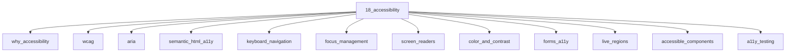

# Accessibility

## Scope

WCAG, ARIA, keyboard UX, and accessible component patterns

## Prerequisites

See the learning paths and each topic's prerequisites in the registry.

## Topics in order

- [Why Accessibility](/18-accessibility/why-accessibility/) — beginner, ~20 min
- [WCAG](/18-accessibility/wcag/) — junior, ~35 min
- [ARIA](/18-accessibility/aria/) — mid, ~40 min
- [Semantic HTML for Accessibility](/18-accessibility/semantic-html-a11y/) — beginner, ~25 min
- [Keyboard Navigation](/18-accessibility/keyboard-navigation/) — junior, ~30 min
- [Focus Management](/18-accessibility/focus-management/) — mid, ~30 min
- [Screen Readers](/18-accessibility/screen-readers/) — mid, ~35 min
- [Color and Contrast](/18-accessibility/color-and-contrast/) — junior, ~25 min
- [Accessible Forms](/18-accessibility/forms-a11y/) — junior, ~30 min
- [Live Regions](/18-accessibility/live-regions/) — mid, ~25 min
- [Accessible Components](/18-accessibility/accessible-components/) — mid, ~40 min
- [Accessibility Testing](/18-accessibility/a11y-testing/) — mid, ~30 min
- [Accessibility in React](/18-accessibility/a11y-in-react/) — mid, ~30 min
- [Accessibility in Next.js](/18-accessibility/a11y-in-nextjs/) — mid, ~25 min

## Module knowledge graph

## Suggested learning paths

Browse [Learning Paths](/learning-paths/).
