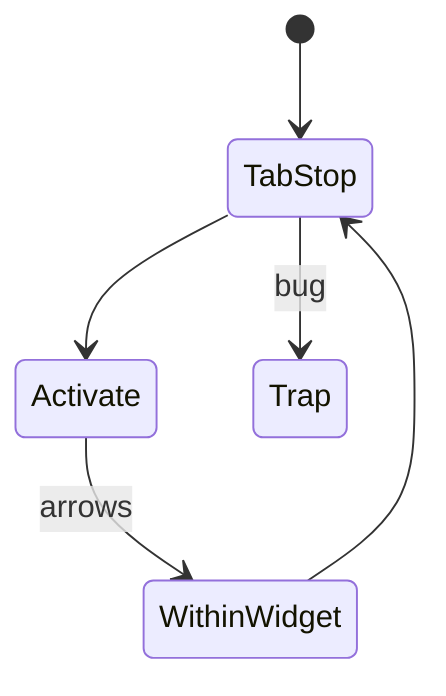
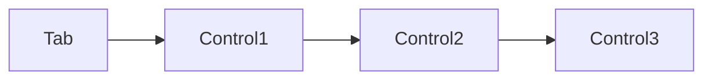

# Keyboard Navigation

<TopicMeta />

<Prerequisites />

::: tip Published
This page meets the handbook **published** bar: deep explanation, ≥10 common mistakes, and official references. Further engine-level errata welcome via PR.
:::

## Introduction

**Keyboard navigation** requires that every interactive task works without a mouse: logical **tab order**, visible focus, correct key behavior (Enter/Space/Arrows/Escape), and **no keyboard traps**.

## Why does it exist?

Motor impairments, power users, and many AT setups are keyboard-primary. Mouse-only UI fails WCAG 2.1.1.

## Historical Background

Desktop accessibility norms migrated to the web; APG standardized widget key patterns.

## Mental Model

Tab moves between tab stops; arrows move within composite widgets. Focus order follows DOM order unless carefully managed.

## Internal Workflow

1. Unplug the mouse and use the product.
2. Fix focus order via DOM order (not positive tabindex).
3. Implement APG keys for custom widgets.
4. Ensure Escape closes dialogs and returns focus.
5. Add regression tests for tab flow.

## Lifecycle



## Browser Perspective

Focus and key events are browser primitives.

## JavaScript Engine Perspective

Not applicable.

## React Perspective

Don’t remove focus outlines globally; style :focus-visible.

## Next.js Perspective

Route changes need focus management (see focus topic).

## Server Perspective

Not applicable.

## Network Perspective

Not applicable.

## Memory Perspective

Not applicable.

## Performance

Negligible; avoid huge tab stop lists by hiding inert UI.

## Production Example

Modal traps focus intentionally; on close, focus returns to opener; Roving tabindex in menu.

## Code Examples

```css
:focus-visible {
  outline: 3px solid #4c9ffe;
  outline-offset: 2px;
}
```

## Diagrams



## Common Mistakes

1. outline: none without :focus-visible alternative
2. tabIndex={1+} chaos
3. Keyboard traps in widgets
4. Only hover interactions
5. Custom select without arrow keys
6. Missing a production edge case for 18-accessibility.keyboard-navigation (#1)
7. Missing a production edge case for 18-accessibility.keyboard-navigation (#2)
8. Missing a production edge case for 18-accessibility.keyboard-navigation (#3)
9. Missing a production edge case for 18-accessibility.keyboard-navigation (#4)
10. Missing a production edge case for 18-accessibility.keyboard-navigation (#5)


## Best Practices

- DOM order = focus order
- APG patterns
- Visible focus

## Anti-patterns

- Mouseonly drag without keyboard alternative
- Focusable decorative elements

## Comparison

| Tab | Arrows |
| --- | --- |
| Between widgets | Within composite widget |

## Interview Questions

### Easy

**Q:** What is a keyboard trap?

**A:** When focus enters a component and cannot leave with keyboard—failing WCAG unless it is a temporary modal with an Escape path.

### Medium

**Q:** Why avoid positive tabindex?

**A:** It creates maintenance nightmares and unexpected orders; prefer DOM reorder and tabindex 0/-1.

### Hard

**Q:** Implement keyboard support for tabs.

**A:** Follow APG: tablist with roving tabindex, arrows change tabs, Home/End optional, aria-selected updated, panel shown and associated.

## Summary

- Keyboard access is mandatory
- Visible focus + logical order
- APG for complex widgets

## References

- [WCAG 2.1.1 Keyboard](https://www.w3.org/WAI/WCAG22/Understanding/keyboard.html)
- [APG — Keyboard patterns](https://www.w3.org/WAI/ARIA/apg/patterns/)

<RelatedTopics />


Prev: [`18-accessibility.semantic-html-a11y`](/18-accessibility/semantic-html-a11y/) · Next: [`18-accessibility.focus-management`](/18-accessibility/focus-management/)
