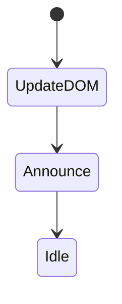
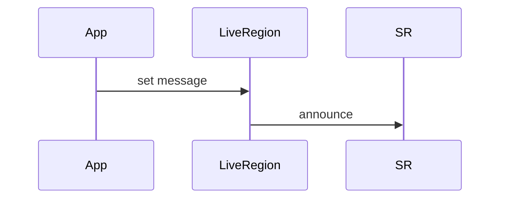

# Live Regions

<TopicMeta />

<Prerequisites />

::: tip Published
This page meets the handbook **published** bar: deep explanation, ≥10 common mistakes, and official references. Further engine-level errata welcome via PR.
:::

## Introduction

**Live regions** (`aria-live`, `role="status"`, `role="alert"`) tell screen readers to announce changes elsewhere on the page. Use for toasts, form status, and background updates—without overusing assertive spam.

## Why does it exist?

SPAs update asynchronously; without live regions or focus moves, SR users miss critical feedback (“Saved”, “Error”).

## Historical Background

ARIA live regions standardized announcement patterns for dynamic web apps.

## Mental Model

polite = finish current speech then announce; assertive = interrupt. Prefer polite for most statuses; alert for critical errors. Atomic/relevant control what is read.

## Internal Workflow

1. Identify updates that don’t take focus.
2. Choose polite vs assertive.
3. Keep messages concise.
4. Avoid clearing/re-adding too aggressively.
5. Verify with SR.

## Lifecycle



## Browser Perspective

SR support nuances exist—test.

## JavaScript Engine Perspective

Not applicable.

## React Perspective

Ensure message text changes so AT detects updates; reuse a stable live region node.

## Next.js Perspective

Not applicable.

## Server Perspective

Not applicable.

## Network Perspective

Not applicable.

## Memory Perspective

Not applicable.

## Performance

Too many live updates degrade UX badly.

## Production Example

Toast library uses role=status for success; role=alert for payment failure; debounced.

## Code Examples

```tsx
<div role="status" aria-live="polite">{statusMessage}</div>
```

## Diagrams



## Common Mistakes

1. aria-live on huge regions
2. assertive for everything
3. Not announcing save failures
4. Duplicate announcements with focus+live
5. Updating live region every keystroke
6. Missing a production edge case for 18-accessibility.live-regions (#1)
7. Missing a production edge case for 18-accessibility.live-regions (#2)
8. Missing a production edge case for 18-accessibility.live-regions (#3)
9. Missing a production edge case for 18-accessibility.live-regions (#4)
10. Missing a production edge case for 18-accessibility.live-regions (#5)


## Best Practices

- Short messages
- polite by default
- Stable container element

## Anti-patterns

- Nested live regions chaos
- Invisible spam text for SEO hacks

## Comparison

| status | alert |
| --- | --- |
| polite | assertive-ish critical |

## Interview Questions

### Easy

**Q:** What does aria-live do?

**A:** It marks a region whose content changes should be announced by assistive tech without focusing it.

### Medium

**Q:** polite vs assertive?

**A:** polite waits for a break in speech; assertive may interrupt—use assertive sparingly for critical messages.

### Hard

**Q:** When prefer focus management over live regions?

**A:** When the user should interact with new content (dialogs, new page views); use live regions for peripheral status.

## Summary

- Live regions announce async UI
- Prefer polite/status
- Don’t spam AT

## References

- [ARIA live regions](https://www.w3.org/WAI/ARIA/apg/practices/live-regions/)
- [MDN — aria-live](https://developer.mozilla.org/en-US/docs/Web/Accessibility/ARIA/Attributes/aria-live)

<RelatedTopics />


Prev: [`18-accessibility.forms-a11y`](/18-accessibility/forms-a11y/) · Next: [`18-accessibility.accessible-components`](/18-accessibility/accessible-components/)
