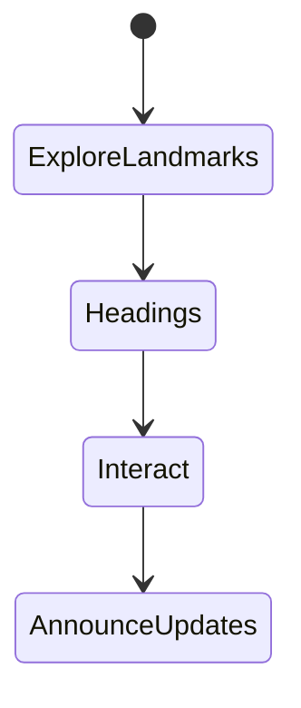
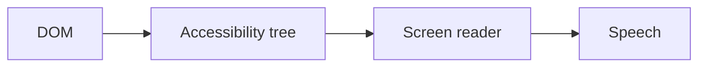

# Screen Readers

<TopicMeta />

<Prerequisites />

::: tip Published
This page meets the handbook **published** bar: deep explanation, ≥10 common mistakes, and official references. Further engine-level errata welcome via PR.
:::

## Introduction

**Screen readers** (VoiceOver, NVDA, JAWS, TalkBack) present the accessibility tree as speech/braille. Users navigate by landmarks, headings, and forms—not by looking at pixels. Building for SR means correct names, roles, values, and updates.

## Why does it exist?

Many a11y failures only appear with SR. Automated tools cannot validate announcement quality.

## Historical Background

SR + browser combos differ (especially on Windows/macOS). Testing on target pairings matters.

## Mental Model

SR users browse structurally. Announcements depend on accessible name computation and live regions. Visual order ≠ reading order if CSS reorders carelessly.

## Internal Workflow

1. Learn basic SR commands on one platform.
2. Smoke-test critical journeys.
3. Fix naming and structure issues.
4. Retest after complex widgets.
5. Don’t over-announce.

## Lifecycle



## Browser Perspective

Exposes accessibility APIs to AT.

## JavaScript Engine Perspective

Not applicable.

## React Perspective

Dynamic updates need live regions or focus moves.

## Next.js Perspective

Not applicable.

## Server Perspective

Not applicable.

## Network Perspective

Not applicable.

## Memory Perspective

Not applicable.

## Performance

Excessive aria-live can overwhelm—throttle status updates.

## Production Example

Release checklist: VoiceOver+Safari and NVDA+Chrome smoke on login and checkout.

## Code Examples

```html
<label for="email">Email</label>
<input id="email" type="email" autocomplete="email" />
```

## Diagrams



## Common Mistakes

1. Testing only with axe
2. Missing form labels
3. Announcing every keystroke
4. CSS order contradicting DOM order
5. Images without alt decisions (empty vs descriptive)
6. Missing a production edge case for 18-accessibility.screen-readers (#1)
7. Missing a production edge case for 18-accessibility.screen-readers (#2)
8. Missing a production edge case for 18-accessibility.screen-readers (#3)
9. Missing a production edge case for 18-accessibility.screen-readers (#4)
10. Missing a production edge case for 18-accessibility.screen-readers (#5)


## Best Practices

- Real SR smoke tests
- Good heading/landmark structure
- Accessible names on controls

## Anti-patterns

- SR-only text walls for everything
- aria-label duplicating visible labels inconsistently

## Comparison

| Screen reader | Common pairing |
| --- | --- |
| VoiceOver | Safari/macOS |
| NVDA | Chrome/Firefox Windows |

## Interview Questions

### Easy

**Q:** What tree do screen readers use?

**A:** The accessibility tree derived from DOM semantics and ARIA.

### Medium

**Q:** Why can a visually obvious button be unusable with SR?

**A:** If it lacks an accessible name or proper role, SR may announce “button” with no name or skip it.

### Hard

**Q:** How do you validate a custom combobox with SR?

**A:** Follow APG, then verify expanded/collapsed announcements, option navigation, and selection with NVDA and VoiceOver—not just axe.

## Summary

- SR users navigate structure
- Names/roles/updates matter
- Manual testing is required

## References

- [WAI — Screen readers](https://www.w3.org/WAI/people-use-web/tools-techniques/)
- [APG](https://www.w3.org/WAI/ARIA/apg/)

<RelatedTopics />


Prev: [`18-accessibility.focus-management`](/18-accessibility/focus-management/) · Next: [`18-accessibility.color-and-contrast`](/18-accessibility/color-and-contrast/)
