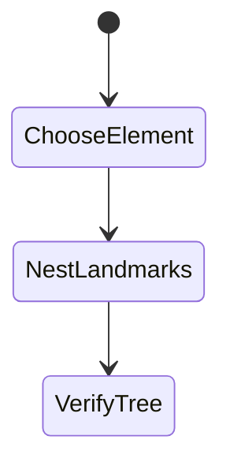
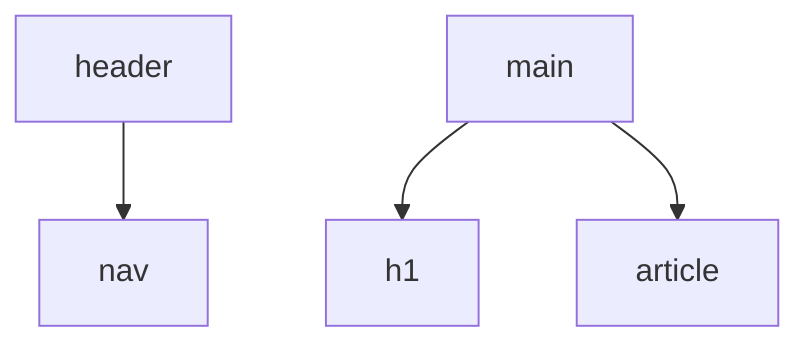

# Semantic HTML for Accessibility

<TopicMeta />

<Prerequisites />

::: tip Published
This page meets the handbook **published** bar: deep explanation, ≥10 common mistakes, and official references. Further engine-level errata welcome via PR.
:::

## Introduction

**Semantic HTML** (`button`, `a`, `nav`, `main`, headings, lists, form controls) gives browsers and AT meaning “for free.” It is the highest-leverage a11y practice and reduces ARIA needs.

## Why does it exist?

Div soup forces every team to reinvent roles/keyboard. Semantics unlock headings maps, landmarks, and default behaviors.

## Historical Background

HTML5 landmark elements improved structure over generic divs; accessibility tree maturity rewarded correct semantics.

## Mental Model

Choose the element that matches the meaning. Headings outline content. Landmarks structure page regions. Controls must be real controls.

## Internal Workflow

1. Structure page with header/nav/main/footer.
2. Use heading levels without skipping chaotically.
3. Use button for actions, a for navigation.
4. Label form controls.
5. Validate with accessibility tree inspection.

## Lifecycle



## Browser Perspective

Builds accessibility tree largely from semantics.

## JavaScript Engine Perspective

Not applicable.

## React Perspective

Component APIs should render semantic elements, not divs by default.

## Next.js Perspective

Root layout should include main landmark and lang.

## Server Perspective

Not applicable.

## Network Perspective

Not applicable.

## Memory Perspective

Not applicable.

## Performance

Semantics are free performance-wise.

## Production Example

App shell: skip link → header/nav → main; feature pages start with one h1.

## Code Examples

```html
<body>
  <a href="#main">Skip to content</a>
  <header><nav aria-label="Primary">...</nav></header>
  <main id="main">
    <h1>Orders</h1>
  </main>
</body>
```

## Diagrams



## Common Mistakes

1. Clickable divs
2. Multiple h1 chaos without thought
3. Fake links with buttons and vice versa
4. No main landmark
5. Using tables for layout
6. Missing a production edge case for 18-accessibility.semantic-html-a11y (#1)
7. Missing a production edge case for 18-accessibility.semantic-html-a11y (#2)
8. Missing a production edge case for 18-accessibility.semantic-html-a11y (#3)
9. Missing a production edge case for 18-accessibility.semantic-html-a11y (#4)
10. Missing a production edge case for 18-accessibility.semantic-html-a11y (#5)


## Best Practices

- Landmarks + skip link
- One clear h1 per view
- Native controls

## Anti-patterns

- `<a href="#">` for buttons
- Heading for styling only

## Comparison

| Semantic | Generic |
| --- | --- |
| Free AT meaning | Needs ARIA/JS |

## Interview Questions

### Easy

**Q:** Why use `<button>` instead of `<div onClick>`?

**A:** Buttons are focusable, activatable with keyboard, and exposed with the correct role to AT by default.

### Medium

**Q:** What are landmarks good for?

**A:** They let SR users jump to regions like nav/main/complementary quickly.

### Hard

**Q:** How should a SPA handle headings on client navigations?

**A:** Ensure each view has a sensible heading structure and manage focus to the new content/heading so SR users know the page changed.

## Summary

- Semantics beat ARIA patches
- Landmarks and headings structure pages
- Native controls first

## References

- [MDN — HTML elements reference](https://developer.mozilla.org/en-US/docs/Web/HTML/Element)
- [WAI — Pages structure](https://www.w3.org/WAI/tutorials/page-structure/)

<RelatedTopics />


Prev: [`18-accessibility.aria`](/18-accessibility/aria/) · Next: [`18-accessibility.keyboard-navigation`](/18-accessibility/keyboard-navigation/)
