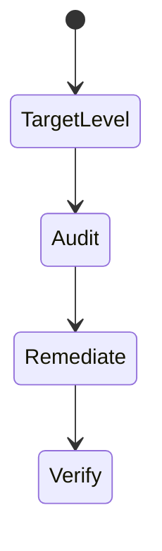
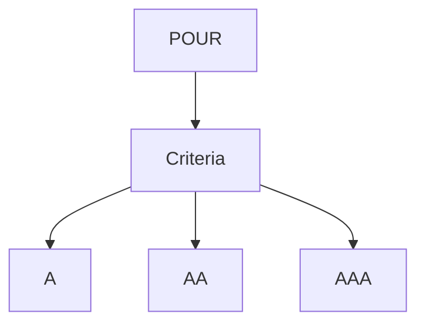

# WCAG

<TopicMeta />

<Prerequisites />

::: tip Published
This page meets the handbook **published** bar: deep explanation, ≥10 common mistakes, and official references. Further engine-level errata welcome via PR.
:::

## Introduction

**WCAG** (currently 2.2) defines testable **success criteria** under POUR at levels **A**, **AA**, and **AAA**. Most organizations target **AA**. Criteria cover contrast, keyboard, timing, forms, etc.

## Why does it exist?

Teams need a shared, auditable bar. WCAG is the language of procurement, law, and audits.

## Historical Background

WCAG 1.0 → 2.0 → 2.1 → 2.2 (new criteria for focus appearance, dragging, target size, etc.). WCAG 3 is in progress but 2.2 remains the practical standard.

## Mental Model

Normative success criteria + informative techniques. You meet criteria, not “use ARIA everywhere.” Prefer HTML techniques when sufficient.

## Internal Workflow

1. Pick target (usually AA).
2. Map UI flows to relevant criteria.
3. Test (automated + manual).
4. Document exceptions/alternatives.
5. Retest on releases.

## Lifecycle



## Browser Perspective

User agents + AT must consume your semantics.

## JavaScript Engine Perspective

Not applicable.

## React Perspective

Components should document which criteria they support.

## Next.js Perspective

Not applicable.

## Server Perspective

Not applicable.

## Network Perspective

Not applicable.

## Memory Perspective

Not applicable.

## Performance

Not directly related; avoid delaying content accessibility for cosmetics.

## Production Example

VPAT/ACR references WCAG 2.2 AA; CI fails serious axe violations mapped to criteria.

## Code Examples

```md
Example targets:
- 1.4.3 Contrast (Minimum) AA
- 2.1.1 Keyboard A
- 2.4.7 Focus Visible AA
- 4.1.2 Name, Role, Value A
```

## Diagrams



## Common Mistakes

1. Claiming compliance from axe alone
2. Targeting AAA everywhere without feasibility
3. Ignoring WCAG 2.2 additions
4. Confusing ARIA authoring with WCAG conformance
5. No evidence/docs for audits
6. Missing a production edge case for 18-accessibility.wcag (#1)
7. Missing a production edge case for 18-accessibility.wcag (#2)
8. Missing a production edge case for 18-accessibility.wcag (#3)
9. Missing a production edge case for 18-accessibility.wcag (#4)
10. Missing a production edge case for 18-accessibility.wcag (#5)


## Best Practices

- AA as default target
- Map defects to criteria IDs
- Combine auto + manual tests

## Anti-patterns

- Checkbox compliance without user testing
- PDF-only “accessible alternative” that is incomplete

## Comparison

| Level | Typical use |
| --- | --- |
| A | Minimum |
| AA | Common legal/product target |
| AAA | Enhanced, not always practical |

## Interview Questions

### Easy

**Q:** What WCAG level do most products target?

**A:** Level AA.

### Medium

**Q:** Name a WCAG 2.2 addition relevant to UI components.

**A:** Examples include Focus Appearance (AA), Dragging Movements (AA), Target Size (Minimum) (AA).

### Hard

**Q:** How do you evidence WCAG AA for a design system?

**A:** Document supported criteria per component, automated checks on stories, keyboard/SR test matrix, known exceptions, and sample app audits.

## Summary

- WCAG 2.2 AA is the common bar
- Criteria are testable requirements
- Automation helps but does not certify alone

## References

- [WCAG 2.2](https://www.w3.org/TR/WCAG22/)
- [How to Meet WCAG (Quickref)](https://www.w3.org/WAI/WCAG22/quickref/)

<RelatedTopics />


Prev: [`18-accessibility.why-accessibility`](/18-accessibility/why-accessibility/) · Next: [`18-accessibility.aria`](/18-accessibility/aria/)
