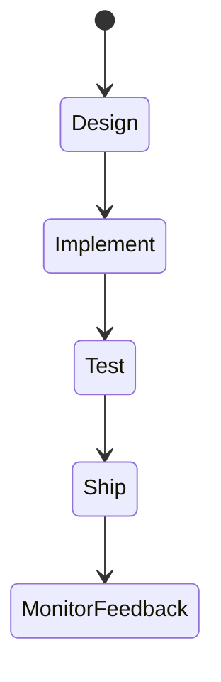
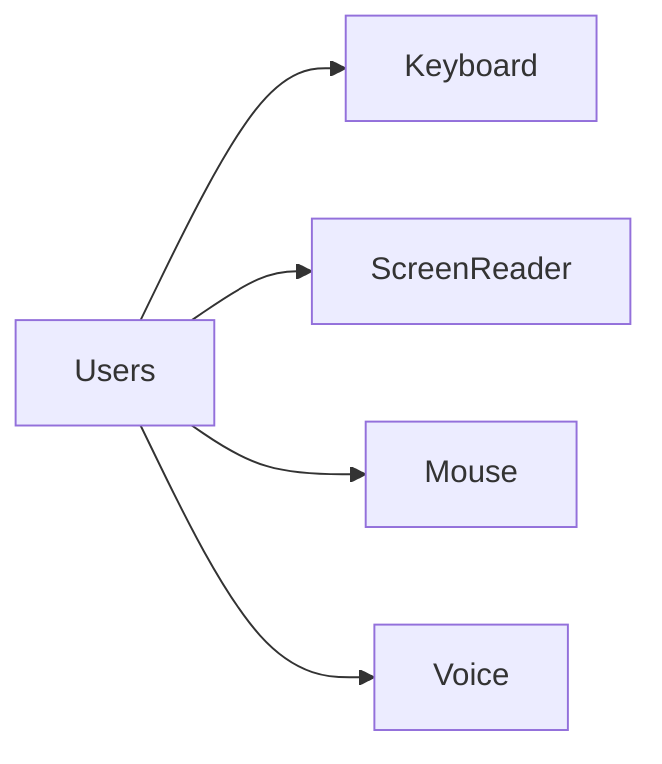

# Why Accessibility

<TopicMeta />

<Prerequisites />

::: tip Published
This page meets the handbook **published** bar: deep explanation, ≥10 common mistakes, and official references. Further engine-level errata welcome via PR.
:::

## Introduction

**Accessibility (a11y)** means designing and building interfaces usable by people with diverse abilities—vision, hearing, motor, cognitive—including those using assistive technologies. It expands market reach, reduces legal risk, and usually improves UX for everyone.

## Why does it exist?

Exclusion is expensive: lost users, lawsuits/regulations (ADA, EAA), and brand damage. Many “a11y fixes” (labels, focus, contrast) also help mobile and keyboard power users.

## Historical Background

From early web accessibility initiatives to WCAG as the global standard, then ARIA to bridge complex widgets. Modern product orgs embed a11y into design systems.

## Mental Model

Perceivable, Operable, Understandable, Robust (POUR). If a task cannot be completed with keyboard + screen reader + adequate contrast, it is broken—not “edge.”

## Internal Workflow

1. Include disabled users in research.
2. Design with semantics and contrast.
3. Build with native elements first.
4. Test with axe + keyboard + AT.
5. Budget remediation like any defect.

## Lifecycle



## Browser Perspective

AT relies on accessibility trees from DOM/ARIA.

## JavaScript Engine Perspective

Not applicable.

## React Perspective

Component libraries must bake a11y in.

## Next.js Perspective

Document titles, landmarks, and focus on route change matter.

## Server Perspective

Not applicable.

## Network Perspective

Not applicable.

## Memory Perspective

Not applicable.

## Performance

A11y is mostly quality; lazy-loading must not strand keyboard users.

## Production Example

Checkout keyboard+SR tested each release; contrast tokens enforced in DS; legal reviews WCAG 2.2 AA targets.

## Code Examples

```html
<!-- Inclusive by default: native control -->
<button type="submit">Pay now</button>
```

## Diagrams



## Common Mistakes

1. Leaving a11y for “later”
2. Only running axe once at the end
3. Assuming disability is rare
4. Icon buttons without names
5. Treating a11y as purely a design concern
6. Missing a production edge case for 18-accessibility.why-accessibility (#1)
7. Missing a production edge case for 18-accessibility.why-accessibility (#2)
8. Missing a production edge case for 18-accessibility.why-accessibility (#3)
9. Missing a production edge case for 18-accessibility.why-accessibility (#4)
10. Missing a production edge case for 18-accessibility.why-accessibility (#5)


## Best Practices

- Shift-left into design system
- Keyboard + AT in DoD
- Track a11y bugs with severity

## Anti-patterns

- Accessibility overlay widgets as the strategy
- “Blind users don’t use our product” assumptions

## Comparison

| Mindset | Outcome |
| --- | --- |
| Optional polish | Retrofit debt |
| Core quality | Inclusive product |

## Interview Questions

### Easy

**Q:** What does POUR stand for?

**A:** Perceivable, Operable, Understandable, Robust—the WCAG principles.

### Medium

**Q:** Why native HTML elements first?

**A:** They come with keyboard behavior, roles, and AT support you would otherwise reimplement with ARIA.

### Hard

**Q:** How do you make a11y sustainable in an org?

**A:** Design-system primitives, CI gates, training, user testing with AT users, and executive-backed WCAG targets.

## Summary

- A11y is product quality and inclusion
- POUR frames requirements
- Build into system, don’t bolt on

## References

- [WAI — Introduction to Accessibility](https://www.w3.org/WAI/fundamentals/accessibility-intro/)
- [WCAG 2.2](https://www.w3.org/TR/WCAG22/)

<RelatedTopics />


Next: [`18-accessibility.wcag`](/18-accessibility/wcag/)
