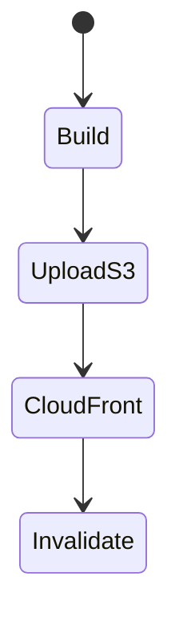
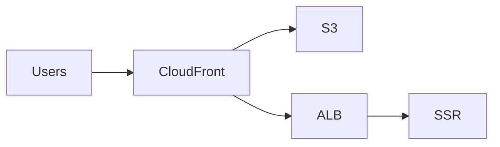

# AWS for Frontend

<TopicMeta />

<Prerequisites />

::: tip Published
This page meets the handbook **published** bar: deep explanation, ≥10 common mistakes, and official references. Further engine-level errata welcome via PR.
:::

## Introduction

**AWS frontend hosting** usually means **S3 + CloudFront** for static assets, **Amplify Hosting** for git workflows, or containers (**ECS/Fargate**, EKS) for SSR. IAM, HTTPS, and cache behaviors are the hard parts.

## Why does it exist?

Enterprises already on AWS want frontends in the same cloud with VPC/API proximity and compliance controls.

## Historical Background

S3 website hosting → CloudFront best practice; Amplify added DX; containers for Next standalone common.

## Mental Model

Static: bucket private + OAI/OAC via CloudFront. Dynamic: target group + ALB. AuthZ via IAM for deploys (OIDC from GitHub).

## Internal Workflow

1. Build artifacts in CI.
2. Sync to S3 / deploy service.
3. CloudFront behaviors for cache.
4. Invalidate HTML paths.
5. Monitor 4xx/5xx.

## Lifecycle



## Browser Perspective

Not applicable.

## JavaScript Engine Perspective

Not applicable.

## React Perspective

Not applicable.

## Next.js Perspective

SSR needs compute (Lambda/ECS), not only S3.

## Server Perspective

Not applicable.

## Network Perspective

CloudFront is the CDN/reverse proxy.

## Memory Perspective

Not applicable.

## Performance

Cache behaviors split static vs SSR paths.

## Production Example

GitHub OIDC → deploy role → S3 sync + CloudFront invalidation for `index.html`.

## Code Examples

```bash
aws s3 sync dist/ s3://my-site/ --delete \
  --cache-control "public,max-age=31536000,immutable" \
  --exclude index.html
aws s3 cp dist/index.html s3://my-site/index.html \
  --cache-control "no-cache"
```

## Diagrams



## Common Mistakes

1. Public S3 website endpoint without CloudFront
2. Invalidating everything every deploy
3. Long-lived AWS keys on CI
4. Wrong SPA error document config
5. Forgetting IPv6/TLS policy basics
6. Missing a production edge case for 19-deployment.aws-frontend (#1)
7. Missing a production edge case for 19-deployment.aws-frontend (#2)
8. Missing a production edge case for 19-deployment.aws-frontend (#3)
9. Missing a production edge case for 19-deployment.aws-frontend (#4)
10. Missing a production edge case for 19-deployment.aws-frontend (#5)


## Best Practices

- CloudFront + private S3 OAC
- OIDC deploy roles
- Split cache behaviors

## Anti-patterns

- Hand-edited buckets as CD
- AdminAccess deploy users

## Comparison

| S3+CF | Amplify | ECS |
| --- | --- | --- |
| Static control | Git DX | SSR containers |

## Interview Questions

### Easy

**Q:** Common AWS static frontend pattern?

**A:** Host files in S3 and serve via CloudFront over HTTPS.

### Medium

**Q:** Why keep the S3 bucket private?

**A:** Force access through CloudFront controls (OAC), logging, and WAF rather than open bucket URLs.

### Hard

**Q:** Deploy Next SSR on AWS options?

**A:** Amplify, OpenNext on Lambda, or containers on ECS/EKS behind ALB/CloudFront—trade ops vs flexibility.

## Summary

- S3+CloudFront is the classic static pattern
- OIDC + private buckets
- SSR needs compute

## References

- [Amazon CloudFront docs](https://docs.aws.amazon.com/cloudfront/)
- [AWS Amplify Hosting](https://docs.aws.amazon.com/amplify/latest/userguide/getting-started.html)

<RelatedTopics />


Prev: [`19-deployment.netlify`](/19-deployment/netlify/) · Next: [`19-deployment.cloudflare`](/19-deployment/cloudflare/)
