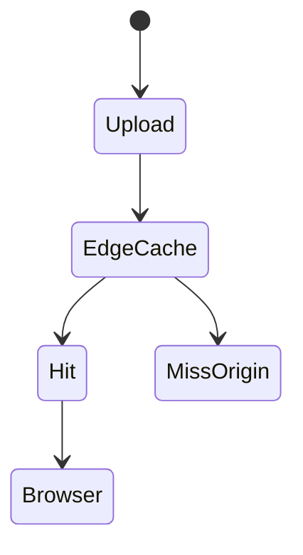

# CDN Deployment

<TopicMeta />

<Prerequisites />

::: tip Published
This page meets the handbook **published** bar: deep explanation, ≥10 common mistakes, and official references. Further engine-level errata welcome via PR.
:::

## Introduction

A **CDN deployment** puts hashed static assets (and often HTML) on edge nodes worldwide. Users download JS/CSS/images from nearby POPs. Correct **cache keys/headers** and invalidation strategy are the core skill.

## Why does it exist?

Origin servers shouldn’t serve every byte globally. CDNs cut latency and cost for static content.

## Historical Background

From Akamai to CloudFront/Cloudflare/Fastly; JAMstack popularized CDN-first frontends.

## Mental Model

Fingerprinted assets → long TTL. HTML/document → short TTL or revalidate. Invalidation/purge on release when needed.

## Internal Workflow

1. Build fingerprinted assets.
2. Upload to object storage/CDN.
3. Set cache headers.
4. Deploy HTML/app pointers.
5. Purge selectively on emergency.

## Lifecycle



## Browser Perspective

Respects Cache-Control; immutable helps.

## JavaScript Engine Perspective

Not applicable.

## React Perspective

Not applicable.

## Next.js Perspective

AssetPrefix / CDN for `_next/static`.

## Server Perspective

Not applicable.

## Network Perspective

Cache hit ratio dominates performance.

## Memory Perspective

Not applicable.

## Performance

Biggest easy win for global users when headers are right.

## Production Example

S3+CloudFront: `/static/*` 1y immutable; `/index.html` no-cache; invalidation on release for HTML.

## Code Examples

```http
Cache-Control: public, max-age=31536000, immutable
```

## Diagrams


## Common Mistakes

1. Caching HTML forever
2. No fingerprinting but long TTL
3. Purging entire CDN every deploy habitually without need
4. Forgetting CORS on CDN-hosted fonts
5. Mixed content via CDN http URLs
6. Missing a production edge case for 19-deployment.cdn-deployment (#1)
7. Missing a production edge case for 19-deployment.cdn-deployment (#2)
8. Missing a production edge case for 19-deployment.cdn-deployment (#3)
9. Missing a production edge case for 19-deployment.cdn-deployment (#4)
10. Missing a production edge case for 19-deployment.cdn-deployment (#5)


## Best Practices

- Hash filenames
- Separate HTML vs asset policies
- Measure hit ratio

## Anti-patterns

- query-string cache busting without config support
- One global short TTL for everything

## Comparison

| CDN static | Origin SSR |
| --- | --- |
| Edge cached | Dynamic compute |

## Interview Questions

### Easy

**Q:** Why put frontend assets on a CDN?

**A:** To serve them from edge locations closer to users with high cache hit rates, reducing latency and origin load.

### Medium

**Q:** Why fingerprint assets?

**A:** So you can cache forever safely; new deploys get new filenames instead of stale cached code.

### Hard

**Q:** Design cache policy for SPA on CDN.

**A:** Immutable long cache for hashed assets; no-cache or short revalidate for index.html; atomic deploy so HTML never points to missing hashes.

## Summary

- CDN for global static delivery
- Fingerprints + correct TTLs
- HTML vs assets differ

## References

- [web.dev — CDN](https://web.dev/articles/content-delivery-networks)
- [MDN — Cache-Control](https://developer.mozilla.org/en-US/docs/Web/HTTP/Headers/Cache-Control)

<RelatedTopics />


Prev: [`19-deployment.reverse-proxy`](/19-deployment/reverse-proxy/) · Next: [`19-deployment.ci-cd`](/19-deployment/ci-cd/)
